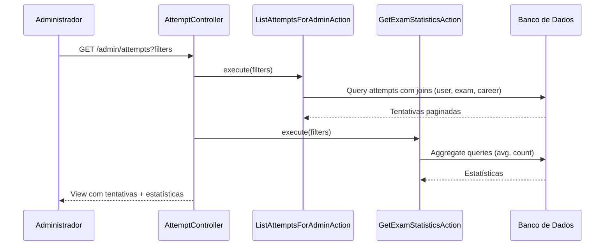

# Documento de Design — Painel Admin de Simulados Respondidos

## Visão Geral

Este documento descreve o design técnico para a criação de uma visão administrativa dedicada aos simulados respondidos. A funcionalidade abrange: listagem paginada de tentativas com filtros, visualização detalhada de tentativas com análise questão a questão, estatísticas agregadas, gestão de reclamações sobre questões, exportação CSV e indicadores visuais de reclamações.

A solução segue a arquitetura Domain-Driven Design (DDD) já estabelecida no projeto, reutilizando o domínio `Exam` existente (modelos `Attempt`, `ExamResult`, `UserAnswer`, `Question`, `Exam`) e criando um novo domínio `Complaint` para a gestão de reclamações. O painel admin utiliza AdminLTE com Blade templates, seguindo os padrões já existentes nos controllers `ExamController`, `WebhookHistoryController` e nas views em `resources/views/admin/`.

## Arquitetura

### Diagrama de Componentes

```mermaid
graph TD
    subgraph "HTTP Layer - Admin Controllers"
        A[AttemptController]
        B[ComplaintController]
    end

    subgraph "Domain: Exam (existente)"
        C[Attempt Model]
        D[Exam Model]
        E[Question Model]
        F[UserAnswer Model]
        G[ExamResult Model]
        H[AttemptRepository - novos métodos]
    end

    subgraph "Domain: Complaint (novo)"
        I[Complaint Model]
        J[ComplaintRepository]
        K[CreateComplaintAction]
        L[UpdateComplaintStatusAction]
        M[ListComplaintsAction]
        N[ComplaintType Enum]
        O[ComplaintPriority Enum]
        P[ComplaintStatus Enum]
    end

    subgraph "Domain: Exam - Novas Actions"
        Q[ListAttemptsForAdminAction]
        R[GetAttemptDetailAction]
        S[GetExamStatisticsAction]
        T[ExportAttemptsCsvAction]
    end

    subgraph "Views - Blade Templates"
        U[attempts/index.blade.php]
        V[attempts/show.blade.php]
        W[complaints/index.blade.php]
    end

    A --> Q
    A --> R
    A --> S
    A --> T
    B --> K
    B --> L
    B --> M
    A --> U
    A --> V
    B --> W
    Q --> H
    R --> H
    S --> H
    T --> H
    K --> J
    L --> J
    M --> J
```



### Diagrama de Fluxo - Listagem de Tentativas



### Decisões de Arquitetura

1. **Novo domínio `Complaint`**: As reclamações são uma entidade independente com ciclo de vida próprio (aberta → em análise → resolvida/rejeitada). Criar um domínio separado mantém a coesão e evita poluir o domínio `Exam`.

2. **Novas Actions no domínio `Exam`**: As actions de listagem, detalhe, estatísticas e exportação de tentativas pertencem ao domínio `Exam` pois operam sobre modelos existentes (`Attempt`, `UserAnswer`, `Question`). Ficam na pasta `Actions/Admin/` seguindo o padrão de `ListExamsForAdminAction`.

3. **Extensão do `AttemptRepository`**: Novos métodos de consulta paginada com filtros são adicionados ao repositório existente, seguindo o padrão do `EdduzWebhookLogRepository::paginate()`.

4. **Exportação CSV via streaming**: Para suportar até 10.000+ registros sem estouro de memória, o CSV é gerado via `StreamedResponse` do Laravel, iterando com `cursor()` ou `chunk()`.

5. **Estatísticas calculadas via query**: As estatísticas (média de nota, taxa de acerto, tempo médio) são calculadas diretamente no banco via `AVG()`, `COUNT()`, `SUM()` para performance, sem carregar todos os registros em memória.

6. **Indicadores de reclamação via subquery**: A contagem de reclamações pendentes por simulado é feita via subquery na listagem de tentativas, evitando N+1 queries.


## Componentes e Interfaces

### 1. AttemptController (`app/Http/Controllers/Admin/AttemptController.php`)

Controller admin para listagem, detalhe e exportação de tentativas.

```php
class AttemptController extends Controller
{
    /**
     * GET /admin/attempts — Lista paginada de tentativas com filtros e estatísticas.
     */
    public function index(
        Request $request,
        ListAttemptsForAdminAction $listAction,
        GetExamStatisticsAction $statsAction
    ): View;

    /**
     * GET /admin/attempts/{attempt} — Detalhe de uma tentativa com respostas e taxa de acerto por questão.
     */
    public function show(
        int $attemptId,
        GetAttemptDetailAction $action
    ): View;

    /**
     * GET /admin/attempts/export — Exportação CSV das tentativas filtradas.
     */
    public function export(
        Request $request,
        ExportAttemptsCsvAction $action
    ): StreamedResponse;

    /**
     * GET /admin/attempts/export/count — Retorna contagem para confirmação antes de exportar.
     */
    public function exportCount(
        Request $request,
        ListAttemptsForAdminAction $action
    ): JsonResponse;
}
```

### 2. ComplaintController (`app/Http/Controllers/Admin/ComplaintController.php`)

Controller admin para gestão de reclamações.

```php
class ComplaintController extends Controller
{
    /**
     * GET /admin/complaints — Lista paginada de reclamações com filtros.
     */
    public function index(
        Request $request,
        ListComplaintsAction $action
    ): View;

    /**
     * POST /admin/complaints — Registra nova reclamação sobre uma questão.
     */
    public function store(
        Request $request,
        CreateComplaintAction $action
    ): RedirectResponse;

    /**
     * PATCH /admin/complaints/{complaint}/status — Atualiza status de uma reclamação.
     */
    public function updateStatus(
        Request $request,
        int $complaintId,
        UpdateComplaintStatusAction $action
    ): RedirectResponse;
}
```

### 3. ListAttemptsForAdminAction (`app/Domain/Exam/Actions/Admin/ListAttemptsForAdminAction.php`)

```php
class ListAttemptsForAdminAction
{
    /**
     * Lista tentativas finalizadas com filtros, paginação e contagem de reclamações pendentes.
     *
     * Filtros suportados:
     * - search: busca por nome do usuário ou título do simulado
     * - exam_id: filtro por simulado específico
     * - career_id: filtro por carreira
     * - date_from / date_to: filtro por período de finalização
     *
     * @return LengthAwarePaginator
     */
    public function execute(array $filters, int $perPage = 15): LengthAwarePaginator;

    /**
     * Retorna a contagem total de tentativas para os filtros aplicados (usado na confirmação de exportação).
     */
    public function count(array $filters): int;
}
```

### 4. GetAttemptDetailAction (`app/Domain/Exam/Actions/Admin/GetAttemptDetailAction.php`)

```php
class GetAttemptDetailAction
{
    /**
     * Retorna os dados completos de uma tentativa:
     * - Informações do usuário e simulado
     * - Lista de respostas com questão, opção selecionada, resposta correta, indicação correto/incorreto
     * - Taxa de acerto por questão (calculada sobre todas as tentativas finalizadas do simulado)
     * - Indicadores de reclamações pendentes por questão
     *
     * @return array{attempt: Attempt, answers: Collection, questionStats: Collection, complaints: Collection}
     */
    public function execute(int $attemptId): array;
}
```

### 5. GetExamStatisticsAction (`app/Domain/Exam/Actions/Admin/GetExamStatisticsAction.php`)

```php
class GetExamStatisticsAction
{
    /**
     * Calcula estatísticas agregadas das tentativas filtradas:
     * - Total de tentativas finalizadas
     * - Nota média
     * - Taxa média de acerto (%)
     * - Tempo médio de resolução (minutos)
     *
     * @return array{total: int, avgScore: float, avgAccuracy: float, avgDurationMinutes: float}
     */
    public function execute(array $filters): array;
}
```

### 6. ExportAttemptsCsvAction (`app/Domain/Exam/Actions/Admin/ExportAttemptsCsvAction.php`)

```php
class ExportAttemptsCsvAction
{
    /**
     * Gera StreamedResponse com CSV das tentativas filtradas.
     * Campos: ID, Nome do Usuário, E-mail, Título do Simulado, Carreira, Nota, Acertos, Total Questões, Duração (min), Data Finalização.
     * Usa cursor() para eficiência de memória.
     */
    public function execute(array $filters): StreamedResponse;
}
```

### 7. CreateComplaintAction (`app/Domain/Complaint/Actions/CreateComplaintAction.php`)

```php
class CreateComplaintAction
{
    /**
     * Registra uma nova reclamação sobre uma questão.
     */
    public function execute(
        int $questionId,
        int $adminId,
        ComplaintType $type,
        string $description,
        ComplaintPriority $priority
    ): Complaint;
}
```

### 8. UpdateComplaintStatusAction (`app/Domain/Complaint/Actions/UpdateComplaintStatusAction.php`)

```php
class UpdateComplaintStatusAction
{
    /**
     * Atualiza o status de uma reclamação e registra nota de resolução.
     */
    public function execute(
        int $complaintId,
        ComplaintStatus $status,
        ?string $resolutionNote = null
    ): Complaint;
}
```

### 9. ListComplaintsAction (`app/Domain/Complaint/Actions/ListComplaintsAction.php`)

```php
class ListComplaintsAction
{
    /**
     * Lista reclamações paginadas com filtros por status, tipo e prioridade.
     */
    public function execute(array $filters, int $perPage = 15): LengthAwarePaginator;
}
```

### 10. ComplaintRepository (`app/Domain/Complaint/Repositories/ComplaintRepository.php`)

```php
class ComplaintRepository
{
    public function create(array $data): Complaint;
    public function update(int $id, array $data): Complaint;
    public function findOrFail(int $id): Complaint;
    public function paginate(array $filters = [], int $perPage = 15): LengthAwarePaginator;
    public function countPendingByExamId(int $examId): int;
    public function countPendingByQuestionIds(array $questionIds): Collection;
}
```

### Rotas

```php
// routes/web.php (dentro do grupo admin autenticado)

// Tentativas
Route::prefix('attempts')->name('attempts.')->group(function () {
    Route::get('/', [AttemptController::class, 'index'])->name('index');
    Route::get('/export', [AttemptController::class, 'export'])->name('export');
    Route::get('/export/count', [AttemptController::class, 'exportCount'])->name('export.count');
    Route::get('/{attempt}', [AttemptController::class, 'show'])->name('show');
});

// Reclamações
Route::prefix('complaints')->name('complaints.')->group(function () {
    Route::get('/', [ComplaintController::class, 'index'])->name('index');
    Route::post('/', [ComplaintController::class, 'store'])->name('store');
    Route::patch('/{complaint}/status', [ComplaintController::class, 'updateStatus'])->name('update-status');
});
```

## Modelos de Dados

### Tabela `complaints` (nova)

| Coluna | Tipo | Descrição |
|---|---|---|
| `id` | bigint (PK) | Identificador auto-incremento |
| `question_id` | bigint, FK | Referência para `questions.id` |
| `admin_id` | bigint, FK | Referência para `users.id` (administrador que registrou) |
| `type` | string(30) | Tipo do problema (enum `ComplaintType`) |
| `description` | text | Descrição detalhada do problema |
| `priority` | string(10) | Prioridade (enum `ComplaintPriority`) |
| `status` | string(20), default 'open' | Status atual (enum `ComplaintStatus`) |
| `resolution_note` | text, nullable | Nota de resolução quando o status é atualizado |
| `resolved_at` | timestamp, nullable | Data/hora da resolução |
| `created_at` | timestamp | Data de criação |
| `updated_at` | timestamp | Data de atualização |

**Índices:**
- `index: question_id` (consulta de reclamações por questão)
- `index: status` (filtro por status na listagem)
- `index: type` (filtro por tipo na listagem)
- `index: priority` (filtro por prioridade na listagem)
- `index: created_at` (ordenação por data)

### Enum `ComplaintType` (`app/Domain/Complaint/Enums/ComplaintType.php`)

```php
enum ComplaintType: string
{
    case INCORRECT_ANSWER = 'incorrect_answer';       // Gabarito incorreto
    case AMBIGUOUS_STATEMENT = 'ambiguous_statement'; // Enunciado ambíguo
    case OUTDATED_QUESTION = 'outdated_question';     // Questão desatualizada
    case FORMATTING_ERROR = 'formatting_error';       // Erro de formatação
    case OTHER = 'other';                             // Outro
}
```

### Enum `ComplaintPriority` (`app/Domain/Complaint/Enums/ComplaintPriority.php`)

```php
enum ComplaintPriority: string
{
    case LOW = 'low';       // Baixa
    case MEDIUM = 'medium'; // Média
    case HIGH = 'high';     // Alta
}
```

### Enum `ComplaintStatus` (`app/Domain/Complaint/Enums/ComplaintStatus.php`)

```php
enum ComplaintStatus: string
{
    case OPEN = 'open';             // Aberta
    case IN_REVIEW = 'in_review';   // Em análise
    case RESOLVED = 'resolved';     // Resolvida
    case REJECTED = 'rejected';     // Rejeitada
}
```

### Model `Complaint` (`app/Domain/Complaint/Models/Complaint.php`)

```php
class Complaint extends Model
{
    protected $fillable = [
        'question_id', 'admin_id', 'type', 'description',
        'priority', 'status', 'resolution_note', 'resolved_at',
    ];

    protected function casts(): array
    {
        return [
            'type' => ComplaintType::class,
            'priority' => ComplaintPriority::class,
            'status' => ComplaintStatus::class,
            'resolved_at' => 'datetime',
        ];
    }

    public function question(): BelongsTo
    {
        return $this->belongsTo(Question::class);
    }

    public function admin(): BelongsTo
    {
        return $this->belongsTo(User::class, 'admin_id');
    }

    public function isPending(): bool
    {
        return in_array($this->status, [ComplaintStatus::OPEN, ComplaintStatus::IN_REVIEW]);
    }
}
```

### DTOs

#### AttemptListItemData (para a listagem)

```php
readonly class AttemptListItemData
{
    public function __construct(
        public int $id,
        public string $userName,
        public string $examTitle,
        public string $careerName,
        public float $score,
        public int $correctAnswers,
        public int $totalQuestions,
        public int $durationMinutes,
        public string $finishedAt,
        public int $pendingComplaints,
    ) {}
}
```

#### AttemptDetailData (para o detalhe)

```php
readonly class AttemptDetailData
{
    public function __construct(
        public int $id,
        public string $userName,
        public string $userEmail,
        public string $examTitle,
        public string $careerName,
        public float $score,
        public int $correctAnswers,
        public int $totalQuestions,
        public int $durationMinutes,
        public string $finishedAt,
        public int $examId,
    ) {}
}
```

#### QuestionAnswerData (para cada resposta no detalhe)

```php
readonly class QuestionAnswerData
{
    public function __construct(
        public int $questionId,
        public int $questionNumber,
        public string $statement,
        public string $selectedOption,
        public string $correctAnswer,
        public bool $isCorrect,
        public string $optionA,
        public string $optionB,
        public string $optionC,
        public string $optionD,
        public string $optionE,
        public ?string $explanation,
        public float $accuracyRate,
        public bool $hasPendingComplaints,
    ) {}
}
```

#### ExamStatisticsData

```php
readonly class ExamStatisticsData
{
    public function __construct(
        public int $totalAttempts,
        public float $avgScore,
        public float $avgAccuracy,
        public float $avgDurationMinutes,
    ) {}
}
```

## Propriedades de Corretude

*Uma propriedade é uma característica ou comportamento que deve ser verdadeiro em todas as execuções válidas de um sistema — essencialmente, uma declaração formal sobre o que o sistema deve fazer. Propriedades servem como ponte entre especificações legíveis por humanos e garantias de corretude verificáveis por máquina.*

### Propriedade 1: Acesso restrito a administradores

*Para qualquer* usuário com role diferente de "admin", a tentativa de acessar as páginas de tentativas (`/admin/attempts`) e reclamações (`/admin/complaints`) deve ser negada (redirecionamento ou HTTP 403).

**Valida: Requisitos 1.1**

### Propriedade 2: Ordenação decrescente de tentativas por data de finalização

*Para qualquer* conjunto de tentativas finalizadas, a listagem paginada deve retornar as tentativas ordenadas por data de finalização em ordem decrescente (mais recente primeiro).

**Valida: Requisitos 1.2**

### Propriedade 3: Apenas tentativas finalizadas na listagem

*Para qualquer* conjunto de tentativas (finalizadas e não finalizadas), a listagem deve retornar apenas tentativas que possuem `finished_at` não nulo.

**Valida: Requisitos 1.8**

### Propriedade 4: Filtros de tentativas retornam apenas resultados correspondentes

*Para qualquer* combinação de filtros aplicados (busca por nome/título, simulado, carreira, período de datas), todas as tentativas retornadas devem satisfazer simultaneamente todos os critérios de filtro ativos.

**Valida: Requisitos 1.4, 1.5, 1.6, 1.7**

### Propriedade 5: Campos obrigatórios na listagem de tentativas

*Para qualquer* tentativa na listagem, os dados retornados devem conter: identificador da tentativa, nome do usuário, título do simulado, nome da carreira, nota, acertos, total de questões, duração em minutos e data de finalização.

**Valida: Requisitos 1.3**

### Propriedade 6: Campos obrigatórios no detalhe da tentativa

*Para qualquer* tentativa visualizada no detalhe, os dados devem conter as informações resumidas (nome, email, título, carreira, nota, acertos, total, duração, data) e para cada resposta: número da questão, enunciado, opção selecionada, resposta correta e indicação de correto/incorreto.

**Valida: Requisitos 2.2, 2.3**

### Propriedade 7: Estatísticas calculadas corretamente sobre tentativas filtradas

*Para qualquer* conjunto de tentativas (com ou sem filtros aplicados), as estatísticas devem refletir: total = contagem das tentativas filtradas, nota média = média aritmética das notas, taxa média de acerto = média de (acertos/total_questões), tempo médio = média das durações em minutos.

**Valida: Requisitos 3.1, 3.2**

### Propriedade 8: Taxa de acerto por questão calculada corretamente

*Para qualquer* questão de um simulado com tentativas finalizadas, a taxa de acerto deve ser igual à proporção de respostas corretas sobre o total de respostas para aquela questão, considerando todas as tentativas finalizadas do simulado.

**Valida: Requisitos 3.3**

### Propriedade 9: Questões com taxa de acerto inferior a 30% marcadas como problemáticas

*Para qualquer* questão exibida no detalhe de uma tentativa, a questão deve ser marcada como "potencialmente problemática" se e somente se sua taxa de acerto for inferior a 30%.

**Valida: Requisitos 3.4**

### Propriedade 10: Persistência de reclamação com dados obrigatórios

*Para qualquer* reclamação criada, o registro persistido deve conter: referência à questão (`question_id`), referência ao administrador (`admin_id`), tipo, descrição, prioridade, status inicial "open" e data de criação.

**Valida: Requisitos 4.3**

### Propriedade 11: Filtros de reclamações retornam apenas resultados correspondentes

*Para qualquer* combinação de filtros aplicados (status, tipo, prioridade), todas as reclamações retornadas devem satisfazer simultaneamente todos os critérios de filtro ativos.

**Valida: Requisitos 4.6, 4.7, 4.8**

### Propriedade 12: Ordenação decrescente de reclamações por data de criação

*Para qualquer* conjunto de reclamações, a listagem paginada deve retornar as reclamações ordenadas por data de criação em ordem decrescente.

**Valida: Requisitos 4.4**

### Propriedade 13: Atualização de status registra data e nota de resolução

*Para qualquer* reclamação cujo status é atualizado, o registro deve conter a data da atualização (`updated_at`) e, quando fornecida, a nota de resolução deve ser persistida.

**Valida: Requisitos 4.9**

### Propriedade 14: CSV contém exatamente as tentativas filtradas com campos obrigatórios

*Para qualquer* conjunto de filtros aplicados, o arquivo CSV exportado deve conter exatamente as mesmas tentativas retornadas pela listagem filtrada, e cada linha deve incluir: ID, nome do usuário, e-mail, título do simulado, carreira, nota, acertos, total de questões, duração e data de finalização.

**Valida: Requisitos 5.2, 5.3**

### Propriedade 15: Indicador de reclamações pendentes por simulado

*Para qualquer* simulado na listagem de tentativas, o indicador de reclamações pendentes deve aparecer se e somente se o simulado possui pelo menos uma reclamação com status "open" ou "in_review", e a quantidade exibida deve corresponder ao total real de reclamações pendentes.

**Valida: Requisitos 6.1, 6.2**

### Propriedade 16: Indicador de reclamações pendentes por questão no detalhe

*Para qualquer* questão exibida no detalhe de uma tentativa, o indicador de reclamação deve aparecer se e somente se a questão possui pelo menos uma reclamação com status "open" ou "in_review".

**Valida: Requisitos 6.3**

## Tratamento de Erros

| Cenário | Comportamento | Código HTTP |
|---|---|---|
| Tentativa não encontrada (show) | Retorna 404 com mensagem "Tentativa não encontrada" | 404 |
| Tentativa sem `finished_at` acessada diretamente | Retorna 404 (tentativa em andamento não é exibível) | 404 |
| Questão não encontrada ao criar reclamação | Retorna 422 com erro de validação | 422 |
| Reclamação não encontrada ao atualizar status | Retorna 404 | 404 |
| Transição de status inválida (ex: rejeitada → aberta) | Retorna 422 com mensagem de erro | 422 |
| Filtro com valores inválidos (ex: data malformada) | Ignora o filtro inválido e retorna resultados sem ele | 200 |
| Exportação CSV sem tentativas | Retorna CSV com apenas o cabeçalho | 200 |
| Exportação CSV com mais de 10.000 registros | Frontend solicita confirmação via endpoint `exportCount` antes de iniciar download | 200 |
| Erro de banco de dados durante exportação | Retorna 500 com mensagem genérica, registra erro em log | 500 |

### Princípios de Tratamento de Erros

1. **Validação no controller**: Todos os inputs de formulário são validados via `$request->validate()` antes de chegar nas Actions, seguindo o padrão existente no `ExamController`.
2. **Falhas silenciosas em filtros**: Filtros com valores inválidos são ignorados ao invés de retornar erro, para não interromper a navegação do administrador.
3. **Feedback visual**: Mensagens de sucesso e erro são exibidas via `session('success')` e `session('error')`, seguindo o padrão AdminLTE existente.

## Estratégia de Testes

### Framework de Testes

- **Pest PHP** (já configurado no projeto) para testes unitários e de feature
- **PHPUnit** como base (Pest roda sobre PHPUnit)
- Banco de dados SQLite em memória para testes (já configurado em `phpunit.xml`)

### Testes Unitários

Focados em casos específicos, edge cases e condições de erro:

- `ListAttemptsForAdminAction`: teste com filtros individuais, filtros combinados, sem tentativas
- `GetAttemptDetailAction`: teste com tentativa válida, tentativa inexistente, tentativa sem respostas
- `GetExamStatisticsAction`: teste com zero tentativas (divisão por zero), tentativa única
- `ExportAttemptsCsvAction`: teste com CSV vazio (apenas cabeçalho), campos com caracteres especiais (vírgulas, aspas)
- `CreateComplaintAction`: teste com dados válidos, questão inexistente
- `UpdateComplaintStatusAction`: teste de transições de status válidas e inválidas
- `ListComplaintsAction`: teste com filtros individuais e combinados
- `ComplaintRepository::countPendingByExamId`: teste com zero reclamações, reclamações mistas (pendentes e resolvidas)

### Testes de Propriedade (Property-Based Testing)

Biblioteca: **PHPUnit** com geração manual de dados via `Faker` (já disponível no projeto como `fakerphp/faker`).

Cada teste de propriedade deve:
- Executar no mínimo 100 iterações com dados gerados aleatoriamente
- Referenciar a propriedade do design com um comentário no formato:
  `// Feature: admin-simulados-view, Property {N}: {título}`

Propriedades a implementar como testes:

1. **Property 1**: Acessar páginas admin com roles aleatórias → verificar que apenas admin tem acesso
2. **Property 2**: Criar tentativas com datas aleatórias → verificar ordenação decrescente
3. **Property 3**: Criar tentativas com e sem `finished_at` → verificar que apenas finalizadas aparecem
4. **Property 4**: Aplicar filtros aleatórios (busca, simulado, carreira, período) → verificar que todos os resultados satisfazem os critérios
5. **Property 5**: Criar tentativas com dados aleatórios → verificar presença de todos os campos na listagem
6. **Property 6**: Criar tentativas com respostas aleatórias → verificar presença de todos os campos no detalhe
7. **Property 7**: Criar conjuntos aleatórios de tentativas → verificar cálculo correto de estatísticas (total, média, taxa, tempo)
8. **Property 8**: Criar respostas aleatórias para questões → verificar taxa de acerto = corretas/total
9. **Property 9**: Criar questões com taxas variadas → verificar marcação de problemáticas apenas quando < 30%
10. **Property 10**: Criar reclamações com dados aleatórios → verificar persistência com todos os campos obrigatórios
11. **Property 11**: Aplicar filtros aleatórios de reclamações → verificar que todos os resultados satisfazem os critérios
12. **Property 12**: Criar reclamações com datas aleatórias → verificar ordenação decrescente
13. **Property 13**: Atualizar status com notas aleatórias → verificar persistência de data e nota
14. **Property 14**: Exportar CSV com filtros aleatórios → verificar correspondência com listagem e presença de campos
15. **Property 15**: Criar simulados com reclamações variadas → verificar indicador e contagem correta
16. **Property 16**: Criar questões com reclamações variadas → verificar indicador no detalhe

### Cobertura de Testes

| Componente | Tipo de Teste |
|---|---|
| `ListAttemptsForAdminAction` | Propriedade (2, 3, 4, 5) + Unitário (edge cases) |
| `GetAttemptDetailAction` | Propriedade (6, 8, 9) + Unitário (tentativa inexistente) |
| `GetExamStatisticsAction` | Propriedade (7) + Unitário (divisão por zero) |
| `ExportAttemptsCsvAction` | Propriedade (14) + Unitário (CSV vazio, caracteres especiais) |
| `CreateComplaintAction` | Propriedade (10) + Unitário (validação) |
| `UpdateComplaintStatusAction` | Propriedade (13) + Unitário (transições inválidas) |
| `ListComplaintsAction` | Propriedade (11, 12) + Unitário (filtros) |
| `AttemptController` | Propriedade (1) + Feature (rotas, views) |
| `ComplaintController` | Propriedade (1) + Feature (rotas, views) |
| `ComplaintRepository` | Propriedade (15, 16) + Unitário (contagem) |
