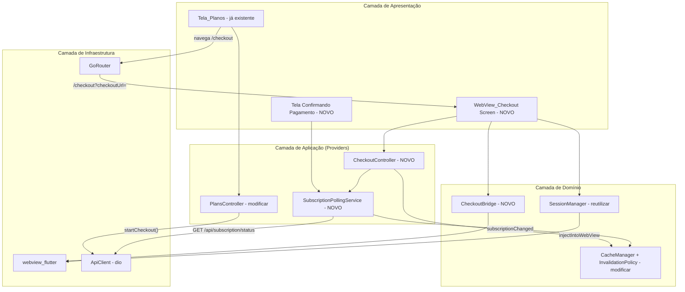
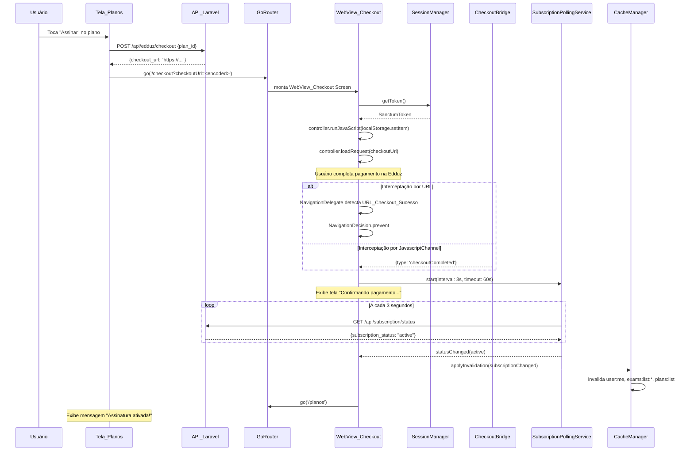
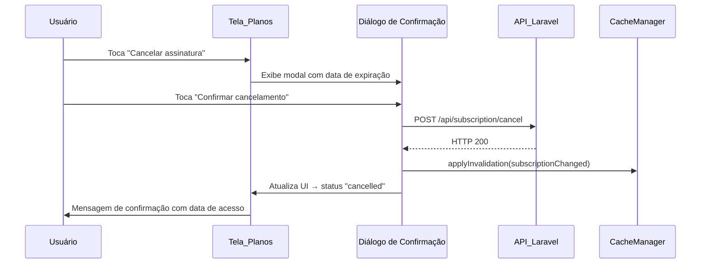

# Design Document

## Overview

Este design descreve a implementação do fluxo de assinatura via WebView embarcada (WebView_Checkout) no app Flutter "Operação Alfa". O componente substitui o comportamento atual que abre o checkout no navegador externo (via `url_launcher`) por uma experiência nativa imersiva, mantendo o token de autenticação injetado, interceptando URLs de sucesso/cancelamento e detectando automaticamente a ativação da assinatura via polling.

O design segue os mesmos padrões já consolidados na WebView_Simulado:
- Injeção de token via `SessionManager.injectIntoWebView` antes do `loadRequest`
- Comunicação JavaScript ↔ Flutter via `JavascriptChannel("OperacaoAlfaApp")`
- `NavigationDelegate` para interceptar URLs e bloquear domínios externos
- `PopScope` para tratamento do botão voltar com diálogo de confirmação
- Rota fora do `ShellRoute` para ocultar a `Bottom_Navigation`

A principal diferença em relação à WebView_Simulado é a adição de um serviço de **polling** pós-checkout que monitora `GET /api/subscription/status` para detectar a ativação da assinatura, seguido de invalidação de cache e navegação de retorno.

### Design Decisions e Justificativas

| Decisão | Alternativas Consideradas | Justificativa |
|---------|---------------------------|---------------|
| WebView embarcada com `webview_flutter` | Navegador externo (atual), `flutter_inappwebview` | Permite injetar token sem expor ao SO, mantém controle sobre navegação e detecção de conclusão. `webview_flutter` é o pacote já utilizado. |
| Polling de 3s por 60s (max 20 tentativas) | WebSocket, push notification | A API Laravel não expõe WebSocket; push exigiria dependência do webhook da Edduz que pode atrasar. Polling simples é confiável e o intervalo é curto o suficiente para UX aceitável. |
| Dual-detection (URL + JavascriptChannel) | Apenas URL, apenas JS channel | A Edduz pode ou não injetar `postMessage`. A interceptação de URL é fallback garantido. O mecanismo de deduplicação (flag `_checkoutCompleted`) previne processamento duplo. |
| `checkoutUrl` como query parameter em `/checkout` | Extra param via `go_router` state | Query parameter sobrevive a redirecionamentos do GoRouter e suporta deep linking. O `state.extra` se perde em restore de estado. |
| Reutilização do `CheckoutBridge` (novo) separado do `WebViewBridge` existente | Estender WebViewBridge com novos tipos | O WebViewBridge existente é acoplado ao conceito de simulado (`ExamFinishedEvent`). Um bridge separado mantém coesão e evita poluir o contrato do simulado. |
| Invalidação expandida (`user:me` + `exams:list:*` + `plans:list`) | Apenas `user:me` | O `subscription_status` afeta tanto a listagem de planos quanto o indicador premium/gratuito nos simulados. A invalidação atômica garante consistência. |

## Architecture

### Visão de Alto Nível — Módulos Envolvidos



### Estrutura de Pastas (Novos Arquivos)

```
alfa-quest/lib/
├── features/
│   └── plans/
│       ├── providers/
│       │   ├── plans_controller.dart           # MODIFICAR — rota interna em vez de url_launcher
│       │   └── checkout_controller.dart        # NOVO — orquestra o fluxo de checkout
│       ├── screens/
│       │   ├── plans_screen.dart               # MODIFICAR — navega para /checkout
│       │   └── webview_checkout_screen.dart    # NOVO — tela da WebView_Checkout
│       ├── widgets/
│       │   ├── confirming_payment_view.dart    # NOVO — UI de "Confirmando pagamento..."
│       │   └── cancel_subscription_dialog.dart # NOVO — diálogo aprimorado de cancelamento
│       └── services/
│           ├── checkout_bridge.dart            # NOVO — JavascriptChannel para checkout
│           └── subscription_polling_service.dart # NOVO — polling de status
├── core/
│   ├── cache/
│   │   └── invalidation_policy.dart           # MODIFICAR — adicionar plans:list
│   └── utils/
│       └── url_patterns.dart                  # MODIFICAR — adicionar patterns de checkout
└── routing/
    ├── app_router.dart                        # MODIFICAR — adicionar rota /checkout
    └── route_paths.dart                       # MODIFICAR — adicionar checkout path
```

### Diagrama de Sequência — Fluxo Principal (Sucesso)



### Diagrama de Sequência — Cancelamento



## Components and Interfaces

### CheckoutController (Riverpod AsyncNotifier)

Orquestra o fluxo completo do checkout dentro da WebView_Checkout Screen. Gerencia os estados da tela (loading, webview, confirming, error, timeout).

```dart
/// Estados possíveis da tela de checkout.
enum CheckoutScreenState {
  /// Injetando token e carregando URL na WebView.
  loading,
  /// WebView ativa — usuário interagindo com Checkout_Edduz.
  webviewActive,
  /// Checkout concluído — polling ativo, exibindo tela de confirmação.
  confirmingPayment,
  /// Polling concluiu com sucesso — assinatura ativada.
  success,
  /// Polling timeout — pagamento sendo processado.
  timeout,
  /// Erro no carregamento ou na WebView.
  error,
}

/// Controlador para a tela de checkout WebView.
///
/// Responsabilidades:
/// - Validar checkoutUrl recebida via query parameter.
/// - Coordenar injeção de token e carregamento da WebView.
/// - Reagir a eventos do CheckoutBridge e NavigationDelegate.
/// - Disparar e gerenciar o SubscriptionPollingService.
/// - Invalidar cache e navegar após conclusão.
///
/// Validates: Requirements 1, 2, 3, 4, 5, 6, 7, 8, 9.
abstract class CheckoutController {
  /// Estado atual da tela.
  CheckoutScreenState get screenState;

  /// Inicia o fluxo: valida URL, injeta token, carrega WebView.
  Future<void> initialize(String checkoutUrl);

  /// Chamado quando checkout é concluído (URL ou JS channel).
  /// Inicia polling. Ignora chamadas duplicadas.
  Future<void> onCheckoutCompleted({String? transactionId});

  /// Chamado quando checkout é cancelado (URL ou JS channel).
  void onCheckoutCancelled();

  /// Chamado quando checkout resulta em erro (JS channel).
  void onCheckoutError(String errorMessage);

  /// Tenta recarregar a WebView após erro.
  Future<void> retry();

  /// Dispara verificação manual (botão "Verificar novamente" no timeout).
  Future<void> checkStatusManually();

  /// Cancela polling e libera recursos.
  void dispose();
}
```

### CheckoutBridge (JavascriptChannel)

Canal de comunicação nativo para a WebView_Checkout. Aceita mensagens JSON com tipos `checkoutCompleted`, `checkoutCancelled` e `checkoutError`.

```dart
/// Eventos emitidos pelo CheckoutBridge.
sealed class CheckoutBridgeEvent {
  const CheckoutBridgeEvent();
}

class CheckoutCompletedEvent extends CheckoutBridgeEvent {
  final String? transactionId;
  const CheckoutCompletedEvent({this.transactionId});
}

class CheckoutCancelledEvent extends CheckoutBridgeEvent {
  const CheckoutCancelledEvent();
}

class CheckoutErrorEvent extends CheckoutBridgeEvent {
  final String errorMessage;
  const CheckoutErrorEvent({required this.errorMessage});
}

/// Ponte JavaScript ↔ Flutter para o fluxo de checkout.
///
/// Expõe o canal "OperacaoAlfaApp" (mesmo nome do simulado) para que a
/// página de checkout Edduz possa comunicar eventos ao app nativo.
///
/// Mensagens esperadas:
/// - `{type: "checkoutCompleted", transactionId: "..."}` → pagamento ok
/// - `{type: "checkoutCancelled"}` → usuário cancelou
/// - `{type: "checkoutError", errorMessage: "..."}` → erro no checkout
///
/// Mensagens malformadas ou com tipo desconhecido são ignoradas com log.
///
/// Validates: Requirements 3.1, 3.2, 3.3, 3.4, 3.5, 3.6, 3.7.
abstract class CheckoutBridge {
  /// Registra o JavascriptChannel no [controller].
  void attach(
    WebViewController controller, {
    required void Function(CheckoutBridgeEvent) onEvent,
  });
}

class CheckoutBridgeImpl implements CheckoutBridge {
  static const channelName = 'OperacaoAlfaApp';

  @override
  void attach(
    WebViewController controller, {
    required void Function(CheckoutBridgeEvent) onEvent,
  }) {
    controller.addJavaScriptChannel(
      channelName,
      onMessageReceived: (JavaScriptMessage msg) {
        _handleMessage(msg.message, onEvent);
      },
    );
  }

  void _handleMessage(
    String rawMessage,
    void Function(CheckoutBridgeEvent) onEvent,
  ) {
    final Map<String, dynamic> payload;
    try {
      final decoded = jsonDecode(rawMessage);
      if (decoded is! Map<String, dynamic>) {
        _log('Payload is not a JSON object');
        return;
      }
      payload = decoded;
    } on FormatException catch (e) {
      _log('Invalid JSON: ${e.message}');
      return;
    }

    final type = payload['type'];
    if (type is! String) {
      _log('Missing or invalid "type" field');
      return;
    }

    switch (type) {
      case 'checkoutCompleted':
        onEvent(CheckoutCompletedEvent(
          transactionId: payload['transactionId'] as String?,
        ));
      case 'checkoutCancelled':
        onEvent(const CheckoutCancelledEvent());
      case 'checkoutError':
        final errorMsg = payload['errorMessage'] as String? ?? 'Unknown error';
        onEvent(CheckoutErrorEvent(errorMessage: errorMsg));
      default:
        _log('Unknown message type: $type');
    }
  }

  void _log(String reason) {
    debugPrint('[CheckoutBridge] MalformedMessage(reason=$reason)');
  }
}
```

### SubscriptionPollingService

Serviço que consulta periodicamente o status da assinatura após a conclusão do checkout.

```dart
/// Resultado do polling de status.
sealed class PollingResult {
  const PollingResult();
}

/// Assinatura ativada com sucesso.
class PollingSuccess extends PollingResult {
  final SubscriptionStatusResponse status;
  const PollingSuccess(this.status);
}

/// Polling atingiu o timeout sem detectar ativação.
class PollingTimeout extends PollingResult {
  const PollingTimeout();
}

/// Status mudou para cancelled/inactive — erro no pagamento.
class PollingPaymentFailed extends PollingResult {
  final SubscriptionStatus status;
  const PollingPaymentFailed(this.status);
}

/// Serviço de polling para detecção de mudança de status da assinatura.
///
/// Consulta GET /api/subscription/status a cada [interval] por no máximo
/// [timeout]. Ignora falhas pontuais de rede e continua até o timeout.
///
/// Validates: Requirements 5.1, 5.2, 5.3, 5.4, 5.5, 5.6, 5.7.
abstract class SubscriptionPollingService {
  /// Inicia o polling. Retorna o resultado final quando o polling termina
  /// (sucesso, timeout ou pagamento falhou).
  Future<PollingResult> start({
    Duration interval = const Duration(seconds: 3),
    Duration timeout = const Duration(seconds: 60),
  });

  /// Executa uma única consulta manual (botão "Verificar novamente").
  Future<SubscriptionStatusResponse> checkOnce();

  /// Cancela o polling imediatamente e libera recursos.
  void cancel();

  /// Se o polling está ativo.
  bool get isActive;
}

class SubscriptionPollingServiceImpl implements SubscriptionPollingService {
  SubscriptionPollingServiceImpl({required PlanRepository planRepository})
    : _planRepository = planRepository;

  final PlanRepository _planRepository;
  Timer? _timer;
  Completer<PollingResult>? _completer;
  bool _cancelled = false;
  int _attempts = 0;

  @override
  bool get isActive => _timer?.isActive ?? false;

  @override
  Future<PollingResult> start({
    Duration interval = const Duration(seconds: 3),
    Duration timeout = const Duration(seconds: 60),
  }) async {
    _cancelled = false;
    _attempts = 0;
    _completer = Completer<PollingResult>();

    final maxAttempts = (timeout.inMilliseconds / interval.inMilliseconds).ceil();

    _timer = Timer.periodic(interval, (_) async {
      if (_cancelled) return;
      _attempts++;

      try {
        final response = await _planRepository.getSubscriptionStatus();

        if (response.status == SubscriptionStatus.active) {
          _finish(PollingSuccess(response));
          return;
        }

        if (response.status == SubscriptionStatus.cancelled ||
            response.status == SubscriptionStatus.inactive) {
          // Apenas trata como falha se já houve polling suficiente
          if (_attempts > 3) {
            _finish(PollingPaymentFailed(response.status));
            return;
          }
        }
      } catch (_) {
        // Ignora falhas pontuais (Req 5.5) — continua o polling.
      }

      if (_attempts >= maxAttempts) {
        _finish(const PollingTimeout());
      }
    });

    return _completer!.future;
  }

  @override
  Future<SubscriptionStatusResponse> checkOnce() {
    return _planRepository.getSubscriptionStatus();
  }

  @override
  void cancel() {
    _cancelled = true;
    _timer?.cancel();
    _timer = null;
    if (_completer != null && !_completer!.isCompleted) {
      _completer!.complete(const PollingTimeout());
    }
  }

  void _finish(PollingResult result) {
    _timer?.cancel();
    _timer = null;
    if (_completer != null && !_completer!.isCompleted) {
      _completer!.complete(result);
    }
  }
}
```

### WebViewCheckoutScreen (StatefulWidget + ConsumerState)

Tela imersiva (fora do ShellRoute) que hospeda a WebView de checkout. Segue exatamente o padrão da `WebViewSimuladoScreen`.

```dart
/// Tela da WebView de Checkout — fora do ShellRoute (sem BottomNav).
///
/// Responsabilidades:
/// - Validar checkoutUrl do query parameter (Req 9.2, 9.3).
/// - Injetar token antes do loadUrl (Req 2.1).
/// - Configurar NavigationDelegate para interceptar URLs (Req 4.1-4.8).
/// - Registrar CheckoutBridge para mensagens JS (Req 3.1-3.7).
/// - PopScope com diálogo de abandono (Req 8.1-8.5).
/// - Timeout de 30s no carregamento inicial (Req 4.8).
/// - Flag _checkoutCompleted para deduplicação (Req 4.7).
/// - Transição para ConfirmingPaymentView quando polling ativo (Req 5.4).
///
/// Validates: Requirements 1-9.
class WebViewCheckoutScreen extends ConsumerStatefulWidget {
  const WebViewCheckoutScreen({required this.checkoutUrl, super.key});
  final String checkoutUrl;
  // ...
}
```

### Modificações no GoRouter

```dart
// Em route_paths.dart — ADICIONAR:
/// Checkout WebView — fora do shell (sem BottomNav). Req 7.1, 9.1.
static const String checkout = '/checkout';

/// Gera path com query parameter para navegação.
static String checkoutPath(String checkoutUrl) =>
    '/checkout?checkoutUrl=${Uri.encodeComponent(checkoutUrl)}';

// Em app_router.dart — ADICIONAR (fora do ShellRoute):
GoRoute(
  path: RoutePaths.checkout,
  redirect: (context, state) {
    final checkoutUrl = state.uri.queryParameters['checkoutUrl'];
    if (checkoutUrl == null || checkoutUrl.isEmpty) {
      return RoutePaths.planos;
    }
    final uri = Uri.tryParse(checkoutUrl);
    if (uri == null || uri.scheme != 'https') {
      return RoutePaths.planos;
    }
    return null; // permite navegação normal
  },
  builder: (context, state) => WebViewCheckoutScreen(
    checkoutUrl: state.uri.queryParameters['checkoutUrl']!,
  ),
),
```

### Modificações na InvalidationPolicy

```dart
// Em invalidation_policy.dart — EXPANDIR subscriptionChanged:
CacheInvalidationEvent.subscriptionChanged: [
  CacheKeys.userMe,
  'exams:list:*',
  'plans:list',  // NOVO — invalida cache de planos após mudança de assinatura
],
```

### URL Patterns para Checkout

```dart
// Em url_patterns.dart — ADICIONAR:

/// Pattern para URL de sucesso do checkout Edduz.
/// Exemplos: `/checkout/success`, `/obrigado`, `/checkout/obrigado`
final RegExp kUrlCheckoutSuccessPattern = RegExp(
  r'/(checkout/success|obrigado|checkout/obrigado)/?$',
  caseSensitive: false,
);

/// Pattern para URL de cancelamento do checkout Edduz.
/// Exemplos: `/checkout/cancel`, `/checkout/cancelado`
final RegExp kUrlCheckoutCancelPattern = RegExp(
  r'/(checkout/cancel|checkout/cancelado)/?$',
  caseSensitive: false,
);

/// Hosts permitidos para o checkout Edduz.
/// A Edduz pode usar subdomínios diferentes para o checkout.
const Set<String> kEdduzHosts = <String>{
  'edduz.com',
  'checkout.edduz.com',
  'pay.edduz.com',
};

/// Retorna true se a URL pertence ao domínio do sistema ou ao Edduz.
bool isAllowedCheckoutHost(Uri uri) =>
    isHostFromDomain(uri) || kEdduzHosts.any((h) => uri.host.endsWith(h));

/// Retorna true se o path corresponde à URL de sucesso do checkout.
bool isCheckoutSuccessPath(String path) =>
    kUrlCheckoutSuccessPattern.hasMatch(path);

/// Retorna true se o path corresponde à URL de cancelamento do checkout.
bool isCheckoutCancelPath(String path) =>
    kUrlCheckoutCancelPattern.hasMatch(path);
```

### Modificações na PlansScreen e PlansController

A `PlansScreen` terá o botão "Assinar" modificado para navegar internamente em vez de abrir o browser externo:

```dart
// Em _PlanCard._handleSubscribe — SUBSTITUIR url_launcher por:
Future<void> _handleSubscribe(BuildContext context, WidgetRef ref) async {
  // Exibir loading no botão (Req 1.6)
  setState(() => _isLoading = true);

  try {
    final checkoutUrl = await ref
        .read(plansControllerProvider.notifier)
        .startCheckout(plan.id);

    if (context.mounted) {
      // Navegar para a rota de checkout (Req 1.2, 9.1)
      context.go(RoutePaths.checkoutPath(checkoutUrl));
    }
  } on ValidationException catch (e) {
    // HTTP 422 (Req 1.3)
    if (context.mounted) {
      ScaffoldMessenger.of(context).showSnackBar(
        SnackBar(content: Text(e.firstMessage)),
      );
    }
  } on UnauthorizedException {
    // HTTP 401 (Req 1.5) — handled by UnauthorizedInterceptor
  } catch (e) {
    // Rede/timeout/5xx (Req 1.4, 1.7)
    if (context.mounted) {
      ScaffoldMessenger.of(context).showSnackBar(
        SnackBar(
          content: const Text('Não foi possível iniciar o checkout.'),
          action: SnackBarAction(
            label: 'Tentar novamente',
            onPressed: () => _handleSubscribe(context, ref),
          ),
        ),
      );
    }
  } finally {
    if (mounted) setState(() => _isLoading = false);
  }
}
```

## Data Models

### Modelos Existentes (Reutilizados)

| Modelo | Arquivo | Uso |
|--------|---------|-----|
| `Plan` | `data/models/plan.dart` | Exibição de planos disponíveis |
| `CheckoutResponse` | `data/models/checkout_response.dart` | Resposta do POST /api/edduz/checkout |
| `SubscriptionStatusResponse` | `data/repositories/plan_repository.dart` | Resposta do polling GET /api/subscription/status |
| `SanctumToken` | `data/models/sanctum_token.dart` | Token injetado na WebView |

### Modelo Novo: CheckoutState (Riverpod State)

```dart
@freezed
abstract class CheckoutState with _$CheckoutState {
  /// WebView carregando a URL de checkout.
  const factory CheckoutState.loading() = CheckoutStateLoading;

  /// WebView ativa — usuário interagindo.
  const factory CheckoutState.active() = CheckoutStateActive;

  /// Confirmando pagamento (polling ativo).
  const factory CheckoutState.confirming({
    required int attemptCount,
    required int maxAttempts,
  }) = CheckoutStateConfirming;

  /// Sucesso — assinatura ativada.
  const factory CheckoutState.success() = CheckoutStateSuccess;

  /// Timeout — pagamento ainda processando.
  const factory CheckoutState.timeout() = CheckoutStateTimeout;

  /// Erro no checkout ou carregamento.
  const factory CheckoutState.error({
    required String message,
    required bool canRetry,
  }) = CheckoutStateError;

  /// Cancelado pelo usuário.
  const factory CheckoutState.cancelled() = CheckoutStateCancelled;

  factory CheckoutState.fromJson(Map<String, dynamic> json) =>
      _$CheckoutStateFromJson(json);
}
```

### Contratos de API Relevantes

| Endpoint | Método | Request | Response | Timeout |
|----------|--------|---------|----------|---------|
| `/api/edduz/checkout` | POST | `{plan_id: string}` | `{checkout_url: string}` | 15s |
| `/api/subscription/status` | GET | — | `{subscription_status: string, subscription_expires_at: string?, subscription_platform_id: string?}` | 15s |
| `/api/subscription/cancel` | POST | — | `{message: string}` | 15s |


## Correctness Properties

*A property is a characteristic or behavior that should hold true across all valid executions of a system — essentially, a formal statement about what the system should do. Properties serve as the bridge between human-readable specifications and machine-verifiable correctness guarantees.*

### Property 1: Checkout URL Validation

*For any* string retornada como `checkout_url` pela API, a função de validação de URL de checkout SHALL aceitar a URL se e somente se ela possui esquema `https` e é parseable como URI válido. Qualquer outro esquema (`http`, `ftp`, string vazia, URI malformado) SHALL ser rejeitado e resultar em redirecionamento para `/planos`.

**Validates: Requirements 1.2, 9.2, 9.3**

### Property 2: Token Injection JS Escaping Round-Trip

*For any* string de token de autenticação (incluindo caracteres especiais como aspas simples, aspas duplas, barras invertidas, caracteres Unicode e strings vazias), a função de geração do JavaScript de injeção SHALL produzir um script que, quando executado em um contexto JavaScript, armazena no localStorage exatamente o valor original do token sem corrupção.

**Validates: Requirements 2.1, 2.5**

### Property 3: CheckoutBridge Message Parsing

*For any* string recebida pelo JavascriptChannel, o CheckoutBridge SHALL despachar exatamente um `CheckoutCompletedEvent` quando a mensagem é JSON válido com `type == "checkoutCompleted"`, exatamente um `CheckoutCancelledEvent` quando `type == "checkoutCancelled"`, exatamente um `CheckoutErrorEvent` quando `type == "checkoutError"`, e SHALL não emitir nenhum evento e não lançar exceção quando a mensagem é JSON malformado, não é um objeto JSON, ou possui campo `type` ausente ou não reconhecido.

**Validates: Requirements 3.2, 3.3, 3.4, 3.5, 3.6**

### Property 4: Checkout URL Path Pattern Matching

*For any* URL path string, a função `isCheckoutSuccessPath` SHALL retornar `true` se e somente se o path corresponde a um dos padrões configurados de sucesso (`/checkout/success`, `/obrigado`, `/checkout/obrigado`), e a função `isCheckoutCancelPath` SHALL retornar `true` se e somente se o path corresponde a um padrão de cancelamento (`/checkout/cancel`, `/checkout/cancelado`). Os dois conjuntos de padrões SHALL ser mutuamente exclusivos (nenhum path pode satisfazer ambos).

**Validates: Requirements 4.2, 4.3**

### Property 5: Navigation Host Validation

*For any* URI, a função `isAllowedCheckoutHost` SHALL retornar `true` se e somente se o host da URI pertence ao `kDominioSistema` ou ao `kEdduzHosts`. URLs com hosts fora desses conjuntos SHALL ser classificadas como externas (navegação bloqueada na WebView).

**Validates: Requirements 4.4, 4.5**

### Property 6: Checkout Completion Idempotency

*For any* sequência de N chamadas (N ≥ 1) ao método `onCheckoutCompleted` do `CheckoutController`, o polling de status SHALL ser iniciado exatamente uma vez. Chamadas subsequentes após a primeira SHALL ser ignoradas sem efeito colateral.

**Validates: Requirements 4.7**

### Property 7: Polling Termination Conditions

*For any* sequência de respostas do endpoint `GET /api/subscription/status` (incluindo respostas bem-sucedidas com qualquer `subscription_status` e falhas de rede), o `SubscriptionPollingService` SHALL terminar com `PollingSuccess` na primeira resposta com `status == active`, SHALL terminar com `PollingPaymentFailed` se após 3+ tentativas o status é `cancelled` ou `inactive`, SHALL ignorar falhas pontuais de rede sem interromper o polling, e SHALL terminar com `PollingTimeout` após exatamente `ceil(timeout / interval)` tentativas se nenhuma das condições anteriores for satisfeita.

**Validates: Requirements 5.1, 5.2, 5.3, 5.5, 5.6**

### Property 8: Cache Invalidation Completeness

*For any* invocação de `applyInvalidation(CacheInvalidationEvent.subscriptionChanged, ...)`, o sistema SHALL invalidar exatamente as chaves `user:me`, todas as chaves com prefixo `exams:list:`, e a chave `plans:list`, de forma que nenhuma dessas entradas persista no cache após a operação.

**Validates: Requirements 6.1**

## Error Handling

### Erros de Rede e Timeouts

| Cenário | Comportamento | Requisito |
|---------|---------------|-----------|
| POST /api/edduz/checkout timeout (15s) | Exibe mensagem + botão "Tentar novamente" na Tela_Planos | 1.4 |
| POST /api/edduz/checkout HTTP 422 | Exibe mensagem de validação da API | 1.3 |
| POST /api/edduz/checkout HTTP 401 | Encerra sessão → tela de login (via UnauthorizedInterceptor) | 1.5 |
| POST /api/edduz/checkout HTTP 5xx | Mensagem genérica "serviço temporariamente indisponível" + retry | 1.7 |
| WebView_Checkout falha no carregamento (30s timeout) | Tela de erro com "Tentar novamente" e "Voltar" | 4.8 |
| Injeção de token falha (5s timeout) | Aborta WebView, mensagem de sessão expirada | 2.5 |
| Token ausente ao abrir checkout | Redireciona para login | 2.4 |
| Polling falha pontual (rede/5xx) | Ignora e continua polling | 5.5 |
| POST /api/subscription/cancel falha | Fecha diálogo, exibe erro, mantém estado anterior | 10.5 |
| GET /api/subscription/status falha (restaurar compra) | Exibe erro com "Tentar novamente" | 11.5 |
| Recarregamento pós-invalidação falha | Exibe dados antigos + indicador + "Tentar novamente" | 6.6 |

### Estratégia de Retry

- **Checkout API**: Retry manual via botão. Sem retry automático para evitar cobranças duplicadas.
- **Polling**: Retry automático implícito no ciclo de polling (falhas são ignoradas).
- **Cancelamento**: Retry manual. Sem retry automático.
- **Restauração**: Retry manual via botão.

### Deduplicação de Eventos

A flag `_checkoutCompleted` no `CheckoutController` garante que mesmo se ambos os mecanismos de detecção (URL interception + JavascriptChannel) disparem, apenas o primeiro evento é processado:

```dart
bool _checkoutCompleted = false;

Future<void> onCheckoutCompleted({String? transactionId}) async {
  if (_checkoutCompleted) return; // Idempotent — ignora duplicatas
  _checkoutCompleted = true;
  // ... inicia polling
}
```

## Testing Strategy

### Abordagem Dual: Testes de Propriedade + Testes de Exemplo

O projeto utiliza **property-based testing** via `glados` (já configurado no projeto) para validar propriedades universais, complementado por testes de exemplo para cenários específicos e de integração.

### Property-Based Tests (PBT)

Library: `glados` (já dependência do projeto)
Configuração: mínimo 100 iterações por propriedade.

Cada teste referencia sua propriedade do design:

| Propriedade | Arquivo de Teste | Tag |
|-------------|------------------|-----|
| Property 1: Checkout URL Validation | `test/property/checkout_url_validation_test.dart` | Feature: android-subscription-webview, Property 1: Checkout URL Validation |
| Property 2: Token Injection JS Escaping | `test/property/token_injection_escaping_test.dart` | Feature: android-subscription-webview, Property 2: Token Injection JS Escaping Round-Trip |
| Property 3: CheckoutBridge Message Parsing | `test/property/checkout_bridge_parsing_test.dart` | Feature: android-subscription-webview, Property 3: CheckoutBridge Message Parsing |
| Property 4: Checkout URL Path Pattern Matching | `test/property/checkout_url_pattern_test.dart` | Feature: android-subscription-webview, Property 4: Checkout URL Path Pattern Matching |
| Property 5: Navigation Host Validation | `test/property/checkout_host_validation_test.dart` | Feature: android-subscription-webview, Property 5: Navigation Host Validation |
| Property 6: Checkout Completion Idempotency | `test/property/checkout_idempotency_test.dart` | Feature: android-subscription-webview, Property 6: Checkout Completion Idempotency |
| Property 7: Polling Termination Conditions | `test/property/subscription_polling_test.dart` | Feature: android-subscription-webview, Property 7: Polling Termination Conditions |
| Property 8: Cache Invalidation Completeness | `test/property/cache_invalidation_subscription_test.dart` | Feature: android-subscription-webview, Property 8: Cache Invalidation Completeness |

### Unit Tests (Exemplos e Edge Cases)

| Componente | Cenários |
|------------|----------|
| `PlansController.startCheckout` | HTTP 200, 422, 401, 5xx, timeout |
| `WebViewCheckoutScreen` | Loading state, error state, abandon dialog, back navigation |
| `SubscriptionPollingService` | Cancel durante polling, dispose limpa timer |
| `CancelSubscriptionDialog` | Confirmação, cancelamento, loading state no botão |
| `CheckoutRoute redirect` | URL válida, URL inválida, sem parâmetro, não autenticado |

### Widget Tests

| Widget | Cenários |
|--------|----------|
| `WebViewCheckoutScreen` | Exibe loading → WebView → confirming → success |
| `ConfirmingPaymentView` | Animação de progresso, mensagem correta |
| `PlansScreen` | Botão Assinar com loading, Restaurar compra, Cancelar assinatura |
| `CancelSubscriptionDialog` | Data formatada, botões habilitados/desabilitados |

### Integration Tests

| Fluxo | Arquivo |
|-------|---------|
| Checkout completo (mock API) | `integration_test/checkout_flow_test.dart` |
| Cancelamento de assinatura | `integration_test/cancel_subscription_test.dart` |
| Restauração de compra | `integration_test/restore_purchase_test.dart` |
| Cache invalidation após checkout | `integration_test/cache_invalidation_test.dart` |
