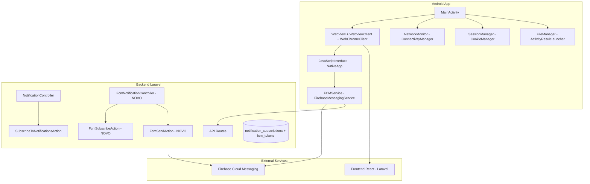
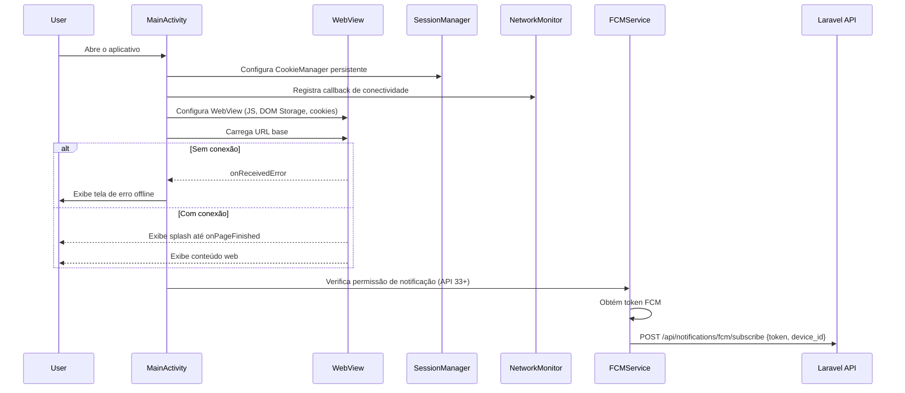
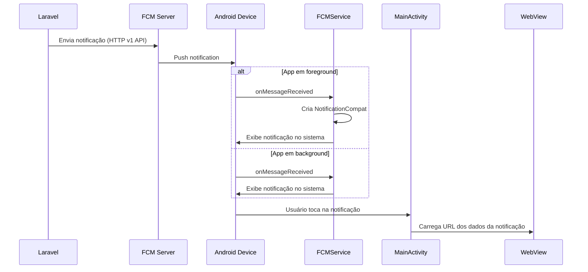

# Design Document: Android WebView App — Operação Alfa

## Overview

Este documento descreve o design técnico do aplicativo Android "Operação Alfa", que encapsula o frontend web existente (React servido por Laravel) em uma WebView nativa Android. O aplicativo oferece experiência nativa mantendo sessões de login persistentes, notificações push via Firebase Cloud Messaging (FCM), navegação intuitiva com botão voltar, upload de arquivos e tratamento de erros de rede.

### Decisões Arquiteturais Chave

1. **Single-Activity Architecture**: O app usa uma única `MainActivity` com a WebView como componente central, simplificando o ciclo de vida e a navegação.

2. **Adaptação do Backend para FCM**: O backend atual usa Web Push API (VAPID) com `endpoint`, `p256dh` e `auth`. Tokens FCM são fundamentalmente diferentes — são strings simples sem chaves criptográficas. O backend precisa de um novo endpoint dedicado (`POST /api/notifications/fcm/subscribe`) para registrar tokens FCM, e um novo canal de envio que use a Firebase Admin SDK (ou HTTP v1 API) para entregar notificações a dispositivos Android. Isso mantém o sistema Web Push existente intacto.

3. **JavaScriptInterface para Bridge Nativo**: Uma interface JavaScript exposta à WebView permite que o frontend React detecte o ambiente nativo e solicite o token FCM, evitando conflitos com o service worker de Web Push.

4. **CookieManager Persistente**: Cookies são persistidos via `CookieManager` com flush explícito, garantindo que sessões de autenticação sobrevivam a reinicializações do app.

## Architecture

### Diagrama de Componentes



### Fluxo de Inicialização



### Fluxo de Notificação Push



## Components and Interfaces

### 1. MainActivity

Atividade principal e única do aplicativo. Gerencia o ciclo de vida da WebView e coordena todos os componentes.

```kotlin
class MainActivity : AppCompatActivity() {
    private lateinit var webView: WebView
    private lateinit var networkMonitor: NetworkMonitor
    private var fileUploadCallback: ValueCallback<Array<Uri>>? = null
    private val fileChooserLauncher: ActivityResultLauncher<Intent>
    
    // Lifecycle
    fun onCreate(savedInstanceState: Bundle?)
    fun onBackPressed()  // Delega ao WebView ou mostra diálogo de saída
    fun onDestroy()      // Flush cookies, libera WebView
    
    // WebView setup
    private fun setupWebView()
    private fun showSplashScreen()
    private fun hideSplashScreen()
    private fun showOfflineScreen()
    private fun hideOfflineScreen()
}
```

**Responsabilidades:**
- Configurar WebView com `WebSettings` (JavaScript, DOM Storage, cookies)
- Registrar `WebViewClient` para interceptar navegação e erros
- Registrar `WebChromeClient` para file uploads e progresso
- Adicionar `JavaScriptInterface` ("NativeApp")
- Gerenciar splash screen e tela de erro offline
- Tratar botão voltar (histórico WebView → diálogo de confirmação)

### 2. WebViewClient Customizado

```kotlin
class AppWebViewClient : WebViewClient() {
    // Intercepta navegação: links internos na WebView, externos no browser
    override fun shouldOverrideUrlLoading(view: WebView, request: WebResourceRequest): Boolean
    
    // Detecta erros de rede para exibir tela offline
    override fun onReceivedError(view: WebView, request: WebResourceRequest, error: WebResourceError)
    override fun onReceivedHttpError(view: WebView, request: WebResourceRequest, errorResponse: WebResourceResponse)
    
    // Esconde splash quando página termina de carregar
    override fun onPageFinished(view: WebView, url: String)
    
    // Aceita certificados SSL em debug (apenas para desenvolvimento local)
    override fun onReceivedSslError(view: WebView, handler: SslErrorHandler, error: SslError)
}
```

**Lógica de roteamento de URLs:**
- URLs que contêm o domínio base do sistema → navegação interna na WebView
- URLs externas → `Intent(ACTION_VIEW)` para abrir no navegador padrão

### 3. WebChromeClient Customizado

```kotlin
class AppWebChromeClient(
    private val onFileChooser: (ValueCallback<Array<Uri>>, WebChromeClient.FileChooserParams) -> Boolean
) : WebChromeClient() {
    // Delega file upload para MainActivity
    override fun onShowFileChooser(
        webView: WebView,
        filePathCallback: ValueCallback<Array<Uri>>,
        fileChooserParams: FileChooserParams
    ): Boolean
}
```

### 4. NativeAppInterface (JavaScriptInterface)

Bridge entre o frontend React e o app nativo.

```kotlin
class NativeAppInterface(private val context: Context) {
    @JavascriptInterface
    fun isNativeApp(): Boolean  // Retorna true — frontend detecta ambiente nativo
    
    @JavascriptInterface
    fun getFcmToken(): String   // Retorna token FCM atual ou string vazia
    
    @JavascriptInterface
    fun getAppVersion(): String // Retorna versionName do BuildConfig
}
```

**Uso no frontend React:**
```typescript
// Detectar se está na WebView nativa
const isNative = window.NativeApp?.isNativeApp() === true;

if (isNative) {
    const fcmToken = window.NativeApp.getFcmToken();
    // Enviar token FCM ao backend em vez de usar Web Push
}
```

### 5. FCMService (FirebaseMessagingService)

```kotlin
class FCMService : FirebaseMessagingService() {
    // Chamado quando um novo token é gerado ou atualizado
    override fun onNewToken(token: String)
    
    // Chamado quando uma mensagem push é recebida
    override fun onMessageReceived(message: RemoteMessage)
    
    // Cria e exibe notificação do sistema
    private fun showNotification(title: String, body: String, url: String?)
    
    // Envia token ao backend
    private fun sendTokenToBackend(token: String)
    
    // Armazena token localmente para retry
    private fun storeTokenLocally(token: String)
}
```

**Formato esperado do payload FCM (data message):**
```json
{
    "data": {
        "title": "Novo Simulado Disponível",
        "body": "Um novo simulado de PM-SP foi adicionado!",
        "url": "/exams/123",
        "icon": "ic_notification"
    }
}
```

> **Decisão**: Usar `data messages` em vez de `notification messages` para garantir que `onMessageReceived` seja chamado tanto em foreground quanto em background, dando controle total sobre a exibição.

### 6. NetworkMonitor

```kotlin
class NetworkMonitor(context: Context) {
    private val connectivityManager: ConnectivityManager
    private var networkCallback: ConnectivityManager.NetworkCallback
    
    var isOnline: Boolean = true
        private set
    
    var onConnectivityChanged: ((Boolean) -> Unit)? = null
    
    fun register()
    fun unregister()
}
```

### 7. Componentes Backend (Novos)

#### 7.1 Novo Modelo: FcmToken

```php
class FcmToken extends Model {
    protected $fillable = ['user_id', 'token', 'device_id'];
    
    public function user(): BelongsTo;
}
```

#### 7.2 Novo Controller: FcmNotificationController

```php
class FcmNotificationController extends Controller {
    // POST /api/notifications/fcm/subscribe
    public function subscribe(Request $request): JsonResponse;
    
    // POST /api/notifications/fcm/unsubscribe  
    public function unsubscribe(Request $request): JsonResponse;
}
```

**Request de subscribe:**
```json
{
    "token": "fcm-device-token-string",
    "device_id": "unique-device-identifier"
}
```

#### 7.3 Nova Action: FcmSendNotificationAction

Usa a Firebase Admin SDK para PHP (ou HTTP v1 API via Guzzle) para enviar notificações a tokens FCM registrados.

```php
class FcmSendNotificationAction {
    public function execute(string $userId, NotificationData $notification): array;
    public function sendToAll(NotificationData $notification): array;
}
```

> **Decisão**: Manter o sistema Web Push (VAPID) existente intacto e adicionar um canal FCM paralelo. O `SendNotificationAction` existente continua funcionando para browsers. Uma nova action `FcmSendNotificationAction` lida com dispositivos Android. Quando o admin envia uma notificação, ambos os canais são acionados.

## Data Models

### Android (SharedPreferences)

| Chave | Tipo | Descrição |
|-------|------|-----------|
| `fcm_token` | String | Token FCM atual do dispositivo |
| `fcm_token_synced` | Boolean | Se o token foi enviado ao backend com sucesso |
| `device_id` | String | UUID único gerado na primeira instalação |

### Backend (Nova tabela: `fcm_tokens`)

| Coluna | Tipo | Descrição |
|--------|------|-----------|
| `id` | bigint (PK) | ID auto-incremento |
| `user_id` | bigint (FK → users) | Usuário dono do token |
| `token` | text | Token FCM do dispositivo |
| `device_id` | string(255) | Identificador único do dispositivo |
| `created_at` | timestamp | Data de criação |
| `updated_at` | timestamp | Data de atualização |

**Índices:**
- `unique(device_id)` — um token por dispositivo
- `index(user_id)` — busca por usuário

### Cookies e Session (WebView)

O `CookieManager` do Android persiste automaticamente os cookies do domínio do sistema, incluindo:
- Cookie de sessão Laravel (`laravel_session`)
- Token XSRF (`XSRF-TOKEN`)
- Qualquer cookie de "remember me"

