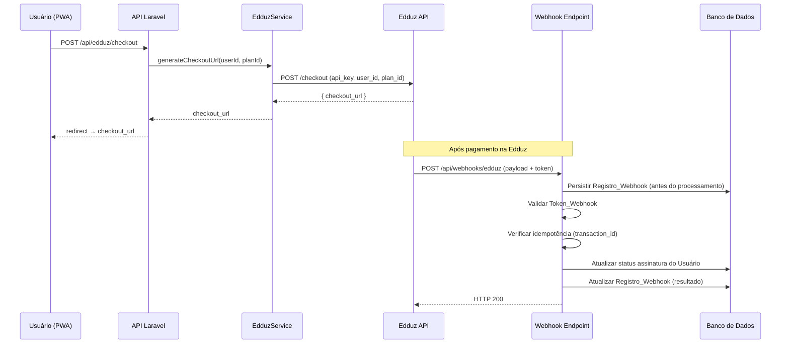
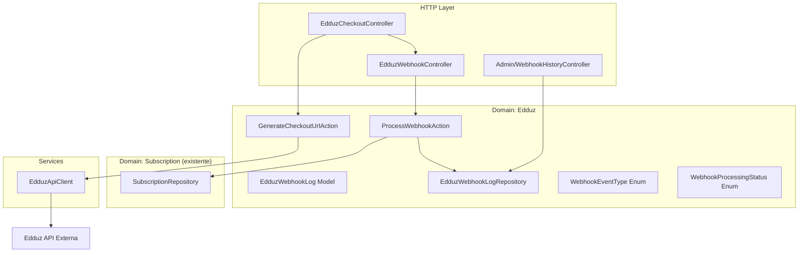

# Documento de Design — Integração de Assinaturas com Edduz

## Visão Geral

Este documento descreve o design técnico para integrar a plataforma Edduz como gateway de pagamento de assinaturas no sistema Operação Alpha. A integração abrange: geração de URL de checkout, recebimento e processamento de webhooks, persistência de histórico de webhooks para auditoria, e uma página administrativa para consulta desse histórico.

A solução segue a arquitetura Domain-Driven Design (DDD) já estabelecida no projeto, criando um novo domínio `Edduz` dentro de `app/Domain/` e reutilizando o domínio `Subscription` existente para atualização de status de assinatura.

## Arquitetura

### Diagrama de Fluxo Geral



### Diagrama de Componentes



### Decisões de Arquitetura

1. **Novo domínio `Edduz`**: Encapsula toda a lógica específica da integração (webhook log, enums, actions) separada do domínio `Subscription` existente. Isso permite trocar o gateway no futuro sem impactar a lógica de assinatura.

2. **`EdduzApiClient` como Service**: O cliente HTTP para a API da Edduz fica em `app/Services/EdduzApiClient.php`, seguindo o padrão já existente em `app/Services/`. Ele é responsável apenas pela comunicação HTTP.

3. **Persistência antes do processamento**: O webhook é salvo no banco antes de qualquer lógica de negócio, garantindo auditabilidade mesmo em caso de falha.

4. **Idempotência via `transaction_id`**: Coluna `transaction_id` com índice único na tabela `edduz_webhook_logs` garante que reenvios não causem efeitos colaterais.

5. **Configuração via `config/services.php`**: As credenciais da Edduz são adicionadas ao arquivo de configuração existente, lidas de variáveis de ambiente.


## Componentes e Interfaces

### 1. EdduzApiClient (`app/Services/EdduzApiClient.php`)

Responsável pela comunicação HTTP com a API da Edduz.

```php
class EdduzApiClient
{
    public function __construct(
        private string $baseUrl,
        private string $apiKey,
    ) {}

    /**
     * Gera URL de checkout na Edduz.
     * @throws EdduzApiException
     */
    public function createCheckoutSession(string $userId, string $planId): string;

    /**
     * Verifica se a configuração está completa.
     */
    public function isConfigured(): bool;
}
```

### 2. GenerateCheckoutUrlAction (`app/Domain/Edduz/Actions/GenerateCheckoutUrlAction.php`)

```php
class GenerateCheckoutUrlAction
{
    public function __construct(
        private EdduzApiClient $client,
        private SubscriptionRepository $subscriptionRepo,
    ) {}

    /**
     * Valida o plano, gera a URL de checkout e retorna.
     * @throws \Exception se o plano for inválido ou a API falhar.
     */
    public function execute(string $userId, string $planId): string;
}
```

### 3. ProcessWebhookAction (`app/Domain/Edduz/Actions/ProcessWebhookAction.php`)

Orquestra todo o fluxo de recebimento de webhook: persistência, validação de token, verificação de idempotência, e atualização de assinatura.

```php
class ProcessWebhookAction
{
    public function __construct(
        private EdduzWebhookLogRepository $webhookLogRepo,
        private SubscriptionRepository $subscriptionRepo,
    ) {}

    /**
     * Processa o webhook recebido.
     * Retorna o status HTTP e a mensagem de resposta.
     */
    public function execute(
        array $payload,
        string $ipAddress,
        array $headers,
        string $receivedToken,
    ): ProcessWebhookResult;
}
```

### 4. EdduzWebhookController (`app/Http/Controllers/Api/EdduzWebhookController.php`)

```php
class EdduzWebhookController extends Controller
{
    /**
     * POST /api/webhooks/edduz
     * Endpoint público (sem auth middleware).
     */
    public function handle(Request $request, ProcessWebhookAction $action): JsonResponse;
}
```

### 5. EdduzCheckoutController (`app/Http/Controllers/Api/EdduzCheckoutController.php`)

```php
class EdduzCheckoutController extends Controller
{
    /**
     * POST /api/edduz/checkout
     * Requer autenticação via Sanctum.
     */
    public function checkout(Request $request, GenerateCheckoutUrlAction $action): JsonResponse;
}
```

### 6. Admin/WebhookHistoryController (`app/Http/Controllers/Admin/WebhookHistoryController.php`)

```php
class WebhookHistoryController extends Controller
{
    /**
     * GET /admin/webhooks/edduz — Lista paginada com filtros.
     */
    public function index(Request $request, EdduzWebhookLogRepository $repo): View;

    /**
     * GET /admin/webhooks/edduz/{id} — Detalhes completos do registro.
     */
    public function show(int $id, EdduzWebhookLogRepository $repo): View;
}
```

### 7. EdduzWebhookLogRepository (`app/Domain/Edduz/Repositories/EdduzWebhookLogRepository.php`)

```php
class EdduzWebhookLogRepository
{
    public function create(array $data): EdduzWebhookLog;
    public function updateProcessingResult(int $id, WebhookProcessingStatus $status, ?string $errorMessage = null): void;
    public function findByTransactionId(string $transactionId): ?EdduzWebhookLog;
    public function paginate(array $filters = [], int $perPage = 20): LengthAwarePaginator;
    public function findOrFail(int $id): EdduzWebhookLog;
}
```

### Rotas

```php
// routes/api/edduz.php
Route::middleware('auth:sanctum')->group(function () {
    Route::post('/edduz/checkout', [EdduzCheckoutController::class, 'checkout']);
});

Route::post('/webhooks/edduz', [EdduzWebhookController::class, 'handle']);

// routes/web.php (dentro do grupo admin autenticado)
Route::prefix('webhooks')->name('webhooks.')->group(function () {
    Route::get('/edduz', [WebhookHistoryController::class, 'index'])->name('edduz.index');
    Route::get('/edduz/{id}', [WebhookHistoryController::class, 'show'])->name('edduz.show');
});
```


## Modelos de Dados

### Tabela `edduz_webhook_logs`

| Coluna | Tipo | Descrição |
|---|---|---|
| `id` | bigint (PK) | Identificador auto-incremento |
| `transaction_id` | string(255), unique, nullable | ID da transação na Edduz (chave de idempotência) |
| `event_type` | string(50) | Tipo do evento (`subscription_confirmed`, `subscription_cancelled`, `subscription_expired`) |
| `user_id` | bigint, nullable | FK para `users.id` (nullable pois o usuário pode não existir) |
| `payload` | json | Payload completo recebido da Edduz |
| `ip_address` | string(45) | Endereço IP de origem da requisição |
| `headers` | json | Cabeçalhos HTTP relevantes |
| `processing_status` | string(20) | Status do processamento (`success`, `error`, `duplicate`, `invalid_token`) |
| `error_message` | text, nullable | Mensagem de erro quando o processamento falha |
| `received_at` | timestamp | Data/hora de recebimento |
| `processed_at` | timestamp, nullable | Data/hora de conclusão do processamento |
| `created_at` | timestamp | Timestamp padrão do Laravel |
| `updated_at` | timestamp | Timestamp padrão do Laravel |

**Índices:**
- `unique: transaction_id` (idempotência)
- `index: event_type` (filtro na página admin)
- `index: processing_status` (filtro na página admin)
- `index: received_at` (ordenação e filtro por período)
- `index: user_id` (consulta por usuário)

### Enum `WebhookEventType` (`app/Domain/Edduz/Enums/WebhookEventType.php`)

```php
enum WebhookEventType: string
{
    case SUBSCRIPTION_CONFIRMED = 'subscription_confirmed';
    case SUBSCRIPTION_CANCELLED = 'subscription_cancelled';
    case SUBSCRIPTION_EXPIRED = 'subscription_expired';
}
```

### Enum `WebhookProcessingStatus` (`app/Domain/Edduz/Enums/WebhookProcessingStatus.php`)

```php
enum WebhookProcessingStatus: string
{
    case SUCCESS = 'success';
    case ERROR = 'error';
    case DUPLICATE = 'duplicate';
    case INVALID_TOKEN = 'invalid_token';
}
```

### Model `EdduzWebhookLog` (`app/Domain/Edduz/Models/EdduzWebhookLog.php`)

```php
class EdduzWebhookLog extends Model
{
    protected $fillable = [
        'transaction_id', 'event_type', 'user_id', 'payload',
        'ip_address', 'headers', 'processing_status',
        'error_message', 'received_at', 'processed_at',
    ];

    protected function casts(): array
    {
        return [
            'payload' => 'array',
            'headers' => 'array',
            'received_at' => 'datetime',
            'processed_at' => 'datetime',
        ];
    }

    public function user(): BelongsTo
    {
        return $this->belongsTo(User::class);
    }
}
```

### DTO `ProcessWebhookResult` (`app/Domain/Edduz/DTOs/ProcessWebhookResult.php`)

```php
class ProcessWebhookResult
{
    public function __construct(
        public readonly int $httpStatus,
        public readonly string $message,
        public readonly WebhookProcessingStatus $processingStatus,
    ) {}
}
```

### Configuração (`config/services.php`)

```php
'edduz' => [
    'api_url' => env('EDDUZ_API_URL'),
    'api_key' => env('EDDUZ_API_KEY'),
    'webhook_token' => env('EDDUZ_WEBHOOK_TOKEN'),
],
```

### Mapeamento Evento → Status de Assinatura

| Evento Edduz | SubscriptionStatus |
|---|---|
| `subscription_confirmed` | `ACTIVE` |
| `subscription_cancelled` | `INACTIVE` |
| `subscription_expired` | `EXPIRED` |


## Propriedades de Corretude

*Uma propriedade é uma característica ou comportamento que deve ser verdadeiro em todas as execuções válidas de um sistema — essencialmente, uma declaração formal sobre o que o sistema deve fazer. Propriedades servem como ponte entre especificações legíveis por humanos e garantias de corretude verificáveis por máquina.*

### Propriedade 1: Parâmetros do checkout contêm identificadores corretos

*Para qualquer* usuário válido e plano pago, a requisição de checkout enviada à API da Edduz deve conter o identificador do usuário e o identificador do plano.

**Valida: Requisitos 1.1, 1.4**

### Propriedade 2: Token inválido retorna 401 e é registrado

*Para qualquer* token de webhook que não corresponda ao token configurado no sistema, o processamento do webhook deve retornar HTTP 401 e o registro de webhook deve ter status `invalid_token`.

**Valida: Requisitos 2.3**

### Propriedade 3: Mapeamento evento → status de assinatura

*Para qualquer* webhook válido com evento de assinatura (confirmada, cancelada ou expirada) e um usuário existente, o status da assinatura do usuário deve ser atualizado para o status correspondente definido no mapeamento (confirmed→active, cancelled→inactive, expired→expired), e o webhook deve retornar HTTP 200.

**Valida: Requisitos 2.4, 2.5, 2.6, 2.8**

### Propriedade 4: Webhook é sempre registrado independentemente do resultado

*Para qualquer* requisição recebida no endpoint de webhook (com token válido ou inválido, com usuário existente ou não), um registro de webhook deve ser persistido no banco de dados contendo o payload completo, IP de origem, cabeçalhos e data de recebimento, antes de qualquer lógica de negócio ser executada.

**Valida: Requisitos 3.1, 3.2, 3.3**

### Propriedade 5: Falha no processamento atualiza registro com erro

*Para qualquer* webhook que falha durante o processamento (ex: usuário não encontrado), o registro de webhook previamente persistido deve ser atualizado com a mensagem de erro e status `error`.

**Valida: Requisitos 3.4**


### Propriedade 6: Acesso à página de histórico restrito a administradores

*Para qualquer* usuário que não seja administrador, a tentativa de acessar a página de histórico de webhooks deve ser negada (redirecionamento ou HTTP 403).

**Valida: Requisitos 4.1**

### Propriedade 7: Ordenação decrescente por data de recebimento

*Para qualquer* conjunto de registros de webhook, a listagem paginada deve retornar os registros ordenados por data de recebimento em ordem decrescente (mais recente primeiro).

**Valida: Requisitos 4.2**

### Propriedade 8: Listagem exibe todos os campos obrigatórios

*Para qualquer* registro de webhook na listagem, a página deve exibir: data/hora de recebimento, tipo de evento, identificador do usuário, status do processamento e endereço IP de origem.

**Valida: Requisitos 4.3**

### Propriedade 9: Filtros retornam apenas registros correspondentes

*Para qualquer* combinação de filtros aplicados (status de processamento, tipo de evento, período de datas), todos os registros retornados devem satisfazer todos os critérios de filtro simultaneamente.

**Valida: Requisitos 4.5, 4.6, 4.7**

### Propriedade 10: Configuração incompleta desabilita integração

*Para qualquer* variável de ambiente obrigatória da Edduz (`EDDUZ_API_URL`, `EDDUZ_API_KEY`, `EDDUZ_WEBHOOK_TOKEN`) que esteja ausente, o método `isConfigured()` do `EdduzApiClient` deve retornar `false`.

**Valida: Requisitos 5.4**

### Propriedade 11: Idempotência por transaction_id

*Para qualquer* webhook com um `transaction_id` que já foi processado com sucesso, o reenvio do mesmo webhook deve: registrar o webhook como duplicado, retornar HTTP 200, e não alterar o status da assinatura do usuário.

**Valida: Requisitos 6.1, 6.2**


## Tratamento de Erros

| Cenário | Comportamento | Código HTTP |
|---|---|---|
| API da Edduz indisponível ao gerar checkout | Retorna erro ao usuário, registra em log | 502 |
| Plano inválido no checkout | Retorna erro de validação | 422 |
| Token de webhook inválido | Registra webhook com status `invalid_token`, retorna 401 | 401 |
| Usuário do webhook não encontrado | Registra webhook com status `error` e mensagem, retorna 200 | 200 |
| Transaction ID duplicado | Registra webhook como `duplicate`, retorna 200 | 200 |
| Evento de webhook desconhecido | Registra webhook com status `error`, retorna 200 | 200 |
| Falha ao persistir webhook log | Registra em log do Laravel, retorna 500 | 500 |
| Variáveis de ambiente ausentes | Log de erro na inicialização, `isConfigured()` retorna false | N/A |

### Princípios de Tratamento de Erros

1. **Webhooks sempre retornam 200 para erros de negócio**: Evita reenvios desnecessários pela Edduz. Apenas erros de infraestrutura (500) ou autenticação (401) retornam códigos de erro.
2. **Tudo é registrado**: Qualquer requisição de webhook é persistida no banco, independentemente do resultado.
3. **Falhas são recuperáveis**: O registro de webhook contém informações suficientes para reprocessamento manual se necessário.

## Estratégia de Testes

### Framework de Testes

- **Pest PHP** (já configurado no projeto) para testes unitários e de feature
- **PHPUnit** como base (Pest roda sobre PHPUnit)
- Banco de dados SQLite em memória para testes (já configurado em `phpunit.xml`)

### Testes Unitários

Focados em casos específicos, edge cases e condições de erro:

- `ProcessWebhookAction`: teste com payload inválido, usuário inexistente, evento desconhecido
- `EdduzApiClient::isConfigured()`: teste com cada variável ausente individualmente
- `GenerateCheckoutUrlAction`: teste com plano gratuito (deve rejeitar), plano inexistente
- `EdduzWebhookLogRepository`: teste de criação e atualização de registros
- Filtros da página admin: teste com filtros individuais e combinados

### Testes de Propriedade (Property-Based Testing)

Biblioteca: **PHPUnit** com geração manual de dados via `Faker` (já disponível no projeto como `fakerphp/faker`).

Cada teste de propriedade deve:
- Executar no mínimo 100 iterações com dados gerados aleatoriamente
- Referenciar a propriedade do design com um comentário no formato:
  `// Feature: edduz-subscription-integration, Property {N}: {título}`

Propriedades a implementar como testes:

1. **Property 1**: Gerar checkout com usuários e planos aleatórios → verificar parâmetros na chamada à API
2. **Property 2**: Enviar webhooks com tokens aleatórios inválidos → verificar 401 e registro com `invalid_token`
3. **Property 3**: Enviar webhooks com eventos aleatórios (confirmed/cancelled/expired) → verificar mapeamento correto de status
4. **Property 4**: Enviar webhooks variados (válidos/inválidos) → verificar que todos são persistidos
5. **Property 5**: Simular falhas de processamento → verificar atualização do registro com erro
6. **Property 6**: Acessar página admin com roles aleatórias → verificar que apenas admin tem acesso
7. **Property 7**: Criar registros com datas aleatórias → verificar ordenação decrescente
8. **Property 8**: Criar registros com dados aleatórios → verificar presença de todos os campos na view
9. **Property 9**: Aplicar filtros aleatórios → verificar que todos os resultados satisfazem os critérios
10. **Property 10**: Remover variáveis de ambiente aleatoriamente → verificar `isConfigured()` retorna false
11. **Property 11**: Enviar mesmo webhook duas vezes → verificar idempotência (status não muda na segunda vez)

### Cobertura de Testes

| Componente | Tipo de Teste |
|---|---|
| `ProcessWebhookAction` | Propriedade (3, 4, 5, 11) + Unitário (edge cases) |
| `GenerateCheckoutUrlAction` | Propriedade (1) + Unitário (erros) |
| `EdduzApiClient` | Propriedade (10) + Unitário (configuração) |
| `EdduzWebhookController` | Feature (HTTP 200/401) |
| `WebhookHistoryController` | Propriedade (6, 7, 9) + Feature (filtros) |
| `EdduzWebhookLogRepository` | Propriedade (7, 9) + Unitário (CRUD) |

