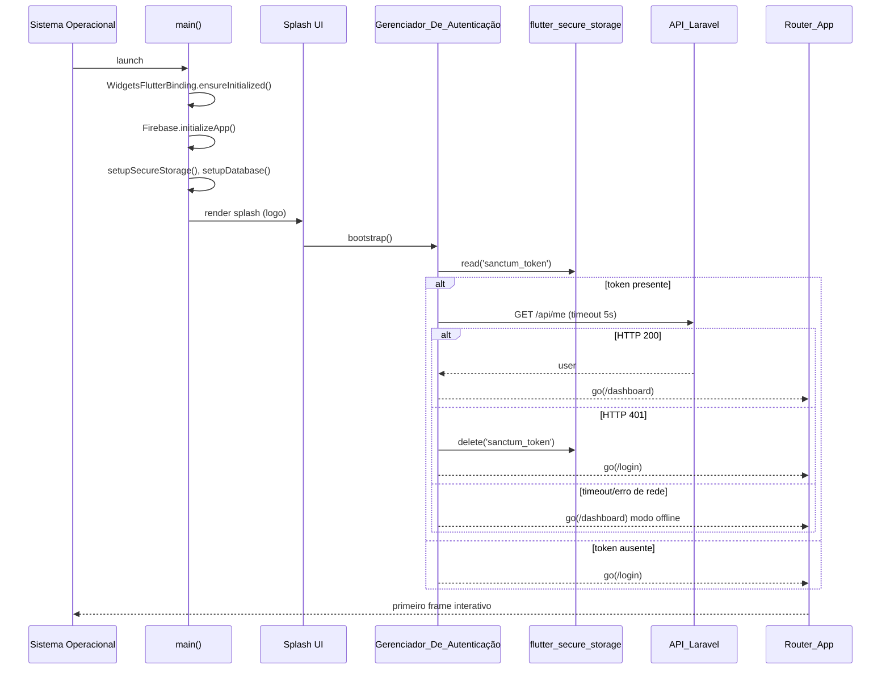
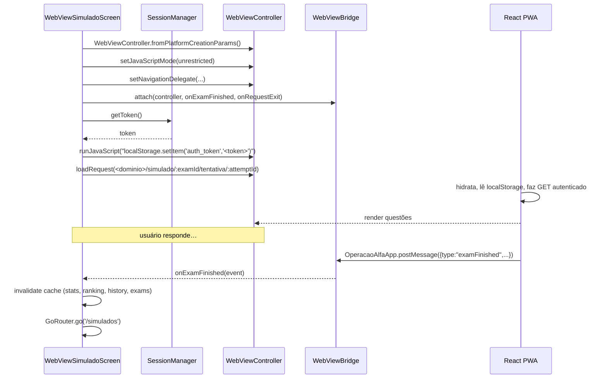
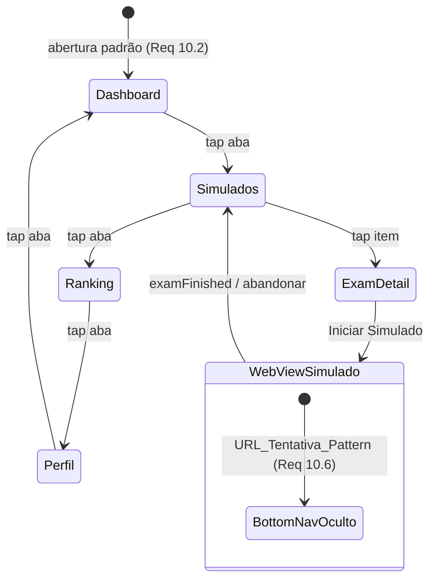
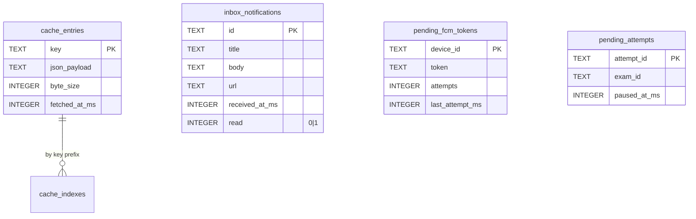

# Design Document

## Overview

O App_Flutter "Operação Alfa" é um aplicativo híbrido multiplataforma (Android e iOS) construído em Flutter com Material Design 3 que combina telas nativas com uma única WebView_Simulado dedicada à realização de provas. O design substitui o app Android atual (WebView pura) por uma arquitetura nativa-first que satisfaz a política do Google Play ao oferecer 5+ telas nativas com widgets interativos, navegação Flutter, integrações com SO (notificações, deep links, armazenamento seguro) e usar a WebView exclusivamente para o fluxo de execução de simulados (questões/cronômetro/respostas) servido pelo React PWA do Domínio_Sistema.

A arquitetura segue três princípios:

1. **Nativo por padrão, WebView por exceção** — todas as listagens, formulários e telas de leitura são Flutter; apenas `/simulado/{examId}/tentativa/{attemptId}` e suas URLs derivadas roteiam para WebView_Simulado.
2. **Sessão única compartilhada** — o Sanctum_Bearer_Token vive em `flutter_secure_storage` e é injetado em `localStorage` da WebView antes do `loadUrl`, replicando o mecanismo já usado pelo React PWA, sem necessidade de novo login.
3. **Stale-while-revalidate em toda leitura** — listagens e estatísticas exibem cache em ≤200ms e revalidam em background, com regras de invalidação por evento (Requisito 18.7) para manter consistência após escritas.

### Design Decisions e Justificativas

| Decisão | Alternativas Consideradas | Justificativa |
|---------|---------------------------|---------------|
| `go_router` para roteamento | `Navigator 2.0` cru, `auto_route` | `go_router` tem suporte oficial a deep linking declarativo (App Links/Universal Links), `ShellRoute` para Bottom Navigation com estado preservado e integra-se ao `RouteInformationParser` que recebe URIs do SO |
| `flutter_riverpod` para estado | `provider`, `bloc`, `GetX` | Riverpod oferece scoping/override fáceis para testes e PBT, sem dependência de `BuildContext` para acesso a estado, e providers `family` mapeiam bem para parâmetros de rota |
| `dio` + interceptors para HTTP | `http` puro, `chopper` | `dio` permite injetar `Authorization: Bearer` e tratar 401 globalmente em um único interceptor, além de timeout granular e cancelamento |
| `webview_flutter` (Hybrid Composition no Android) | `flutter_inappwebview` | É o pacote oficial mantido pelo time Flutter; cobre `JavascriptChannel`, `runJavaScript` (injeção de localStorage) e `setNavigationDelegate` (interceptação de URLs) que cobrem 100% do Requisito 6 |
| Cache em SQLite via `drift` | `hive`, `shared_preferences` | SQLite suporta consultas por chave + TTL + tamanho agregado, necessário para o limite de 50MB com auto-eviction (Requisito 18.5); `drift` gera código tipado e roda em isolate |
| `firebase_messaging` + `flutter_local_notifications` | OneSignal, APNs direto | FCM atende Android e iOS via APNs; `flutter_local_notifications` é necessário para exibir notificações em foreground (Requisito 8.5) já que o FCM não cria UI quando o app está aberto |
| `flutter_secure_storage` | EncryptedSharedPreferences direto | Multiplataforma (Keychain iOS / Keystore Android) com API uniforme; já é o padrão recomendado para Sanctum tokens em apps Flutter |

## Architecture

### Visão de Alto Nível

O App_Flutter é organizado em quatro camadas com dependências unidirecionais (camadas superiores dependem das inferiores):

```mermaid
graph TB
    subgraph "Camada de Apresentação (Flutter UI)"
        UI_Login[Tela Login]
        UI_Register[Tela Cadastro]
        UI_Dashboard[Tela Dashboard]
        UI_ExamList[Listagem Simulados]
        UI_ExamDetail[Detalhes Simulado]
        UI_Profile[Tela Perfil]
        UI_Ranking[Tela Ranking]
        UI_History[Histórico Tentativas]
        UI_Notifications[Inbox Notificações]
        UI_Plans[Planos Assinatura]
        UI_DeleteAccount[Excluir Conta]
        UI_WebView[WebView_Simulado]
        UI_Splash[Splash + Onboarding]
    end

    subgraph "Camada de Aplicação (Use Cases / Providers Riverpod)"
        UC_Auth[AuthController]
        UC_Exams[ExamsController]
        UC_Profile[ProfileController]
        UC_Ranking[RankingController]
        UC_Notifications[NotificationsController]
        UC_DeepLink[DeepLinkController]
    end

    subgraph "Camada de Domínio (Managers + Repositórios)"
        M_Auth[Gerenciador_De_Autenticação]
        M_Session[Gerenciador_De_Sessão]
        M_Connectivity[Gerenciador_De_Conectividade]
        M_Router[Router_App]
        M_DeepLink[Deep_Link_Handler]
        M_FCM[FCM_Service]
        M_Cache[CacheManager]
        Repos[Repositórios: Exam, User, Ranking, Plan, Notification]
    end

    subgraph "Camada de Infraestrutura"
        INF_Http[ApiClient - dio]
        INF_Secure[flutter_secure_storage]
        INF_DB[(SQLite via drift)]
        INF_Conn[connectivity_plus]
        INF_WV[webview_flutter]
        INF_FCM[firebase_messaging]
        INF_Local[flutter_local_notifications]
        INF_Links[app_links + uni_links]
    end

    UI_Login --> UC_Auth
    UI_Register --> UC_Auth
    UI_Dashboard --> UC_Profile
    UI_Dashboard --> UC_Ranking
    UI_ExamList --> UC_Exams
    UI_ExamDetail --> UC_Exams
    UI_Profile --> UC_Profile
    UI_Ranking --> UC_Ranking
    UI_History --> UC_Exams
    UI_Notifications --> UC_Notifications
    UI_Plans --> UC_Profile
    UI_WebView --> M_Session
    UI_Splash --> UC_Auth

    UC_Auth --> M_Auth
    UC_Auth --> M_Session
    UC_Exams --> Repos
    UC_Profile --> Repos
    UC_Ranking --> Repos
    UC_Notifications --> M_FCM
    UC_DeepLink --> M_DeepLink

    M_Auth --> INF_Http
    M_Session --> INF_Secure
    M_Session --> INF_WV
    Repos --> INF_Http
    Repos --> M_Cache
    M_Cache --> INF_DB
    M_Connectivity --> INF_Conn
    M_FCM --> INF_FCM
    M_FCM --> INF_Local
    M_DeepLink --> INF_Links
    M_Router --> M_DeepLink
```



### Estrutura de Pastas Flutter

```
alfa-quest/
├── lib/
│   ├── main.dart
│   ├── app.dart                          # MaterialApp.router + tema MD3
│   ├── core/
│   │   ├── config/                       # AppConfig (urls, flavors)
│   │   ├── theme/                        # ThemeData useMaterial3:true
│   │   ├── network/                      # ApiClient (dio), interceptors
│   │   ├── storage/                      # SecureStorage, Database (drift)
│   │   ├── cache/                        # CacheManager, política SWR
│   │   ├── errors/                       # ApiException, mappers
│   │   └── utils/                        # url patterns, validators
│   ├── features/
│   │   ├── auth/                         # login, register, splash, onboarding
│   │   ├── dashboard/
│   │   ├── exams/                        # listagem, detalhe, webview
│   │   ├── profile/                      # perfil, exclusão de conta
│   │   ├── ranking/
│   │   ├── notifications/                # inbox + handler
│   │   ├── plans/                        # planos + checkout
│   │   ├── history/                      # histórico de tentativas
│   │   └── connectivity/                 # banner de conectividade
│   ├── routing/
│   │   ├── app_router.dart               # GoRouter + ShellRoute
│   │   ├── deep_link_handler.dart
│   │   └── route_paths.dart
│   ├── services/
│   │   ├── auth_manager.dart
│   │   ├── session_manager.dart
│   │   ├── fcm_service.dart
│   │   ├── connectivity_manager.dart
│   │   └── webview_bridge.dart           # JavascriptChannel
│   └── data/
│       ├── models/                       # DTOs/freezed classes
│       └── repositories/
├── android/                              # já existe; ajustar manifest
├── ios/                                  # criar via flutter create
└── test/
    ├── unit/
    ├── widget/
    └── property/                         # property-based tests (glados/fast_check)
```

### Inicialização e Boot Sequence



## Components and Interfaces

### Gerenciador_De_Autenticação (`AuthManager`)

Responsável por login, registro e bootstrap de sessão. Não conhece UI; expõe um `Stream<AuthState>` consumido pelo `AuthController` (Riverpod).

```dart
sealed class AuthState {
  const AuthState();
}
class AuthUnauthenticated extends AuthState { const AuthUnauthenticated(); }
class AuthAuthenticated extends AuthState {
  final User user;
  final SanctumToken token;
  const AuthAuthenticated(this.user, this.token);
}
class AuthLoading extends AuthState { const AuthLoading(); }

abstract class AuthManager {
  Stream<AuthState> get state;
  Future<AuthAuthenticated> login({
    required String email,
    required String password,
    required bool rememberMe,
  });
  Future<AuthAuthenticated> register({
    required String name,
    required String email,
    required String password,
    required String passwordConfirmation,
  });
  Future<User> bootstrap();        // splash flow
  Future<void> logout();
}
```

Comportamento chave:

- `login` envia `POST /api/login` com timeout 15s; em 200, persiste token via `Gerenciador_De_Sessão`. Em 401, propaga `InvalidCredentialsException(message)`. Em 429, propaga `RateLimitException`.
- `register` envia `POST /api/register`; em 422, propaga `ValidationException(errors: Map<String, List<String>>)` consumida pela tela.
- `bootstrap` orquestra a sequência do diagrama acima.
- `logout` chama `POST /api/logout` (ignora falha de rede), depois `SessionManager.clear()` e emite `AuthUnauthenticated`.

### Gerenciador_De_Sessão (`SessionManager`)

Responsável pela persistência do token e sincronização com a WebView_Simulado.

```dart
abstract class SessionManager {
  Future<SanctumToken?> getToken();
  Future<void> saveToken(SanctumToken token, {required bool persistAcrossLaunches});
  Future<void> clearToken();
  Future<void> clearAll();   // token + caches + cookies WebView + localStorage WebView

  /// Injeta o token no localStorage da WebView ANTES do loadUrl.
  Future<void> injectIntoWebView(WebViewController controller);
}
```

Detalhes:

- Quando `persistAcrossLaunches=false` (Lembrar-me desmarcado, Requisito 1.6/7.7), o token vive apenas em memória; em `init()`, se o storage tinha token mas a flag `remember_me` é `false`, deleta o token.
- `injectIntoWebView` usa `controller.runJavaScript` antes de `loadRequest` para gravar `window.localStorage.setItem('<chave_pwa>', '<token>')`. A chave exata será confirmada lendo o código React (esperada `auth_token` ou `sanctum_token`); um teste de propriedade valida o round-trip.
- `clearAll` invoca em ordem: `WebViewCookieManager.clearCookies()`, `controller.runJavaScript('localStorage.clear(); sessionStorage.clear();')`, `secureStorage.deleteAll()` e `cacheManager.clearAll()`. Concluído em ≤2s (Requisito 7.3).

### Gerenciador_De_Conectividade (`ConnectivityManager`)

Wrapper sobre `connectivity_plus` que expõe um `ValueListenable<ConnectivityStatus>` consumido por um `OfflineBanner` montado no `Scaffold` raiz.

```dart
enum ConnectivityStatus { online, offline }

abstract class ConnectivityManager {
  ValueListenable<ConnectivityStatus> get status;
  Stream<ConnectivityStatus> get changes;
}
```

O banner aparece em ≤3s após queda detectada (Requisito 12.1). Quando o status volta para `online`, dispara `ref.invalidate(currentScreenProvider)` para recarga da tela ativa em ≤5s (Requisito 12.4).

### Router_App e Deep_Link_Handler

Implementado com `go_router`. A árvore de rotas tem um `ShellRoute` que hospeda o `BottomNavigationBar` para as 4 abas principais e rotas `push` para telas filhas.

```dart
final goRouter = GoRouter(
  initialLocation: '/splash',
  redirect: _authRedirect,           // bloqueia rotas autenticadas se sem token
  routes: [
    GoRoute(path: '/splash', builder: (_, __) => const SplashScreen()),
    GoRoute(path: '/onboarding', builder: (_, __) => const OnboardingScreen()),
    GoRoute(path: '/login', builder: (_, __) => const LoginScreen()),
    GoRoute(path: '/register', builder: (_, __) => const RegisterScreen()),
    ShellRoute(
      builder: (_, __, child) => HomeShell(child: child),  // BottomNav
      routes: [
        GoRoute(path: '/dashboard', builder: (_, __) => const DashboardScreen()),
        GoRoute(
          path: '/simulados',
          builder: (_, __) => const ExamListScreen(),
          routes: [
            GoRoute(
              path: ':examId',                              // /simulados/:examId
              builder: (_, s) => ExamDetailScreen(examId: s.pathParameters['examId']!),
              routes: [
                GoRoute(
                  path: 'resultado/:attemptId',             // deep link de resultado
                  builder: (_, s) => ExamDetailScreen(
                    examId: s.pathParameters['examId']!,
                    highlightAttemptId: s.pathParameters['attemptId'],
                  ),
                ),
              ],
            ),
          ],
        ),
        GoRoute(path: '/ranking', builder: (_, __) => const RankingScreen()),
        GoRoute(path: '/perfil', builder: (_, __) => const ProfileScreen()),
      ],
    ),
    // FORA do shell para esconder a BottomNav (Requisito 10.6)
    GoRoute(
      path: '/simulados/:examId/tentativa/:attemptId',
      builder: (_, s) => WebViewSimuladoScreen(
        examId: s.pathParameters['examId']!,
        attemptId: s.pathParameters['attemptId']!,
      ),
    ),
    GoRoute(path: '/notificacoes', builder: (_, __) => const NotificationsScreen()),
    GoRoute(path: '/planos', builder: (_, __) => const PlansScreen()),
    GoRoute(path: '/historico', builder: (_, __) => const HistoryScreen()),
    GoRoute(path: '/excluir-conta', builder: (_, __) => const DeleteAccountScreen()),
  ],
);
```

#### Deep_Link_Handler

```dart
abstract class DeepLinkHandler {
  /// Converte um Uri externo (esquema operacaoalfa:// OU https do Domínio_Sistema)
  /// para uma rota interna do GoRouter, aplicando regras dos requisitos 11.1-11.8.
  String? resolve(Uri uri);

  /// Mantém um deep link pendente quando o usuário ainda não está autenticado.
  void enqueuePending(Uri uri);
  Uri? consumePending();
}
```

Tabela de mapeamento URL → rota interna (Requisito 11):

| Padrão de URI recebido | Rota interna | Requisito |
|---|---|---|
| `operacaoalfa://simulado/:id` | `/simulados/:id` | 11.2 |
| `operacaoalfa://simulado/:id/tentativa/:attemptId` ou `/executar/:attemptId` | `/simulados/:id/tentativa/:attemptId` | 11.3 |
| `operacaoalfa://simulado/:id/resultado/:attemptId` | `/simulados/:id/resultado/:attemptId` | 11.4 |
| `https://operacaoalfa.com.br/simulado/...` (mesmos paths) | mesmo mapeamento via App Links | 11.1, 11.6 |
| Host fora do Domínio_Sistema | `null` (ignorado/abre no navegador) | 11.8 |
| Path desconhecido | `/dashboard` | 11.7 |

#### URL Patterns (constantes compartilhadas)

```dart
final RegExp kUrlTentativaPattern = RegExp(
  r'^/simulado/[^/]+/(tentativa|executar)/[^/]+/?$',
);
final RegExp kUrlResultadoPattern = RegExp(
  r'^/simulado/[^/]+/resultado/[^/]+/?$',
);
const Set<String> kDominioSistema = {
  'operacaoalfa.com.br',
  'operacao-alfa.homolog.mydev.com.br',
};
```

### FCM_Service

```dart
abstract class FcmService {
  Future<NotificationPermissionStatus> ensurePermission();   // Requisito 8.1, 8.3
  Future<String?> getToken();
  Stream<String> get tokenRefresh;
  Future<void> subscribeOnBackend(String token, String deviceId);
  Future<void> unsubscribeOnBackend(String deviceId);
  Stream<RemoteNotification> get foregroundMessages;
  Future<RemoteNotification?> getInitialMessage();           // app cold-start via tap
}
```

Comportamento de exibição:

- Foreground: cada `RemoteNotification` é convertida em uma `LocalNotification` via `flutter_local_notifications` em um canal dedicado `operacao_alfa_default` (Requisito 8.5).
- Background/terminated: o sistema operacional exibe a notificação automaticamente (Requisito 8.6) por se tratar de payload `data` mais o backend enviando `notification` quando aplicável; o tap dispara `getInitialMessage()` ou `onMessageOpenedApp` que despacha para `DeepLinkHandler` o campo `data.url`.
- Validação: se `title` e `body` estão ambos ausentes, descarta antes de exibir (Requisito 8.7).

### CacheManager

```dart
abstract class CacheManager {
  /// Lê uma entrada se existir; retorna stale=true quando idade > maxAge.
  Future<CacheEntry<T>?> read<T>(String key, {required T Function(Map<String, dynamic>) decode});

  /// Persiste uma entrada com timestamp.
  Future<void> write<T>(String key, T value, Map<String, dynamic> json);

  /// Invalida chaves específicas (Requisito 18.7).
  Future<void> invalidate(Iterable<String> keys);

  /// Invalida tudo (logout — Requisito 18.7).
  Future<void> clearAll();

  /// Tamanho total ocupado em bytes.
  Future<int> totalBytes();

  /// Política LRU de eviction quando ultrapassa 50MB, removendo até ficar ≤40MB.
  Future<void> evictIfNeeded();
}

class CacheEntry<T> {
  final T value;
  final DateTime fetchedAt;
  final bool stale;       // age > 5 min
}
```

Chaves canônicas usadas pelos repositórios:

| Endpoint | Chave de cache | Invalida em |
|---|---|---|
| `GET /api/exams?career_id=:c` | `exams:list:career=${c ?? 'all'}` | conclusão de simulado, mudança de assinatura, logout |
| `GET /api/exams/:id` | `exams:detail:${id}` | conclusão da própria tentativa, logout |
| `GET /api/performance/statistics` | `perf:statistics` | conclusão de simulado, logout |
| `GET /api/performance/history` | `perf:history` | conclusão de simulado, logout |
| `GET /api/ranking?type=weekly` | `ranking:weekly` | conclusão de simulado, logout |
| `GET /api/ranking/my-position` | `ranking:my_position` | conclusão de simulado, logout |
| `GET /api/user/profile` | `user:profile` | PUT /api/user/profile, logout |
| `GET /api/me` | `user:me` | PUT /api/user/profile, mudança de assinatura, logout |
| `GET /api/plans` | `plans:list` | logout |

### Repositórios e ApiClient

Cada repositório segue o padrão SWR:

```dart
class ExamRepository {
  Future<CacheEntry<List<Exam>>> listExams({int? careerId}) async {
    final key = 'exams:list:career=${careerId ?? 'all'}';
    final cached = await cache.read<List<Exam>>(key, decode: _decodeList);
    if (cached != null) {
      // dispara revalidação em background sem bloquear
      unawaited(_revalidate(key, careerId));
      return cached;
    }
    return _fetchAndStore(key, careerId);
  }
}
```

`ApiClient` configurado com `dio`:

- `baseUrl` derivado de `--dart-define=ENV=prod|homolog`.
- Interceptor 1 (auth): adiciona `Authorization: Bearer $token` quando há sessão.
- Interceptor 2 (401-handler): em 401, dispara `SessionManager.clearToken()` e empurra `/login` em ≤3s (Requisito 7.6).
- Interceptor 3 (versioning): se a resposta vem com `X-API-Min-Version > clientVersion`, navega para `ForceUpdateScreen` (Requisito 21.7).
- Timeout de 15s para login/register e padrão 30s nas demais.

### WebView_Simulado e WebViewBridge

```dart
class WebViewSimuladoScreen extends StatefulWidget {
  final String examId;
  final String attemptId;
}

abstract class WebViewBridge {
  /// Cria/configura o JavascriptChannel "OperacaoAlfaApp".
  void attach(WebViewController controller, {
    required void Function(ExamFinishedEvent) onExamFinished,
    required VoidCallback onRequestExit,
  });
}
```

Mensagens do canal nativo (`OperacaoAlfaApp.postMessage(JSON.stringify(...))`):

```json
{ "type": "examFinished", "examId": "uuid", "attemptId": "uuid" }
{ "type": "requestExit" }
```

Sequência de carregamento (Requisitos 6.1-6.4, 7.2):



Mecanismo complementar de detecção (Requisito 6.6 b): `setNavigationDelegate.onPageFinished` testa a URL contra `kUrlResultadoPattern` e, se casar, dispara o mesmo handler de conclusão.

Tratamento do botão voltar (Requisitos 6.5, 14.6, 14.8):

```dart
PopScope(
  canPop: false,
  onPopInvokedWithResult: (didPop, _) async {
    if (await controller.canGoBack()) {
      await controller.goBack();
      return;
    }
    final confirm = await showDialog<bool>(...);    // diálogo "abandonar simulado?"
    if (confirm == true && context.mounted) context.go('/simulados');
  },
  child: WebViewWidget(controller: controller),
);
```

### Telas Nativas — Inventário e Componentes-chave

| # | Tela | Widgets Principais | Estado |
|---|---|---|---|
| 1 | Login | `Form`, `TextFormField`(email/senha), `Checkbox` Lembrar-me, `FilledButton`, link para Cadastro | `loginControllerProvider` |
| 2 | Cadastro | `Form` com 4 campos + validação local | `registerControllerProvider` |
| 3 | Dashboard | Cards de estatísticas, posição no ranking, atalhos para listagem/histórico, `RefreshIndicator` | `dashboardControllerProvider` |
| 4 | Listagem Simulados | `ListView.builder`, `FilterChip`s para carreiras, `RefreshIndicator`, estado vazio | `examListControllerProvider.family(careerId)` |
| 5 | Detalhes Simulado | Header com `title/description`, `Wrap` de metadados, botão `Iniciar Simulado` ou `Assinar` | `examDetailControllerProvider.family(id)` |
| 6 | WebView Simulado | `WebViewWidget` + `PopScope` + overlay de conexão | `webviewSessionProvider.family({examId, attemptId})` |
| 7 | Perfil | `Form` editável (name/email/phone), tile de assinatura, links Privacidade, botões Logout / Excluir | `profileControllerProvider` |
| 8 | Ranking | `ListView.builder` + cabeçalho fixo "Minha posição", `RefreshIndicator` | `rankingControllerProvider` |
| 9 | Histórico Tentativas | `ListView.builder` + estado vazio | `historyControllerProvider` |
| 10 | Inbox Notificações | `ListView.builder` + indicador lido/não-lido + botão "Configurações do sistema" | `notificationsInboxProvider` |
| 11 | Planos | Cards de plano + `FilledButton` Assinar + `TextButton` Restaurar/Cancelar | `plansControllerProvider` |
| 12 | Excluir Conta | `Form` com TextField onde o usuário digita "EXCLUIR" + botão habilitado condicionalmente | `deleteAccountControllerProvider` |
| 13 | Splash | `Image` logo + `CircularProgressIndicator` | `authBootstrapProvider` |
| 14 | Onboarding (primeira execução) | Texto + links para PP/TermosDeUso + `Checkbox` aceite | `onboardingControllerProvider` |
| 15 | Force Update | Tela bloqueante com link para a loja | `apiVersionGateProvider` |

A `BottomNavigationBar` cobre 4 dessas (Dashboard / Simulados / Ranking / Perfil — Requisito 10.1) e a AppBar de cada uma exibe o ícone de sino com badge (Requisito 10.8).

### Comportamento da Bottom Navigation



Estado preservado entre abas via `IndexedStack` dentro do `HomeShell` (Requisito 10.5); cada subtela mantém seu `ScrollController` próprio sem reinicialização.

## Data Models

Modelos Dart gerados via `freezed` + `json_serializable` (immutable, `copyWith`, equality por valor). Campos seguem snake_case retornados pelo Laravel; o mapeamento para camelCase é feito no `fromJson`.

### Auth e Usuário

```dart
@freezed
class SanctumToken with _$SanctumToken {
  const factory SanctumToken({
    required String value,                  // opaco
    required DateTime obtainedAt,
    @Default(false) bool persistAcrossLaunches,
  }) = _SanctumToken;
  factory SanctumToken.fromJson(Map<String, dynamic> j) => _$SanctumTokenFromJson(j);
}

@freezed
class User with _$User {
  const factory User({
    required int id,
    required String name,
    required String email,
    String? phone,
    required SubscriptionStatus subscriptionStatus,
    DateTime? subscriptionExpiresAt,
    String? subscriptionPlatformId,
  }) = _User;
  factory User.fromJson(Map<String, dynamic> j) => _$UserFromJson(j);
}

enum SubscriptionStatus { active, inactive, cancelled, pending }

extension SubscriptionStatusX on User {
  bool get hasActiveSubscription =>
      subscriptionStatus == SubscriptionStatus.active &&
      (subscriptionExpiresAt == null ||
       subscriptionExpiresAt!.isAfter(DateTime.now()));
}

@freezed
class LoginRequest with _$LoginRequest {
  const factory LoginRequest({
    required String email,
    required String password,
    @Default(false) bool rememberMe,
  }) = _LoginRequest;
}

@freezed
class LoginResponse with _$LoginResponse {
  const factory LoginResponse({
    required String token,
    required User user,
  }) = _LoginResponse;
  factory LoginResponse.fromJson(Map<String, dynamic> j) =>
      _$LoginResponseFromJson(j);
}

@freezed
class RegisterRequest with _$RegisterRequest {
  const factory RegisterRequest({
    required String name,
    required String email,
    required String password,
    required String passwordConfirmation,
  }) = _RegisterRequest;
}

@freezed
class ApiValidationError with _$ApiValidationError {
  const factory ApiValidationError({
    required String message,
    required Map<String, List<String>> errors,    // estrutura `errors.{campo}` Laravel
  }) = _ApiValidationError;
  factory ApiValidationError.fromJson(Map<String, dynamic> j) =>
      _$ApiValidationErrorFromJson(j);
}
```

### Simulados e Tentativas

```dart
@freezed
class Career with _$Career {
  const factory Career({
    required int id,
    required String name,
  }) = _Career;
  factory Career.fromJson(Map<String, dynamic> j) => _$CareerFromJson(j);
}

@freezed
class Exam with _$Exam {
  const factory Exam({
    required String id,
    required String title,
    String? description,
    required int numQuestions,
    required int durationMin,
    required bool isFree,
    int? careerId,
    PreviousAttemptSummary? lastAttempt,
  }) = _Exam;
  factory Exam.fromJson(Map<String, dynamic> j) => _$ExamFromJson(j);
}

@freezed
class PreviousAttemptSummary with _$PreviousAttemptSummary {
  const factory PreviousAttemptSummary({
    required String attemptId,
    required AttemptStatus status,
    required DateTime startedAt,
    DateTime? finishedAt,
    double? accuracyPercentage,
  }) = _PreviousAttemptSummary;
  factory PreviousAttemptSummary.fromJson(Map<String, dynamic> j) =>
      _$PreviousAttemptSummaryFromJson(j);
}

enum AttemptStatus { inProgress, finished }

@freezed
class StartAttemptResponse with _$StartAttemptResponse {
  const factory StartAttemptResponse({
    required String attemptId,
    required String examId,
  }) = _StartAttemptResponse;
  factory StartAttemptResponse.fromJson(Map<String, dynamic> j) =>
      _$StartAttemptResponseFromJson(j);
}
```

### Estatísticas, Ranking e Histórico

```dart
@freezed
class PerformanceStatistics with _$PerformanceStatistics {
  const factory PerformanceStatistics({
    required int totalExamsCompleted,
    required double accuracyPercentage,
    int? totalQuestionsAnswered,
    int? totalCorrectAnswers,
  }) = _PerformanceStatistics;
  factory PerformanceStatistics.fromJson(Map<String, dynamic> j) =>
      _$PerformanceStatisticsFromJson(j);
}

@freezed
class RankingEntry with _$RankingEntry {
  const factory RankingEntry({
    required int position,
    required int userId,
    required String userName,
    required int score,
    @Default(false) bool isCurrentUser,
  }) = _RankingEntry;
  factory RankingEntry.fromJson(Map<String, dynamic> j) =>
      _$RankingEntryFromJson(j);
}

@freezed
class MyRankingPosition with _$MyRankingPosition {
  const factory MyRankingPosition({
    int? position,           // null quando 404
    required int score,
  }) = _MyRankingPosition;
  factory MyRankingPosition.fromJson(Map<String, dynamic> j) =>
      _$MyRankingPositionFromJson(j);
}

@freezed
class HistoryItem with _$HistoryItem {
  const factory HistoryItem({
    required String attemptId,
    required String examId,
    required String examTitle,
    required AttemptStatus status,
    required DateTime startedAt,
    DateTime? finishedAt,
    double? accuracyPercentage,
  }) = _HistoryItem;
  factory HistoryItem.fromJson(Map<String, dynamic> j) =>
      _$HistoryItemFromJson(j);
}
```

### Notificações e Push

```dart
@freezed
class FcmSubscribeRequest with _$FcmSubscribeRequest {
  const factory FcmSubscribeRequest({
    required String token,
    required String deviceId,        // UUID gerado na 1ª instalação
  }) = _FcmSubscribeRequest;
}

@freezed
class FcmUnsubscribeRequest with _$FcmUnsubscribeRequest {
  const factory FcmUnsubscribeRequest({
    required String deviceId,
  }) = _FcmUnsubscribeRequest;
}

@freezed
class RemoteNotification with _$RemoteNotification {
  const factory RemoteNotification({
    String? title,
    String? body,
    String? url,                     // payload data.url
    Map<String, String>? extras,
  }) = _RemoteNotification;
}

@freezed
class InboxNotification with _$InboxNotification {
  const factory InboxNotification({
    required String id,              // uuid local
    String? title,
    String? body,
    String? url,
    required DateTime receivedAt,
    @Default(false) bool read,
  }) = _InboxNotification;
  factory InboxNotification.fromJson(Map<String, dynamic> j) =>
      _$InboxNotificationFromJson(j);
}
```

### Planos e Assinatura

```dart
@freezed
class Plan with _$Plan {
  const factory Plan({
    required String id,
    required String name,
    required String description,
    required double price,
    required int durationDays,
    required List<String> features,
  }) = _Plan;
  factory Plan.fromJson(Map<String, dynamic> j) => _$PlanFromJson(j);
}

@freezed
class CheckoutResponse with _$CheckoutResponse {
  const factory CheckoutResponse({
    required String checkoutUrl,
  }) = _CheckoutResponse;
  factory CheckoutResponse.fromJson(Map<String, dynamic> j) =>
      _$CheckoutResponseFromJson(j);
}
```

### Cache e Conectividade

```dart
@freezed
class CacheEntry<T> with _$CacheEntry<T> {
  const factory CacheEntry({
    required T value,
    required DateTime fetchedAt,
    required bool stale,             // age > 5 min
  }) = _CacheEntry<T>;
}

class CacheRow {                     // schema drift
  String key;
  String jsonPayload;
  int byteSize;
  DateTime fetchedAt;
}
```

### Schema do Banco Local (drift)



## Correctness Properties

*A property is a characteristic or behavior that should hold true across all valid executions of a system — essentially, a formal statement about what the system should do. Properties serve as the bridge between human-readable specifications and machine-verifiable correctness guarantees.*

### Property 1: Persistência do token respeita "Lembrar-me"

*For any* `SanctumToken` arbitrário e qualquer valor booleano `rememberMe`, após `SessionManager.saveToken(token, persistAcrossLaunches: rememberMe)` seguido de uma reinicialização simulada do `SessionManager` sobre o mesmo `flutter_secure_storage` subjacente, `SessionManager.getToken()` SHALL retornar `token` se e somente se `rememberMe == true`; caso contrário retorna `null`.

**Validates: Requirements 1.6, 7.7**
**Test approach:** property-based com `glados` para Dart — gerador combinando `String` (token), `bool` (rememberMe) e fake in-memory secure storage.

### Property 2: Logout limpa todo o estado de sessão

*For any* estado inicial composto por (token persistido, mapa arbitrário de cookies da WebView, mapa arbitrário de entradas de `localStorage`, conjunto arbitrário de `CacheEntry` para qualquer chave canônica), após uma chamada a `SessionManager.clearAll()` em até 2 segundos simulados, todas as quatro fontes de estado SHALL estar vazias: `getToken() == null`, `WebViewCookieManager` sem cookies, `localStorage` e `sessionStorage` da WebView sem chaves, `CacheManager.totalBytes() == 0`.

**Validates: Requirements 7.3, 7.4, 18.7**
**Test approach:** property-based com `glados` — geradores compostos de estado pré-condição + fakes para cada subsistema; asserção de vacuidade pós-`clearAll`.

### Property 3: Resposta 401 sempre redireciona para login e revoga o token

*For any* endpoint autenticado da API_Laravel e qualquer rota corrente do `GoRouter` distinta de `/login`, quando o `ApiClient` receber HTTP 401 da resposta, em até 3 segundos simulados o estado final do app SHALL satisfazer simultaneamente: `SessionManager.getToken() == null`, rota corrente == `/login` e o `AuthState` emitido pelo `AuthManager` é `AuthUnauthenticated`.

**Validates: Requirements 7.6, 17.5**
**Test approach:** sequence-based PBT — gerador de (endpoint, rota inicial, payload de erro 401); mock do `dio` retornando 401; clock simulado para verificar a janela de 3s.

### Property 4: Token na WebView é igual ao SanctumToken ativo antes do `loadUrl`

*For any* `SanctumToken` ativo no `SessionManager` no momento da abertura da `WebView_Simulado`, a sequência de operações registradas pelo `WebViewController` fake SHALL ser exatamente: primeiro um `runJavaScript` que executa `window.localStorage.setItem('<chave_pwa>', '<token.value>')`, e somente depois um `loadRequest` para a URL de tentativa correspondente. Nunca pode haver `loadRequest` sem `setItem` prévio com o token corrente.

**Validates: Requirements 6.2, 7.2**
**Test approach:** sequence-based PBT — `WebViewController` fake que registra a ordem de chamadas; gerador de tokens; asserção sobre a ordem total das operações.

### Property 5: Casamento de URL de tentativa e resultado é total e desambíguo

*For any* `Uri` recebida pelo `DeepLinkHandler.resolve(uri)` cujo host pertence ao `Domínio_Sistema`, exatamente uma das três condições SHALL ser verdadeira:
- o path casa com `kUrlTentativaPattern` e a rota retornada é `/simulados/:examId/tentativa/:attemptId`,
- o path casa com `kUrlResultadoPattern` e a rota retornada é `/simulados/:examId/resultado/:attemptId`,
- nenhum dos dois patterns casa e a rota retornada é uma rota válida do `GoRouter` (incluindo `/dashboard` como fallback do Requisito 11.7).

Os dois regex SHALL ser mutuamente exclusivos: nenhuma `Uri` casa com ambos simultaneamente.

**Validates: Requirements 11.1, 11.2, 11.3, 11.4, 11.7, 11.8**
**Test approach:** property-based com `glados` — gerador estruturado de paths (`/simulado/:id`, `/simulado/:id/tentativa/:tid`, `/simulado/:id/executar/:tid`, `/simulado/:id/resultado/:tid`, paths arbitrários fora do padrão); asserção de exclusividade e totalidade.

### Property 6: Deep link pendente é consumido exatamente uma vez após autenticação

*For any* sequência finita de ações compostas por `enqueuePending(uri)`, `login()` e `consumePending()`, ao final da sequência o número total de URIs efetivamente entregues via `consumePending()` SHALL ser igual ao número de pares `(enqueuePending, login)` realizados, com cada URI entregue exatamente uma vez na ordem FIFO. Após uma chamada a `consumePending`, uma segunda chamada sem novo `enqueuePending` SHALL retornar `null`.

**Validates: Requirements 11.5**
**Test approach:** sequence-based PBT — modelo abstrato de fila/Option; comparação de comportamento contra o `DeepLinkHandler` real.

### Property 7: SWR não retorna dado stale sem disparar revalidação

*For any* chave `k`, qualquer `CacheEntry` com `fetchedAt = t0` e qualquer instante de leitura `tNow` em um clock fake, quando `CacheManager.read(k)` é chamado:
- se `tNow - t0 ≤ 5min`, então o resultado tem `stale == false` e nenhuma revalidação é disparada,
- se `tNow - t0 > 5min`, então o resultado tem `stale == true` E o repositório associado dispara exatamente uma revalidação assíncrona (`unawaited(_revalidate(k, ...))`) — não zero, não duas.

**Validates: Requirements 18.2, 18.3**
**Test approach:** property-based com `glados` — geradores de `(t0, tNow)`; clock injetável; spy em `_revalidate`.

### Property 8: Tamanho do cache nunca excede 50MB após eviction

*For any* sequência arbitrária de chamadas `CacheManager.write(k, v, json)` com payloads de tamanho variado, após cada operação de escrita seguida de `evictIfNeeded()` o invariante `totalBytes() ≤ 50_000_000` SHALL ser sempre verdadeiro, e quando uma eviction efetivamente ocorrer, `totalBytes()` SHALL ficar `≤ 40_000_000` ao final, removendo entradas em ordem LRU (mais antigas primeiro).

**Validates: Requirements 18.5**
**Test approach:** sequence-based PBT — gerador de operações `write`; asserção de invariante após cada passo.

### Property 9: Invalidação por evento purga exatamente as chaves do mapa do Requisito 18.7

*For any* evento `E ∈ {examFinished, profileUpdated, subscriptionChanged, logout}` e qualquer estado de cache populado com um subconjunto arbitrário das chaves canônicas, após disparar `E` o conjunto de chaves removidas SHALL ser exatamente igual ao subconjunto definido pelo mapa do Requisito 18.7 para `E` (intersectado com as chaves presentes); nenhuma chave fora desse subconjunto SHALL ser removida (exceto quando `E == logout`, que remove todas).

**Validates: Requirements 18.7**
**Test approach:** table-based + property-based — tabela de eventos×chaves esperadas; gerador do estado pré-condição; diff exato.

### Property 10: BottomNavigationBar é oculta sse a rota corresponde ao URL_Tentativa_Pattern

*For any* path interno do `GoRouter`, a função `shouldShowBottomNav(path)` SHALL retornar `false` se e somente se o path satisfaz `kUrlTentativaPattern`. Em todos os outros paths reconhecidos pelo router (incluindo detalhes de simulado, resultados e telas auxiliares como notificações), a BottomNav SHALL ser exibida.

**Validates: Requirements 10.6, 10.7**
**Test approach:** property-based com `glados` — gerador de paths estruturados; função pura testável sem widget tester.

### Property 11: Estado de cada aba da BottomNav é preservado ao alternar

*For any* sequência finita de ações `(selectTab(t), scrollTo(t, offset), loadData(t, items))`, ao executar uma ação posterior `selectTab(t')` seguida por `selectTab(t)` voltando à aba original, o estado observável da aba `t` (offset de scroll e lista de modelos exibida) SHALL ser idêntico ao estado imediatamente antes do `selectTab(t')` — sem reinicialização, sem nova chamada à API, sem reset de scroll.

**Validates: Requirements 10.3, 10.5**
**Test approach:** sequence-based PBT com `IndexedStack` — modelo abstrato `Map<Tab, TabState>`; comparação por igualdade.

### Property 12: Notificações sem `title` E sem `body` nunca são exibidas; tap sempre roteia via DeepLinkHandler

*For any* `RemoteNotification n` recebida pelo `FcmService`:
- se `(n.title == null || n.title.isEmpty) && (n.body == null || n.body.isEmpty)`, então o número de invocações de `flutter_local_notifications.show(...)` SHALL ser exatamente 0,
- caso contrário, SHALL ser exatamente 1.

E *for any* notificação efetivamente exibida e tocada pelo usuário, a rota final do `GoRouter` SHALL ser igual a `DeepLinkHandler.resolve(Uri.parse(n.url))` quando `n.url` for uma URI válida do `Domínio_Sistema`, ou `/dashboard` em qualquer outro caso (URL ausente, inválida, ou de host externo).

**Validates: Requirements 8.7, 8.8, 8.9**
**Test approach:** property-based com `glados` — gerador de `RemoteNotification` com `title?` e `body?` independentemente nuláveis; spy no plugin de notificações locais; comparação do destino de roteamento.

### Property 13: Banner de conectividade respeita as janelas de 3s e 5s

*For any* sequência cronologicamente ordenada de eventos `(timestamp, ConnectivityStatus)` em um clock fake e qualquer instante de observação `tNow`, o estado do `OfflineBanner` SHALL satisfazer:
- `visible == true` se e somente se existe um evento `(t_off, offline)` com `t_off ≤ tNow` tal que nenhum evento `(t_on, online)` com `t_off ≤ t_on ≤ tNow` ocorreu E `tNow - t_off ≥ 3s` (ou seja: já passou tempo suficiente para o banner aparecer e a conexão ainda não voltou),
- `visible == false` se a última transição relevante foi `online` há pelo menos 5 segundos (banner já dispensado) ou se nunca houve evento `offline` no histórico observado.

**Validates: Requirements 12.1, 12.4**
**Test approach:** sequence-based PBT — clock fake; gerador de sequências de eventos; asserção de invariante temporal em cada `tNow` amostrado.


## Error Handling

A estratégia divide os erros em cinco classes ortogonais. Cada classe tem (a) um tipo dedicado em `core/errors/`, (b) um ponto de captura definido (interceptor `dio`, `setNavigationDelegate`, callback FCM), (c) uma transformação para `UiFeedback` (`SnackBar`, banner, dialog ou tela cheia) consumida pela camada de apresentação. O objetivo é que nenhuma `Exception` "vaze" de um repositório sem ser mapeada para um dos tipos abaixo.

### Hierarquia de Exceções

```dart
sealed class AppException implements Exception {
  final String message;
  const AppException(this.message);
}

/// API_Laravel respondeu com status code e payload.
sealed class ApiException extends AppException {
  final int statusCode;
  const ApiException(this.statusCode, super.message);
}
class UnauthenticatedException extends ApiException { /* 401 */ }
class ValidationException extends ApiException {
  final Map<String, List<String>> fieldErrors;        // errors.{campo}
  /* 422 */
}
class RateLimitException extends ApiException { final Duration retryAfter; /* 429 */ }
class ServerException extends ApiException { /* 5xx */ }
class NotFoundException extends ApiException { /* 404 */ }
class ApiClientException extends ApiException { /* 4xx genérico */ }
class ForceUpdateRequiredException extends ApiException { /* X-API-Min-Version > app */ }

/// Falhas de transporte sem resposta HTTP válida.
sealed class NetworkException extends AppException { const NetworkException(super.m); }
class TimeoutException extends NetworkException { /* > 15s login / 30s demais */ }
class NoConnectionException extends NetworkException { /* connectivity offline */ }
class TlsException extends NetworkException { /* certificado inválido */ }

/// WebView_Simulado.
sealed class WebViewException extends AppException { const WebViewException(super.m); }
class WebViewLoadFailedException extends WebViewException { final int? errorCode; }
class WebViewNavigationRejectedException extends WebViewException { final Uri rejected; }

/// FCM.
sealed class FcmException extends AppException { const FcmException(super.m); }
class FcmTokenRegistrationFailedException extends FcmException { final int attempt; }
class FcmPermissionDeniedException extends FcmException { /* não fatal */ }

/// Checkout / assinatura (Edduz).
sealed class CheckoutException extends AppException { const CheckoutException(super.m); }
class CheckoutUrlUnavailableException extends CheckoutException {}
class SubscriptionStatusStaleException extends CheckoutException {}
```

### Mapa Exceção → Feedback de UI

| Classe / Status | Onde captura | Feedback ao usuário | Requisito |
|---|---|---|---|
| `UnauthenticatedException` (401) | Interceptor `dio` | `SessionManager.clearAll()` + redirect imediato a `/login` com SnackBar "Sessão expirada" | 7.6, 17.5 |
| `ValidationException` (422) | Camada de apresentação no controller | Mensagem inline em cada `TextFormField` por campo, conforme `errors.{campo}`; sem SnackBar | 1.4, 2.4, 9.7 |
| `RateLimitException` (429) | Login/Register | Dialog "Aguarde antes de tentar novamente" com `retryAfter` quando disponível | 1.10 |
| `ServerException` (5xx) | Repositórios | Snack `"Servidor temporariamente indisponível"` + estado de erro com botão "Tentar novamente" | 5.7, 9.6, 13.6, 19.6, 22.8 |
| `NotFoundException` (404) | Tela específica | Mensagem dedicada por contexto: simulado não encontrado, ranking sem posição, etc. | 5.6, 3.7, 13.7 |
| `ForceUpdateRequiredException` | Interceptor de versionamento | Tela bloqueante full-screen `ForceUpdateScreen` com link para a loja | 21.7 |
| `TimeoutException` (>15s login / >30s) | `dio` ou splash | Login: SnackBar "servidor temporariamente indisponível". Demais: mantém cache + SnackBar discreta | 1.5, 17.8 |
| `NoConnectionException` | `ConnectivityManager` | Banner global não-dismissível (Requisito 12.1); telas seguem cache (12.2) ou estado vazio (12.3) | 12.1-12.4 |
| `TlsException` | `dio` | SnackBar "Conexão segura indisponível" + log local; nunca downgrade para HTTP | 14.5 |
| `WebViewLoadFailedException` | `setNavigationDelegate.onWebResourceError` | Overlay sobre WebView com botão "Tentar novamente" e "Voltar para detalhes" | 6.9 |
| `WebViewNavigationRejectedException` | `setNavigationDelegate.onNavigationRequest` | URL aberta via `url_launcher` no navegador externo, sem feedback de erro | 6.11, 11.8 |
| `FcmTokenRegistrationFailedException` | `FcmService` | Silencioso (não bloqueante); incrementa contador de tentativas no `pending_fcm_tokens`; após 5 falhas consecutivas, registra log e desiste até próxima inicialização | 8.11 |
| `FcmPermissionDeniedException` | Solicitação de permissão | Sem dialog; o app prossegue normalmente (Requisito 8.3) | 8.3 |
| `CheckoutUrlUnavailableException` | Tela de Planos | SnackBar "Não foi possível iniciar o pagamento" + botão "Tentar novamente" | 19.6 |
| `SubscriptionStatusStaleException` | "Restaurar compra" | Snack informativa "Status atualizado" após refresh de `GET /api/me` | 19.5 |

### Estratégia de Retry

- `RateLimitException`: respeitar `Retry-After` quando presente; caso contrário não retentar automaticamente (decisão do usuário).
- `TimeoutException` em GETs idempotentes: 1 retry com backoff de 2s. POSTs/PUTs/DELETEs nunca retêm automaticamente para evitar duplicação.
- `FcmTokenRegistrationFailedException`: até 5 tentativas consecutivas com falha agregadas em `pending_fcm_tokens.attempts` (Requisito 8.11). Backoff exponencial 2s/4s/8s/16s/32s entre tentativas dentro de uma mesma sessão; após a quinta falha, congela até próxima inicialização do app.
- `NoConnectionException`: o `ConnectivityManager` dispara `ref.invalidate(currentScreenProvider)` automaticamente ao voltar a online (Requisito 12.4); nenhum retry manual necessário no repositório.

### Política de Logging e Privacidade

`AppException.toLogString()` SHALL emitir apenas: classe, status code, endpoint (path sem query), mensagem genérica. Nunca incluir corpo de resposta, token, e-mail ou telefone (Requisito 21.6). Logs ficam em memória apenas durante a sessão; nenhum dado é enviado para serviços externos (Requisito 21.5).


## Testing Strategy

A estratégia combina quatro níveis de teste, cada um cobrindo uma fatia distinta dos requisitos. Property-based testing aplica-se às camadas puras (auth, sessão, cache, deep linking, navegação) e usa o pacote `glados` para Dart com no mínimo **100 iterações** por propriedade, conforme exigido pelas Correctness Properties acima.

### 1. Unit Tests (`test/unit/`)

Cobrem lógica isolada que não envolve `BuildContext` nem I/O real. Usam mocks via `mocktail`.

| Alvo | O que valida | Exemplos |
|---|---|---|
| `LoginRequest`/`RegisterRequest` validators | Validação local (e-mail formato, senha 6-128, etc.) antes do envio | Requisitos 1.8, 2.5 |
| `ApiException` mappers | Conversão de `DioException` em subclasse correta | Cobertura do mapa de Error Handling |
| `User.hasActiveSubscription` | Lógica derivada de `subscription_status` + `subscription_expires_at` | Requisito 5.5 |
| `DeepLinkHandler.resolve` (casos pontuais) | Casos canônicos antes do property test | Requisito 11 |
| `kUrlTentativaPattern`/`kUrlResultadoPattern` | Casos âncora + edge cases (path com trailing slash) | Requisitos 6, 11 |
| Mappers `fromJson` (freezed) | Round-trip JSON com payloads reais do backend | Modelos de dados |

### 2. Widget Tests (`test/widget/`)

Cobrem comportamento de telas isoladas usando `WidgetTester` e `ProviderScope.overrides` para injetar fakes.

| Alvo | O que valida |
|---|---|
| `LoginScreen` | Erros 422 inline, botão desabilitado durante loading (Req 1.9), navegação ao sucesso |
| `ExamListScreen` | Shimmer durante load, estado vazio, pull-to-refresh, filtro por carreira |
| `ExamDetailScreen` | Botão "Iniciar Simulado" desabilitado para premium sem assinatura (Req 5.5) |
| `HomeShell` | BottomNav preserva estado entre abas (Req 10.5), badge de notificações atualiza (Req 10.8 + 16.5) |
| `WebViewSimuladoScreen` | `PopScope` exibe diálogo de confirmação (Req 6.5), overlay de offline (Req 12.5) |
| `OfflineBanner` | Aparece em ≤3s após `ConnectivityStatus.offline` (Req 12.1) |
| `ProfileScreen` | Edição parcial envia apenas campos modificados (Req 9.4) |
| `DeleteAccountScreen` | Botão habilitado apenas após digitar "EXCLUIR" (Req 20.2) |
| `ForceUpdateScreen` | Bloqueia toda navegação até atualização (Req 21.7) |

### 3. Property-Based Tests (`test/property/`) — `glados` para Dart

Implementam as 13 propriedades da seção Correctness Properties. Cada arquivo de teste:

- Importa `package:glados/glados.dart`.
- Configura `Glados.defaultMaxRuns = 100` no `setUpAll`.
- Cada teste é etiquetado com um comentário no formato:
  ```dart
  // Feature: flutter-hybrid-app, Property N: <título da propriedade>
  ```
- Usa `Glados<T>(generator).test('descrição', (input) { ... })` para propriedades simples e `glados2`/`glados3` para múltiplas entradas.

Estrutura recomendada:

```
test/property/
├── auth/
│   ├── remember_me_persistence_test.dart      # Property 1
│   ├── logout_clears_state_test.dart          # Property 2
│   └── unauthorized_redirect_test.dart        # Property 3
├── webview/
│   └── session_injection_order_test.dart      # Property 4
├── deeplinks/
│   ├── pattern_total_disjoint_test.dart       # Property 5
│   └── pending_link_consumed_once_test.dart   # Property 6
├── cache/
│   ├── swr_age_test.dart                      # Property 7
│   ├── eviction_size_test.dart                # Property 8
│   └── invalidation_map_test.dart             # Property 9
├── navigation/
│   ├── bottom_nav_visibility_test.dart        # Property 10
│   └── tab_state_preservation_test.dart       # Property 11
├── fcm/
│   └── notification_filtering_routing_test.dart  # Property 12
└── connectivity/
    └── banner_timing_test.dart                # Property 13
```

Geradores customizados (`Generator<T>`) para `SanctumToken`, `Uri` do Domínio_Sistema, `RemoteNotification`, `CacheEntry` e `ConnectivityEvent` ficam em `test/property/_generators/` para reuso.

### 4. Integration Tests (`integration_test/`)

Usam o pacote `integration_test` do Flutter (mantém o ambiente real do app, sem mocks profundos) e rodam contra a homologação ou contra um stub local da API_Laravel.

| Cenário | Cobre |
|---|---|
| **Login → Dashboard → WebView_Simulado round-trip** | Token persistido em secure storage real é injetado em `localStorage` da WebView real e o React PWA carrega autenticado sem novo login (Req 6, 7) |
| **Deep link autenticado** | Abrir o app via `adb shell am start -d "operacaoalfa://simulado/123"` chega na tela correta (Req 11) |
| **Deep link não autenticado** | Mesmo deep link redireciona para login e, após autenticar, navega à URL original (Req 11.5) |
| **FCM tap em background** | Mensagem FCM com `data.url` recebida com app em background; tap leva à rota correspondente (Req 8.6, 8.8) |
| **Conclusão de simulado invalida caches** | Ao receber `examFinished` no JavascriptChannel, dashboard, ranking e listagem refletem novos dados (Req 6.7, 18.7) |
| **Splash bootstrap** | Cold start com token válido vai a `/dashboard` em ≤5s; sem token vai a `/login` (Req 17) |
| **Logout limpeza completa** | Após logout, ao reabrir a WebView de qualquer URL do domínio, o React PWA deve mostrar tela de login (Req 7.3, 7.4) |

### 5. Manual QA Checklist (Google Play & App Store Compliance)

Lista executada pelo time de QA antes de cada submissão, com prints anexados:

- [ ] App possui ≥5 telas nativas funcionais sem WebView (Req 15.1) — verificar Login, Cadastro, Dashboard, Listagem, Perfil
- [ ] WebView_Simulado abre apenas em `/simulados/:id/tentativa/:attemptId` e suas variantes (Req 15.2)
- [ ] Navegação entre seções nunca instancia uma WebView (Req 15.6)
- [ ] BottomNavigationBar com 4 abas, ícone+label, MD3 (Req 10.1, 14.2)
- [ ] Splash com logo, ≤5s, transição para Dashboard ou Login conforme estado (Req 17)
- [ ] Permissão de notificação é solicitada apenas após login (Req 8.1)
- [ ] Botão voltar do Android e swipe-back do iOS funcionam corretamente dentro e fora da WebView (Req 14.6, 14.7, 14.8)
- [ ] Onboarding com aceite de Política de Privacidade e Termos antes do login na primeira execução (Req 21.1)
- [ ] Links permanentes para PP e Termos visíveis em Perfil (Req 21.2)
- [ ] Item "Excluir minha conta" presente, exige digitar "EXCLUIR", chama `DELETE /api/user/account` (Req 20)
- [ ] Página pública de exclusão de conta acessível em URL do domínio (Req 20.6)
- [ ] Data Safety (Google Play) e App Privacy (App Store) refletem exatamente os dados do Req 21.4
- [ ] Nenhuma comunicação com domínios fora do Domínio_Sistema (verificar via Charles Proxy) — exceção: Firebase para FCM
- [ ] App opera em modo offline com banner + cache (Req 12)
- [ ] Tela bloqueante `ForceUpdateScreen` aparece quando o servidor retorna `X-API-Min-Version` superior (Req 21.7) — testar via stub
- [ ] AssetLinks.json publicado em `/.well-known/assetlinks.json` e `apple-app-site-association` em `/.well-known/apple-app-site-association` validados pelo "Statement List Generator and Tester" do Google
- [ ] APK release não contém certificados de debug nem `usesCleartextTraffic="true"` no manifest de release


## Security and Privacy

### Armazenamento de Tokens e Identificadores

Apenas três artefatos são considerados sensíveis e SHALL viver exclusivamente em `flutter_secure_storage`:

| Chave | Conteúdo | Plataforma de armazenamento |
|---|---|---|
| `sanctum_token` | Sanctum_Bearer_Token opaco | Keychain (`accessibility: first_unlock_this_device`) no iOS / EncryptedSharedPreferences via Keystore no Android |
| `device_id` | UUID v4 gerado na primeira instalação (Req 8.4) | idem |
| `remember_me` | Flag booleana (Req 1.6, 7.7) | idem |

Configuração explícita do `flutter_secure_storage`:

```dart
const _opts = IOSOptions(
  accessibility: KeychainAccessibility.first_unlock_this_device,
  synchronizable: false,                  // não sincroniza com iCloud
);
const _aOpts = AndroidOptions(
  encryptedSharedPreferences: true,
);
```

Dados não sensíveis (cache de respostas, inbox de notificações local, fila de tentativas pendentes de upload de FCM token) ficam em SQLite via `drift`, sem criptografia aplicação-nível, mas dentro do diretório privado do app, isolado por sandbox da plataforma.

### Isolamento da WebView_Simulado

- Cookies da WebView SHALL ser limpos via `WebViewCookieManager().clearCookies()` em `clearAll()` (logout) e `localStorage`/`sessionStorage` via `controller.runJavaScript('localStorage.clear(); sessionStorage.clear();')` (Req 7.3).
- A WebView SHALL navegar exclusivamente para hosts do `Domínio_Sistema`; o `setNavigationDelegate.onNavigationRequest` SHALL retornar `NavigationDecision.prevent` para qualquer outro host e abrir a URL no navegador externo via `url_launcher` (Req 6.11, 11.8).
- `setBackgroundColor(Colors.transparent)` e zero compartilhamento de cookies/cache com outras instâncias de WebView do app (uma única `WebView_Simulado` é instanciada por execução).

### Network Security

- Toda comunicação com `API_Laravel` SHALL ser HTTPS (TLS 1.2+).
- Android `network_security_config.xml` é dividido em dois flavors:
  - **release**: `cleartextTrafficPermitted="false"` em todos os domínios; bundle inclui apenas certificados raiz do sistema. Sem exceções.
  - **debug**: exceção pontual permitindo HTTP apenas para `10.0.2.2` (loopback do emulador Android) — Req 14.5.
- iOS `Info.plist` usa `NSAppTransportSecurity` sem exceções para builds de release (Req 14.4).

### Privacy / Data Safety

| Plataforma | Onde declarar | Dados a declarar (Req 21.4) |
|---|---|---|
| Google Play Console | Data Safety form | Personal info: name, email; Phone number (optional); Device or other IDs: FCM token, `device_id`; App activity: simulado statistics |
| App Store Connect | App Privacy section | Same set, mapeado para as categorias da Apple (Contact Info, Identifiers, Usage Data) |

Princípios:

- **Sem telemetria de terceiros** (Req 21.5): nenhum SDK de analytics (Firebase Analytics, Mixpanel, Amplitude, etc.) é incluído no app. Firebase Cloud Messaging É incluído mas é declarado nas políticas; outras features do Firebase ficam desabilitadas via `firebase_core` config.
- **Sem coleta de erros remota**: Crashlytics, Sentry e similares não são adicionados nesta versão. Logs ficam em memória apenas (Req 21.5, 21.6).
- **Mascaramento em logs**: `AppException.toLogString()` nunca expõe e-mail, telefone, token nem corpo de respostas (Req 21.6).
- **Aceite explícito** (Req 21.1): a `OnboardingScreen` exibida na primeira execução requer um `Checkbox` marcado para "li e aceito a Política de Privacidade e os Termos de Uso" antes que o botão "Continuar" fique habilitado.
- **Permissões mínimas**: AndroidManifest declara apenas `INTERNET`, `ACCESS_NETWORK_STATE`, `POST_NOTIFICATIONS` (Android 13+) — Req 14.4. Nada de `READ_EXTERNAL_STORAGE`, `CAMERA` ou `LOCATION`.

### Conformidade com LGPD

- Direito de exclusão: implementado via Req 20 (`DELETE /api/user/account`) + página pública (Req 20.6).
- Direito de acesso: usuário pode visualizar seus dados em Perfil (Req 9) e exportar via página web do Domínio_Sistema (fora do escopo do app).
- Política de retenção: definida no backend; o app apenas reflete o estado.


## Build and Configuration

### Flavors

O app tem dois flavors com bundles separados, cada um apontando para um host distinto do `Domínio_Sistema`:

| Flavor | applicationId / bundleId | API base URL | Firebase project | Distribuição |
|---|---|---|---|---|
| `homolog` | `br.com.operacaoalfa.app.homolog` | `https://operacao-alfa.homolog.mydev.com.br` | projeto Firebase de homologação | Play Internal Testing / TestFlight |
| `prod` | `br.com.operacaoalfa.app` | `https://operacaoalfa.com.br` | projeto Firebase de produção | Google Play / App Store |

Configuração via `--dart-define` no comando de build (não embutir secrets no código):

```bash
# Build de homologação
flutter build apk --flavor homolog \
  --dart-define=ENV=homolog \
  --dart-define=API_BASE_URL=https://operacao-alfa.homolog.mydev.com.br \
  --dart-define=APP_VERSION=1.0.0+1

# Build de produção
flutter build appbundle --flavor prod \
  --dart-define=ENV=prod \
  --dart-define=API_BASE_URL=https://operacaoalfa.com.br \
  --dart-define=APP_VERSION=1.0.0+1
```

`AppConfig` lê os defines:

```dart
class AppConfig {
  static const env = String.fromEnvironment('ENV', defaultValue: 'homolog');
  static const apiBaseUrl = String.fromEnvironment('API_BASE_URL');
  static const version = String.fromEnvironment('APP_VERSION');
  static bool get isProd => env == 'prod';
}
```

`google-services.json` (Android) e `GoogleService-Info.plist` (iOS) são versionados em pastas separadas por flavor:

```
android/app/src/homolog/google-services.json
android/app/src/prod/google-services.json
ios/Runner/Firebase/Homolog/GoogleService-Info.plist
ios/Runner/Firebase/Prod/GoogleService-Info.plist
```

`build.gradle.kts` usa `productFlavors` para selecionar o `google-services.json` correto. No iOS, um Run Script Phase copia o arquivo da pasta correspondente em build time.

### Android — `AndroidManifest.xml`

```xml
<manifest xmlns:android="http://schemas.android.com/apk/res/android">

    <uses-permission android:name="android.permission.INTERNET"/>
    <uses-permission android:name="android.permission.ACCESS_NETWORK_STATE"/>
    <uses-permission android:name="android.permission.POST_NOTIFICATIONS"/>

    <application
        android:label="Operação Alfa"
        android:networkSecurityConfig="@xml/network_security_config"
        android:usesCleartextTraffic="false"
        android:icon="@mipmap/ic_launcher">

        <activity
            android:name=".MainActivity"
            android:launchMode="singleTop"
            android:exported="true"
            android:theme="@style/LaunchTheme"
            android:configChanges="orientation|keyboardHidden|keyboard|screenSize|smallestScreenSize|locale|layoutDirection|fontScale|screenLayout|density|uiMode"
            android:hardwareAccelerated="true"
            android:windowSoftInputMode="adjustResize">

            <intent-filter>
                <action android:name="android.intent.action.MAIN"/>
                <category android:name="android.intent.category.LAUNCHER"/>
            </intent-filter>

            <!-- Esquema customizado: operacaoalfa:// -->
            <intent-filter>
                <action android:name="android.intent.action.VIEW"/>
                <category android:name="android.intent.category.DEFAULT"/>
                <category android:name="android.intent.category.BROWSABLE"/>
                <data android:scheme="operacaoalfa"/>
            </intent-filter>

            <!-- App Links: operacaoalfa.com.br + homolog -->
            <intent-filter android:autoVerify="true">
                <action android:name="android.intent.action.VIEW"/>
                <category android:name="android.intent.category.DEFAULT"/>
                <category android:name="android.intent.category.BROWSABLE"/>
                <data android:scheme="https" android:host="operacaoalfa.com.br"/>
                <data android:scheme="https" android:host="operacao-alfa.homolog.mydev.com.br"/>
            </intent-filter>

            <meta-data android:name="flutterEmbedding" android:value="2"/>
        </activity>

        <!-- Canal padrão de notificação FCM -->
        <meta-data
            android:name="com.google.firebase.messaging.default_notification_channel_id"
            android:value="operacao_alfa_default"/>
    </application>
</manifest>
```

`res/xml/network_security_config.xml` (apenas debug build-type permite HTTP em `10.0.2.2`):

```xml
<network-security-config>
    <base-config cleartextTrafficPermitted="false"/>
    <domain-config cleartextTrafficPermitted="true">
        <domain includeSubdomains="false">10.0.2.2</domain>
    </domain-config>
</network-security-config>
```

### iOS — `Info.plist`

```xml
<key>NSAppTransportSecurity</key>
<dict>
    <key>NSAllowsArbitraryLoads</key>
    <false/>
</dict>

<!-- URL Schemes: operacaoalfa:// -->
<key>CFBundleURLTypes</key>
<array>
    <dict>
        <key>CFBundleURLName</key>
        <string>br.com.operacaoalfa.app</string>
        <key>CFBundleURLSchemes</key>
        <array>
            <string>operacaoalfa</string>
        </array>
    </dict>
</array>

<!-- Notificações -->
<key>UIBackgroundModes</key>
<array>
    <string>remote-notification</string>
    <string>fetch</string>
</array>

<!-- Privacy strings -->
<key>NSUserTrackingUsageDescription</key>
<string>Operação Alfa não realiza rastreamento de uso entre apps.</string>
```

`Runner.entitlements` declara Associated Domains para Universal Links:

```xml
<key>com.apple.developer.associated-domains</key>
<array>
    <string>applinks:operacaoalfa.com.br</string>
    <string>applinks:operacao-alfa.homolog.mydev.com.br</string>
</array>
```

### Arquivos `.well-known` no servidor

O backend Laravel SHALL servir, em ambos os hosts do `Domínio_Sistema`, dois arquivos JSON públicos sem autenticação:

**`/.well-known/assetlinks.json`** (Android App Links — Req 11.6):

```json
[{
  "relation": ["delegate_permission/common.handle_all_urls"],
  "target": {
    "namespace": "android_app",
    "package_name": "br.com.operacaoalfa.app",
    "sha256_cert_fingerprints": ["<SHA-256 do certificado de release>"]
  }
}]
```

Em homologação, listar também `br.com.operacaoalfa.app.homolog`.

**`/.well-known/apple-app-site-association`** (iOS Universal Links — Req 11.6):

```json
{
  "applinks": {
    "apps": [],
    "details": [{
      "appID": "<TEAM_ID>.br.com.operacaoalfa.app",
      "paths": ["/simulado/*", "/dashboard", "/perfil", "/ranking"]
    }]
  }
}
```

Servido com `Content-Type: application/json` e sem extensão `.json` no path da URL final (requisito iOS).

### Build Pipeline

- **Lint**: `flutter analyze` + `dart format --set-exit-if-changed` em CI.
- **Testes**: `flutter test` (unit + widget + property) + `flutter test integration_test/` em emulador.
- **Geração de código**: `dart run build_runner build --delete-conflicting-outputs` antes de qualquer build (gera freezed, json_serializable, drift, riverpod_generator se usado).
- **Versionamento**: `pubspec.yaml` `version: 1.0.0+N` com `N` incrementado a cada release, casado com `--dart-define=APP_VERSION` para que o cliente envie `User-Agent: OperacaoAlfa/1.0.0+N (Android|iOS)`.


## Migration and Rollout

### Coexistência com o App Android Atual

O repositório já possui em `android/` um app Android nativo Kotlin que opera como WebView pura, atualmente publicado na Google Play sob o `applicationId` legado. A transição para o App_Flutter SHALL preservar este código durante a fase de transição (zero risco de regressão imediata) e adotar a seguinte estratégia:

1. O novo app Flutter é criado em `alfa-quest/` (caminho separado) com `applicationId` IGUAL ao do app Android atual, lendo do `android/app/build.gradle.kts` original. Isso garante que a atualização da Play Store substitua o app legado in-place, sem que o usuário precise reinstalar e sem perder seus 5+ anos de instalação.
2. Por essa razão, a chave de assinatura (`upload-keystore` / `release-keystore`) do app legado SHALL ser reutilizada no novo build Flutter; perdê-la implicaria criar um novo listing.
3. O diretório `android/` legado fica congelado durante a transição (sem novas features) mas permanece versionado para referência e rollback emergencial.
4. Após a primeira release Flutter estável (≥2 semanas em produção sem incidentes críticos), o diretório `android/` legado SHALL ser removido em um PR dedicado.

### Estratégia de Versionamento

- **Versão do app**: bump major (`2.0.0+1`) na primeira release Flutter, deixando claro no changelog que a arquitetura mudou.
- **Versão da API**: a API_Laravel não muda contratos durante a transição. Os mesmos endpoints servem o React PWA atual, o app Android legado (que apenas embute o PWA) e o novo App_Flutter.
- **Header `User-Agent`**: `OperacaoAlfa/<version> (<platform>; flavor=<flavor>)` para que o backend possa diferenciar tráfego flutter vs. PWA vs. app legado em dashboards.

### Force Update Gate (Req 21.7)

- O backend passa a emitir o header `X-API-Min-Version: <semver>` em todas as respostas autenticadas.
- O `ApiClient` (interceptor de versionamento) compara `X-API-Min-Version` com `AppConfig.version`. Se `AppConfig.version < X-API-Min-Version`, o interceptor lança `ForceUpdateRequiredException`, que é traduzida em uma navegação irreversível para `ForceUpdateScreen`.
- `ForceUpdateScreen` exibe mensagem fixa, link para a Play Store / App Store via `url_launcher`, sem botão "voltar" funcional. Permanece bloqueante até update.
- **Rollout do gate**: o backend SHALL começar emitindo `X-API-Min-Version` igual à primeira versão Flutter publicada (não bloqueia ninguém em t0). Apenas em release futura, ao bumpar essa versão, usuários com app desatualizado verão a tela.

### Rollout Faseado

| Fase | % de tráfego | Sinais monitorados | Critérios de avanço |
|---|---|---|---|
| 1 — Internal Testing | 5-10 testers internos | crash-free %, erros 401, latência | zero crash em 1 semana |
| 2 — Closed Beta | 100-500 usuários voluntários | adoção de WebView_Simulado, taxa de conclusão de simulado, FCM delivery | crash-free ≥99.5% |
| 3 — Production Staged | 5% → 20% → 50% → 100% via Play Console | métricas backend (`User-Agent`), reviews da loja, suporte | sem regressão de KPIs vs. app legado |
| 4 — Decomissionamento legado | 100% Flutter | nenhum tráfego com User-Agent legado por 30 dias | remoção de `android/` legado |

### Plano de Rollback

- **Rollback rápido**: Play Console suporta rollback para a versão anterior em até alguns minutos. Como o `applicationId` é o mesmo, o app legado volta ao ar para usuários que ainda não atualizaram.
- **Rollback duro** (post-100%): publicar uma release Flutter que apenas redireciona para a WebView completa (mantendo a estrutura nativa básica para conformidade), enquanto o problema é diagnosticado.
- **Feature flags do backend**: adicionar campo `mobile_features` em `GET /api/me` que pode desabilitar partes do app remotamente (e.g., `notifications: false` desliga FCM caso haja incidente).


## Backend Dependencies

Esta seção restata, na forma de checklist, as dependências de backend identificadas em `requirements.md` na seção "Notas Técnicas e Dependências de Backend". O time de backend SHALL endereçar cada item antes da release Flutter correspondente; itens não bloqueantes podem ser entregues em sprints subsequentes desde que mitigados conforme indicado na coluna "Mitigação".

### Checklist de Dependências

- [ ] **BD-1: Paginação em `GET /api/exams`** (Bloqueante para escala >1000 simulados)
  - Adicionar parâmetros `page` e `per_page` (default 20).
  - Retornar metadados `meta: { current_page, last_page, total }`.
  - **Mitigação atual** (Req 4.4): App_Flutter usa `ListView.builder` virtualizado sobre a coleção completa retornada por `Collection::all()`.
  - **Quando o backend implementar**: o `ExamRepository` adapta para infinite-scroll consumindo as páginas.

- [ ] **BD-2: Upload de foto de perfil** (Não bloqueante para v1)
  - Adicionar coluna `profile_photo_path` na tabela `users`.
  - Criar endpoint `POST /api/user/profile/photo` aceitando `multipart/form-data` com validação de tipo (jpg/png) e tamanho (≤2MB).
  - Configurar disco S3-compatible para armazenamento.
  - **Mitigação atual** (Req 9.10): tela de Perfil exibe placeholder; campo "alterar foto" não é oferecido.

- [ ] **BD-3: Inbox de notificações server-side** (Não bloqueante; reabilitar sincronização entre dispositivos)
  - Criar tabela `notifications` (id, user_id, title, body, url, sent_at, read_at).
  - Endpoints: `GET /api/notifications`, `POST /api/notifications/{id}/read`, `POST /api/notifications/read-all`.
  - Hook no envio FCM persiste o registro.
  - **Mitigação atual** (Req 16.2): inbox é local-only no dispositivo via SQLite/drift; não sincroniza entre dispositivos do mesmo usuário.

- [x] **BD-4: Header `X-API-Min-Version`** (Bloqueante para o gate de força-atualização) — `done`
  - Middleware Laravel que adiciona o header em todas as respostas autenticadas com base em config (env var `MOBILE_MIN_VERSION`).
  - Inicialmente fixar valor igual à primeira versão Flutter publicada (não bloqueia ninguém).
  - Documentar processo para bumpar a versão (variável de ambiente + restart).
  - **Mitigação atual** (Req 21.7): o app já tem `ForceUpdateScreen` implementada; só falta o backend emitir o header.

- [x] **BD-5: Página pública de exclusão de conta** (Bloqueante para Google Play Submission) — `done`
  - Criar rota web pública `/conta/excluir` (sem autenticação obrigatória) no Laravel servindo página HTML que coleta e-mail/CPF e dispara o mesmo fluxo de `DELETE /api/user/account`.
  - Página deve estar acessível sem instalar o app, conforme exigência do Google Play vigente desde 2024.
  - URL final SHALL ser pública e estável (sem parâmetros de sessão); o app linkará para ela em Perfil (Req 20.6).

- [ ] **BD-6: Atualização da documentação `ESTRUTURA_URLS.md`** (Não bloqueante; correção de inconsistência)
  - Atualizar `laravel/ESTRUTURA_URLS.md` que cita `operacaoalfa.com` (sem `.br`) para refletir o domínio correto `operacaoalfa.com.br`.
  - Garantir consistência entre toda a documentação do projeto.

- [ ] **BD-7: Padronização de URL de execução de simulado** (Não bloqueante; débito técnico)
  - Atualmente convivem dois padrões: `/simulado/:id/executar/:tentativaId` e `/simulado/:examId/tentativa/:attemptId`.
  - **Mitigação atual**: `kUrlTentativaPattern` aceita ambos via grupo `(tentativa|executar)` (Req 6.6, 11.3).
  - Plano de longo prazo: o React PWA migra para o padrão `/tentativa/` único; após estabilização, `kUrlTentativaPattern` simplifica.

- [ ] **BD-8: Redirect de URL legada do app Android** (Compatibilidade)
  - O app Android legado abre URLs absolutas no Domínio_Sistema; verificar que o React PWA continua aceitando essas mesmas URLs durante a fase de coexistência (Migration and Rollout).

### Coordenação entre Times

- O time backend SHALL marcar cada item como `done` no checklist via PR que atualize esta seção.
- Itens BD-1, BD-4 e BD-5 são bloqueadores duros para a release Flutter na Play Store; os demais podem entregar em paralelo.
- Cada item entregue SHALL incluir testes automatizados no Laravel (`Tests\Feature`) cobrindo o contrato esperado pelo App_Flutter.
