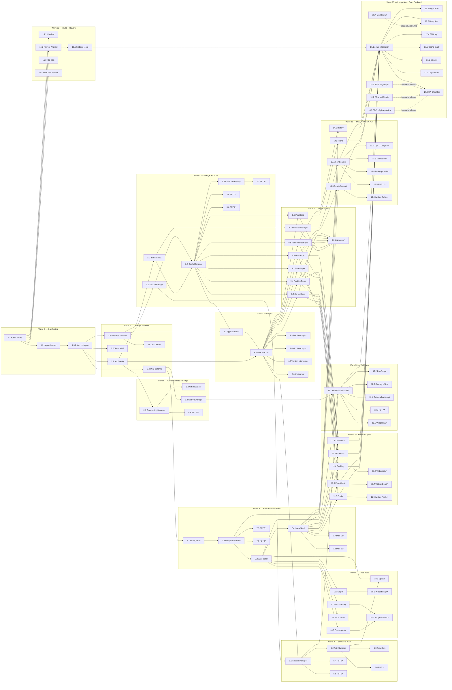

# Implementation Plan: App_Flutter "Operação Alfa" (híbrido nativo + WebView)

## Overview

Convert the feature design into a series of prompts for a code-generation LLM that will implement each step with incremental progress. Make sure that each prompt builds on the previous prompts, and ends with wiring things together. There should be no hanging or orphaned code that isn't integrated into a previous step. Focus ONLY on tasks that involve writing, modifying, or testing code.

A implementação segue a arquitetura em 4 camadas do `design.md` (Apresentação → Aplicação → Domínio → Infraestrutura) e progride de baixo para cima: scaffolding e infraestrutura primeiro (storage, network, theme, config), depois gerenciadores de domínio (auth, sessão, cache, conectividade), depois roteamento e shell, depois repositórios, depois telas (na ordem de dependência), depois FCM e build/flavors, encerrando com QA manual e coordenação com o backend Laravel para os itens BD-1, BD-4 e BD-5.

Convenções desta lista:

- Linguagem alvo: **Dart/Flutter** (a escolha já está fixada no `design.md`).
- Diretório do app Flutter: `alfa-quest/` (atualmente vazio). O `applicationId` do app legado em `android/app/build.gradle.kts` é reutilizado para que a release Flutter substitua o app atual in-place via Play Store, conforme seção *Migration and Rollout* do design.
- Sub-tarefas marcadas com `*` são opcionais (testes unitários, de propriedade, de widget e integração) — podem ser puladas para acelerar um MVP, mas são fortemente recomendadas para os 13 invariantes de correção definidos no design.
- Cada teste de propriedade traz no comentário do arquivo o cabeçalho `// Feature: flutter-hybrid-app, Property N: <título>` exigido pela seção *Testing Strategy* do design e usa o pacote `glados` (`Glados.defaultMaxRuns = 100`).
- Referências `_Requirements: X.Y_` apontam para a sub-cláusula granular do `requirements.md` (não apenas para a User Story).
- Itens de coordenação com o backend (seção 18) são **tarefas Laravel**, não Flutter; ficam neste plano apenas para tracking conjunto da release.

## Tasks

- [x] 1. Scaffolding do projeto Flutter e dependências
  - [x] 1.1 Criar projeto Flutter em `alfa-quest/` com applicationId herdado
    - Executar `flutter create --org br.com.operacaoalfa --project-name alfa_quest --platforms android,ios .` dentro de `alfa-quest/`
    - Editar `android/app/build.gradle` (do projeto Flutter) para usar `applicationId "br.com.operacaoalfa.app"` (mesmo do app legado em `android/app/build.gradle.kts`) e `minSdk = 26`, `targetSdk` alinhado ao app atual
    - Apagar arquivos de exemplo (`lib/main.dart` placeholder, testes de exemplo) deixando apenas `main.dart` mínimo carregando `MaterialApp` vazio
    - _Requirements: 14.1, 14.2_
  
  - [x] 1.2 Adicionar dependências em `pubspec.yaml`
    - Runtime: `flutter_riverpod`, `go_router`, `dio`, `webview_flutter`, `flutter_secure_storage`, `connectivity_plus`, `firebase_core`, `firebase_messaging`, `flutter_local_notifications`, `app_links`, `url_launcher`, `drift`, `drift_flutter`, `path_provider`, `freezed_annotation`, `json_annotation`, `uuid`, `intl`
    - Dev: `build_runner`, `freezed`, `json_serializable`, `drift_dev`, `glados`, `mocktail`, `integration_test` (do Flutter SDK)
    - Rodar `flutter pub get` e confirmar resolução
    - _Requirements: 14.3_
  
  - [x] 1.3 Configurar `analysis_options.yaml` e `build_runner`
    - Importar `package:flutter_lints/flutter.yaml` e ativar regras adicionais (prefer_const_constructors, avoid_dynamic_calls, no_logic_in_create_state)
    - Criar script `scripts/codegen.sh` que executa `dart run build_runner build --delete-conflicting-outputs`
    - Adicionar `.gitignore` cobrindo `*.g.dart`, `*.freezed.dart` se a equipe optar por não comitar — neste projeto comitamos os gerados para CI rápido; documentar a decisão no README do `alfa-quest/`
    - _Requirements: 14.1_

- [x] 2. Configuração, tema e modelos de domínio
  - [x] 2.1 `AppConfig` com leitura de `--dart-define`
    - Criar `lib/core/config/app_config.dart` com `String.fromEnvironment('ENV')`, `'API_BASE_URL'` e `'APP_VERSION'`
    - Expor getters `isProd`, `apiBaseUrl`, `version` e `dominioSistema` (Set com produção e homologação)
    - _Requirements: 14.4, 14.5, 21.7_
  
  - [x] 2.2 Tema Material Design 3
    - Criar `lib/core/theme/app_theme.dart` exportando `lightTheme` e `darkTheme` com `ThemeData(useMaterial3: true)`, `ColorScheme.fromSeed(seedColor: Color(0xFF...))` (cor primária do design system do projeto)
    - Definir tipografia `TextTheme` Material 3 e densidade adaptativa
    - Aplicar o tema em `lib/app.dart` envolvendo um `MaterialApp.router` ainda sem rotas (placeholder)
    - _Requirements: 14.2, 15.1_
  
  - [x] 2.3 Modelos Freezed e mappers `fromJson`
    - Criar em `lib/data/models/`: `sanctum_token.dart`, `user.dart` (com `SubscriptionStatus` enum + extensão `hasActiveSubscription`), `auth_requests.dart` (LoginRequest, RegisterRequest, LoginResponse), `api_validation_error.dart`, `career.dart`, `exam.dart`, `previous_attempt_summary.dart` (com `AttemptStatus` enum), `start_attempt_response.dart`, `performance_statistics.dart`, `ranking_entry.dart`, `my_ranking_position.dart`, `history_item.dart`, `fcm_subscribe_request.dart`, `remote_notification.dart`, `inbox_notification.dart`, `plan.dart`, `checkout_response.dart`
    - Usar `@freezed` + `@JsonSerializable` conforme exemplos da seção *Data Models* do design
    - Rodar `dart run build_runner build` e validar geração
    - _Requirements: 1.2, 2.2, 3.2, 4.2, 5.2, 8.4, 9.2, 13.2, 19.1, 22.2_
  
  - [x] 2.4 Constantes de URL e Domínio_Sistema
    - Criar `lib/core/utils/url_patterns.dart` com `kUrlTentativaPattern = RegExp(r'^/simulado/[^/]+/(tentativa|executar)/[^/]+/?$')`, `kUrlResultadoPattern = RegExp(r'^/simulado/[^/]+/resultado/[^/]+/?$')` e `kDominioSistema = {'operacaoalfa.com.br', 'operacao-alfa.homolog.mydev.com.br'}`
    - Exportar helpers `bool isTentativaPath(String path)`, `bool isResultadoPath(String path)`, `bool isHostFromDomain(Uri uri)`
    - Cobrir casos âncora com testes unitários no mesmo arquivo de teste (trailing slash, paths fora do padrão, sub-paths)
    - _Requirements: 6.6, 11.1, 11.3, 11.4, 11.8_
  
  - [x] 2.5 Unit tests de round-trip JSON dos modelos
    - Para cada modelo Freezed criado em 2.3, escrever um teste em `test/unit/models/` que decodifica um payload representativo da API_Laravel e valida que `model.toJson()` produz o mesmo JSON (idempotência)
    - Cobrir variações: `subscription_expires_at` nulo, `phone` nulo, `lastAttempt` nulo, listas vazias
    - _Requirements: 1.2, 2.2, 9.2_

- [x] 3. Armazenamento local e cache
  - [x] 3.1 `SecureStorage` wrapper para token, device_id e remember_me
    - Criar `lib/core/storage/secure_storage.dart` que encapsula `flutter_secure_storage` com `IOSOptions(accessibility: KeychainAccessibility.first_unlock_this_device, synchronizable: false)` e `AndroidOptions(encryptedSharedPreferences: true)`
    - Expor métodos `read/write/delete` para as chaves `sanctum_token`, `device_id`, `remember_me` (Set/Get/Delete)
    - Garantir que `device_id` é gerado via `Uuid().v4()` na primeira chamada se ausente
    - _Requirements: 7.1, 8.4, 21.3_
  
  - [x] 3.2 Schema `drift` e migração inicial
    - Criar `lib/core/storage/database.dart` com tabelas `cache_entries` (key PK, json_payload, byte_size, fetched_at_ms), `inbox_notifications`, `pending_fcm_tokens`, `pending_attempts` conforme ER do design
    - Executar geração com `drift_dev` e validar que o `OperacaoAlfaDatabase.openConnection()` usa diretório privado via `path_provider.getApplicationDocumentsDirectory()`
    - _Requirements: 16.2, 18.1_
  
  - [x] 3.3 `CacheManager` com SWR e LRU eviction
    - Criar `lib/core/cache/cache_manager.dart` implementando `read<T>`, `write<T>`, `totalBytes`, `clearAll`
    - Considerar uma entrada `stale` quando `fetchedAt` excede 5 minutos
    - Implementar `evictIfNeeded` removendo entradas em ordem ascendente de `fetched_at_ms` até `totalBytes() ≤ 40MB` quando ultrapassa 50MB
    - _Requirements: 18.1, 18.2, 18.3, 18.5_
  
  - [x] 3.4 `InvalidationPolicy` e mapa de chaves canônicas
    - Criar `lib/core/cache/invalidation_policy.dart` com enum `CacheInvalidationEvent { examFinished, profileUpdated, subscriptionChanged, logout }`
    - Mapear cada evento para o conjunto exato de chaves a remover, conforme tabela do Requisito 18.7 e seção *CacheManager* do design (`exams:list:*`, `perf:statistics`, `perf:history`, `ranking:weekly`, `ranking:my_position`, `user:profile`, `user:me`)
    - Logout invoca `CacheManager.clearAll()` (remove todas as chaves)
    - _Requirements: 18.7_
  
  - [x] 3.5 Property test 7 — SWR não retorna dado stale sem disparar revalidação
    - Arquivo: `test/property/cache/swr_age_test.dart`
    - **Propriedade 7: SWR não retorna dado stale sem disparar revalidação**
    - **Valida: Requisitos 18.2, 18.3**
    - Comentário-tag obrigatório no topo: `// Feature: flutter-hybrid-app, Property 7: SWR não retorna dado stale sem disparar revalidação`
    - Gerador de `(t0, tNow)` com clock fake injetável; spy em `_revalidate`
    - _Requirements: 18.2, 18.3_
  
  - [x] 3.6 Property test 8 — Tamanho do cache nunca excede 50MB após eviction
    - Arquivo: `test/property/cache/eviction_size_test.dart`
    - **Propriedade 8: Tamanho do cache nunca excede 50MB após eviction**
    - **Valida: Requisitos 18.5**
    - Comentário-tag: `// Feature: flutter-hybrid-app, Property 8: Tamanho do cache nunca excede 50MB após eviction`
    - Sequence-based PBT com gerador de operações `write` de tamanho variado; asserção de invariante após cada escrita seguida de `evictIfNeeded`
    - _Requirements: 18.5_
  
  - [x] 3.7 Property test 9 — Invalidação por evento purga exatamente as chaves do mapa
    - Arquivo: `test/property/cache/invalidation_map_test.dart`
    - **Propriedade 9: Invalidação por evento purga exatamente as chaves do mapa do Requisito 18.7**
    - **Valida: Requisitos 18.7**
    - Comentário-tag: `// Feature: flutter-hybrid-app, Property 9: Invalidação por evento purga exatamente as chaves do mapa do Requisito 18.7`
    - Tabela de eventos × subconjuntos esperados; gerador de estado pré-condição arbitrário; diff exato pós-invalidação
    - _Requirements: 18.7_

- [x] 4. Camada de rede com `dio` e tratamento de exceções
  - [x] 4.1 Hierarquia `AppException` e mapeamento de erros
    - Criar `lib/core/errors/app_exception.dart` com hierarquia selada: `ApiException` (UnauthenticatedException 401, ValidationException 422 com `fieldErrors`, RateLimitException 429 com `retryAfter`, ServerException 5xx, NotFoundException 404, ApiClientException, ForceUpdateRequiredException), `NetworkException` (TimeoutException, NoConnectionException, TlsException), `WebViewException`, `FcmException`, `CheckoutException`
    - Implementar `AppException.toLogString()` que retorna apenas classe + status + path sem query (sem corpo de resposta, token, e-mail ou telefone) — Requisito 21.6
    - _Requirements: 21.6_
  
  - [x] 4.2 `ApiClient` baseado em `dio`
    - Criar `lib/core/network/api_client.dart` configurando `Dio` com `baseUrl: AppConfig.apiBaseUrl`, `connectTimeout: 15s` para login/register e `30s` padrão para os demais
    - Adicionar header `User-Agent: OperacaoAlfa/<version> (Android|iOS; flavor=<flavor>)`
    - Expor `Future<Response<T>>` para os métodos REST padrão e um helper `mapDioError(DioException)` que produz `AppException`
    - _Requirements: 1.5, 14.5_
  
  - [x] 4.3 Interceptor de autenticação (`Authorization: Bearer`)
    - Criar `lib/core/network/auth_interceptor.dart` que injeta o header `Authorization: Bearer <token>` lendo do `SessionManager` em todas as requisições para endpoints autenticados (lista negra para `/api/login`, `/api/register`, `/api/careers`, `/api/plans`)
    - _Requirements: 7.5_
  
  - [x] 4.4 Interceptor de 401 e redirecionamento
    - Criar `lib/core/network/unauthorized_interceptor.dart` que, ao detectar 401, chama `SessionManager.clearToken()` e empurra um evento para um `Stream<void>` consumido pelo `Router_App` para navegar a `/login` em ≤3s
    - Garantir que durante o splash bootstrap (validação inicial em `/api/me`) o interceptor não dispara redirecionamento múltiplo
    - _Requirements: 7.6, 17.5_
  
  - [x] 4.5 Interceptor de versionamento `X-API-Min-Version`
    - Criar `lib/core/network/version_interceptor.dart` que compara `response.headers['X-API-Min-Version']` com `AppConfig.version` (semver) e, quando a versão do cliente é inferior, lança `ForceUpdateRequiredException`
    - Quando o header não está presente (situação atual antes do BD-4), o interceptor é no-op
    - _Requirements: 21.7_
  
  - [x] 4.6 Unit tests de mapeamento `DioException → AppException`
    - Arquivo: `test/unit/network/dio_error_mapper_test.dart`
    - Cobrir cada status code (401, 422, 429, 404, 500, 503) e cada `DioExceptionType` (connectionTimeout, receiveTimeout, badCertificate, unknown)
    - Validar que `toLogString()` nunca contém `body`, `email`, `phone` ou `token`
    - _Requirements: 21.6_

- [x] 5. Gerenciador_De_Sessão e Gerenciador_De_Autenticação
  - [x] 5.1 `SessionManager` (token + injeção em WebView + logout)
    - Criar `lib/services/session_manager.dart` implementando a interface da seção *Components and Interfaces* do design
    - `saveToken(token, persistAcrossLaunches)`: quando `false`, mantém apenas em memória e remove o token do `SecureStorage` se existir
    - `getToken()`: prioriza memória; se ausente, lê do `SecureStorage` apenas se a flag `remember_me` for `true`
    - `clearAll()`: ordem garantida — `WebViewCookieManager.clearCookies()`, `controller.runJavaScript('localStorage.clear(); sessionStorage.clear();')`, `secureStorage.deleteAll()`, `cacheManager.clearAll()`, concluído em ≤2s
    - `injectIntoWebView(controller)`: chama `runJavaScript` com `window.localStorage.setItem('<chave_pwa>', '<token>')` antes de qualquer `loadRequest`. **Verificar a chave exata lendo o React PWA** (esperada `auth_token`) e centralizar como constante `kPwaTokenKey`
    - _Requirements: 7.1, 7.2, 7.3, 7.4, 7.7_
  
  - [x] 5.2 `AuthManager` (login, registro, bootstrap, logout)
    - Criar `lib/services/auth_manager.dart` com `Stream<AuthState>` (sealed: AuthLoading, AuthAuthenticated, AuthUnauthenticated)
    - `login(email, password, rememberMe)`: POST `/api/login` com timeout 15s; em 200 chama `SessionManager.saveToken(token, persistAcrossLaunches: rememberMe)`; em 401 propaga `UnauthenticatedException` com mensagem da API; em 429 propaga `RateLimitException`
    - `register(name, email, password, passwordConfirmation)`: POST `/api/register`; em 422 propaga `ValidationException(errors: errors.{campo})`
    - `bootstrap()`: implementa o sequence diagram da seção *Inicialização* (lê token, GET `/api/me` com timeout 5s, modos válido/expirado/timeout)
    - `logout()`: POST `/api/logout` (ignora falha de rede), depois `SessionManager.clearAll()`, emite `AuthUnauthenticated`
    - _Requirements: 1.2, 1.4, 1.5, 1.10, 2.2, 2.3, 2.4, 7.3, 7.4, 17.3, 17.4, 17.5_
  
  - [x] 5.3 Providers Riverpod para AuthState e SessionManager
    - Criar `lib/services/providers.dart` com `secureStorageProvider`, `cacheManagerProvider`, `sessionManagerProvider`, `apiClientProvider`, `authManagerProvider`, `authStateProvider` (consumido pelas telas)
    - Expor um `currentTokenProvider` consumido pelo `AuthInterceptor`
    - _Requirements: 7.1, 7.5_
  
  - [x] 5.4 Property test 1 — Persistência do token respeita "Lembrar-me"
    - Arquivo: `test/property/auth/remember_me_persistence_test.dart`
    - **Propriedade 1: Persistência do token respeita "Lembrar-me"**
    - **Valida: Requisitos 1.6, 7.7**
    - Comentário-tag: `// Feature: flutter-hybrid-app, Property 1: Persistência do token respeita "Lembrar-me"`
    - Gerador combinando `String` (token), `bool` (rememberMe) e fake in-memory secure storage; reinicialização simulada do `SessionManager`
    - _Requirements: 1.6, 7.7_
  
  - [x] 5.5 Property test 2 — Logout limpa todo o estado de sessão
    - Arquivo: `test/property/auth/logout_clears_state_test.dart`
    - **Propriedade 2: Logout limpa todo o estado de sessão**
    - **Valida: Requisitos 7.3, 7.4, 18.7**
    - Comentário-tag: `// Feature: flutter-hybrid-app, Property 2: Logout limpa todo o estado de sessão`
    - Geradores compostos para token persistido + cookies + localStorage + cache; asserção de vacuidade total após `clearAll()` em ≤2s simulados
    - _Requirements: 7.3, 7.4, 18.7_
  
  - [x] 5.6 Property test 3 — Resposta 401 sempre redireciona e revoga token
    - Arquivo: `test/property/auth/unauthorized_redirect_test.dart`
    - **Propriedade 3: Resposta 401 sempre redireciona para login e revoga o token**
    - **Valida: Requisitos 7.6, 17.5**
    - Comentário-tag: `// Feature: flutter-hybrid-app, Property 3: Resposta 401 sempre redireciona para login e revoga o token`
    - Sequence-based PBT com gerador de (endpoint, rota inicial, payload de erro 401); mock do dio retornando 401; clock simulado para verificar a janela de 3s
    - _Requirements: 7.6, 17.5_

- [x] 6. Conectividade e WebViewBridge
  - [x] 6.1 `ConnectivityManager` baseado em `connectivity_plus`
    - Criar `lib/services/connectivity_manager.dart` com `ValueListenable<ConnectivityStatus>` e `Stream<ConnectivityStatus>`
    - Detectar offline em ≤3s e emitir transições; expor um helper `whenOnline(Future<T> Function())` para revalidações automáticas
    - _Requirements: 12.1, 12.4_
  
  - [x] 6.2 `OfflineBanner` global no `Scaffold` raiz
    - Criar `lib/features/connectivity/widgets/offline_banner.dart`: banner não-dismissível na parte superior quando `ConnectivityStatus.offline`
    - Acoplar ao `HomeShell` (criado depois) e a outras rotas top-level via `MaterialBanner` ou `SafeArea` no topo
    - _Requirements: 12.1_
  
  - [x] 6.3 `WebViewBridge` (JavascriptChannel "OperacaoAlfaApp")
    - Criar `lib/services/webview_bridge.dart` com `attach(WebViewController, onExamFinished, onRequestExit)`
    - Implementar parser que lê JSON `{ "type": "examFinished", "examId", "attemptId" }` e `{ "type": "requestExit" }` e propaga eventos
    - Lidar com payloads malformados (loga via `AppException.toLogString` e ignora)
    - _Requirements: 6.4, 6.6, 6.7_
  
  - [x] 6.4 Property test 13 — Banner de conectividade respeita janelas de 3s e 5s
    - Arquivo: `test/property/connectivity/banner_timing_test.dart`
    - **Propriedade 13: Banner de conectividade respeita as janelas de 3s e 5s**
    - **Valida: Requisitos 12.1, 12.4**
    - Comentário-tag: `// Feature: flutter-hybrid-app, Property 13: Banner de conectividade respeita as janelas de 3s e 5s`
    - Clock fake; gerador de sequências cronológicas de `(timestamp, ConnectivityStatus)`; asserção de invariante temporal em cada `tNow` amostrado
    - _Requirements: 12.1, 12.4_

- [x] 7. Roteamento, Deep Link Handler e Shell
  - [x] 7.1 `route_paths.dart` com constantes
    - Criar `lib/routing/route_paths.dart` com todos os paths declarados no `goRouter` do design (`/splash`, `/onboarding`, `/login`, `/register`, `/dashboard`, `/simulados`, `/simulados/:examId`, `/simulados/:examId/resultado/:attemptId`, `/simulados/:examId/tentativa/:attemptId`, `/ranking`, `/perfil`, `/notificacoes`, `/planos`, `/historico`, `/excluir-conta`, `/forcar-atualizacao`)
    - Exportar helpers `String examDetailPath(String id)`, `String tentativaPath(String examId, String attemptId)`, etc.
    - _Requirements: 11.2, 11.3, 11.4_
  
  - [x] 7.2 `DeepLinkHandler` puro (sem navegação)
    - Criar `lib/routing/deep_link_handler.dart` implementando `String? resolve(Uri uri)` conforme tabela do design
    - Implementar fila FIFO `enqueuePending(uri)` / `consumePending()` para deep links recebidos antes da autenticação
    - Tratar host fora do `kDominioSistema` retornando `null` (link é aberto via `url_launcher` pelo chamador) e path desconhecido retornando `/dashboard`
    - _Requirements: 11.1, 11.2, 11.3, 11.4, 11.5, 11.7, 11.8_
  
  - [x] 7.3 `AppRouter` com `go_router` e `ShellRoute`
    - Criar `lib/routing/app_router.dart` declarando o `GoRouter` da seção *Router_App* do design
    - Implementar `redirect: _authRedirect` que: se `AuthUnauthenticated` e rota é autenticada → `/login` (preservando deep link pendente); se `AuthAuthenticated` e rota é `/login` ou `/register` → `/dashboard`
    - Configurar `ShellRoute` com `HomeShell` para Dashboard / Simulados / Ranking / Perfil; `WebViewSimuladoScreen` ficar **fora** do shell (Requisito 10.6)
    - Integrar `app_links` para receber URIs externas e chamar `DeepLinkHandler.resolve(uri)`
    - _Requirements: 10.1, 10.6, 10.7, 11.1, 11.6_
  
  - [x] 7.4 `HomeShell` com `BottomNavigationBar` + `IndexedStack`
    - Criar `lib/features/shell/home_shell.dart` mantendo as 4 abas (Dashboard, Simulados, Ranking, Perfil) em um `IndexedStack` para preservar estado entre alternâncias
    - Implementar `shouldShowBottomNav(String currentLocation)` que retorna `false` quando o location casa com `kUrlTentativaPattern` (Requisito 10.6); a função SHALL ser pura e exportada para teste
    - AppBar global com ícone de sino + badge numérico (consumido de `notificationsBadgeProvider`) que navega para `/notificacoes`
    - _Requirements: 10.1, 10.2, 10.3, 10.4, 10.5, 10.6, 10.7, 10.8_
  
  - [x] 7.5 Property test 5 — Pattern de URL é total e desambíguo
    - Arquivo: `test/property/deeplinks/pattern_total_disjoint_test.dart`
    - **Propriedade 5: Casamento de URL de tentativa e resultado é total e desambíguo**
    - **Valida: Requisitos 11.1, 11.2, 11.3, 11.4, 11.7, 11.8**
    - Comentário-tag: `// Feature: flutter-hybrid-app, Property 5: Casamento de URL de tentativa e resultado é total e desambíguo`
    - Gerador estruturado de paths variados; asserção de exclusividade mútua e totalidade da resolução
    - _Requirements: 11.1, 11.2, 11.3, 11.4, 11.7, 11.8_
  
  - [x] 7.6 Property test 6 — Deep link pendente é consumido exatamente uma vez
    - Arquivo: `test/property/deeplinks/pending_link_consumed_once_test.dart`
    - **Propriedade 6: Deep link pendente é consumido exatamente uma vez após autenticação**
    - **Valida: Requisitos 11.5**
    - Comentário-tag: `// Feature: flutter-hybrid-app, Property 6: Deep link pendente é consumido exatamente uma vez após autenticação`
    - Modelo abstrato de fila/Option; comparação com o `DeepLinkHandler` real
    - _Requirements: 11.5_
  
  - [x] 7.7 Property test 10 — BottomNav oculta sse rota = URL_Tentativa
    - Arquivo: `test/property/navigation/bottom_nav_visibility_test.dart`
    - **Propriedade 10: BottomNavigationBar é oculta sse a rota corresponde ao URL_Tentativa_Pattern**
    - **Valida: Requisitos 10.6, 10.7**
    - Comentário-tag: `// Feature: flutter-hybrid-app, Property 10: BottomNavigationBar é oculta sse a rota corresponde ao URL_Tentativa_Pattern`
    - Gerador de paths estruturados; função pura `shouldShowBottomNav(path)` testada sem widget tester
    - _Requirements: 10.6, 10.7_
  
  - [x] 7.8 Property test 11 — Estado de cada aba preservado ao alternar
    - Arquivo: `test/property/navigation/tab_state_preservation_test.dart`
    - **Propriedade 11: Estado de cada aba da BottomNav é preservado ao alternar**
    - **Valida: Requisitos 10.3, 10.5**
    - Comentário-tag: `// Feature: flutter-hybrid-app, Property 11: Estado de cada aba da BottomNav é preservado ao alternar`
    - Sequence-based PBT modelando `Map<Tab, TabState>`; comparação por igualdade após sequências de `selectTab/scrollTo/loadData`
    - _Requirements: 10.3, 10.5_

- [x] 8. Checkpoint — Infraestrutura, sessão, conectividade e roteamento
  - Garantir que todos os testes (unit + property) das tarefas 2-7 passam com `flutter test`
  - Validar que `flutter analyze` não emite warnings novos
  - Confirmar que o app compila (`flutter run --flavor homolog --dart-define=ENV=homolog --dart-define=API_BASE_URL=https://operacao-alfa.homolog.mydev.com.br`) exibindo uma tela placeholder do Splash com o tema MD3 aplicado
  - Ensure all tests pass, ask the user if questions arise.

- [x] 9. Repositórios SWR
  - [x] 9.1 `ExamRepository` (listagem, detalhe, start)
    - Criar `lib/data/repositories/exam_repository.dart` com `listExams({int? careerId})`, `getExam(String id)`, `startAttempt(String id)`
    - Listagem usa chave `exams:list:career=${careerId ?? 'all'}` e padrão SWR (cached → revalidate em background)
    - Detalhe usa chave `exams:detail:${id}`; `startAttempt` é POST sem cache
    - _Requirements: 4.1, 4.3, 4.4, 5.1, 5.4, 18.1, 18.2_
  
  - [x] 9.2 `CareerRepository` (lista pública para filtro)
    - Criar `lib/data/repositories/career_repository.dart` com `listCareers()` consumindo GET `/api/careers` (não autenticado); cachear resultado por sessão (não persistido)
    - _Requirements: 4.3_
  
  - [x] 9.3 `UserRepository` (perfil, me, logout)
    - Criar `lib/data/repositories/user_repository.dart` com `getMe()`, `getProfile()`, `updateProfile(partialMap)`, `deleteAccount()`, `logout()`
    - `updateProfile` envia apenas campos modificados (Requisito 9.4); ao retornar 200 invalida `user:profile` e `user:me` via `InvalidationPolicy(profileUpdated)`
    - _Requirements: 7.3, 9.1, 9.4, 9.5, 17.3, 20.3_
  
  - [x] 9.4 `RankingRepository` (ranking + minha posição)
    - Criar `lib/data/repositories/ranking_repository.dart` com `getWeeklyRanking({int limit = 100})` cacheado em `ranking:weekly` e `getMyPosition()` cacheado em `ranking:my_position`
    - Tratar 404 em `getMyPosition` como retorno `null` (sem posição) para a UI exibir mensagem específica
    - _Requirements: 3.7, 13.1, 13.2, 13.5, 13.7_
  
  - [x] 9.5 `PerformanceRepository` (estatísticas + histórico)
    - Criar `lib/data/repositories/performance_repository.dart` com `getStatistics()` em `perf:statistics` e `getHistory()` em `perf:history`
    - _Requirements: 3.1, 3.2, 22.1, 22.2_
  
  - [x] 9.6 `PlanRepository` (planos + checkout + assinatura)
    - Criar `lib/data/repositories/plan_repository.dart` com `listPlans()` em `plans:list`, `startCheckout(String planId)` (POST `/api/edduz/checkout`), `getSubscriptionStatus()` (GET `/api/subscription/status`), `cancelSubscription()` (POST `/api/subscription/cancel`)
    - _Requirements: 19.1, 19.2, 19.3, 19.5, 19.7_
  
  - [x] 9.7 `NotificationsRepository` (inbox local)
    - Criar `lib/data/repositories/notifications_repository.dart` consumindo a tabela `inbox_notifications` do drift
    - Métodos: `insert(InboxNotification)`, `listLatest({int limit = 100})`, `markRead(String id)`, `markAllRead()`, `unreadCount()`, `purgeOldest()` (mantém ≤100, removendo as mais antigas)
    - _Requirements: 16.1, 16.2, 16.3, 16.5, 16.6, 16.7_
  
  - [x] 9.8 Unit tests dos repositórios — comportamento SWR e invalidação
    - Para cada repositório, testar: leitura inicial sem cache, leitura subsequente com cache <5min (não chama API), leitura subsequente >5min (retorna stale + dispara revalidação), invalidação por evento
    - _Requirements: 18.2, 18.3, 18.7_

- [x] 10. Telas de boot — Splash, Onboarding, Login, Cadastro, ForceUpdate
  - [x] 10.1 `SplashScreen`
    - Criar `lib/features/auth/screens/splash_screen.dart` com logo centralizado e `CircularProgressIndicator`
    - Consumir `authBootstrapProvider` (FutureProvider que invoca `AuthManager.bootstrap()`); ao concluir, navega via `GoRouter` para `/dashboard`, `/login` ou `/onboarding` conforme o resultado
    - Garantir que a splash não excede 5s (timeout em `bootstrap`); em timeout com token presente, vai a `/dashboard` em modo offline
    - Configurar splash screen nativa do SO (Android 12+ Splash Screen API e iOS LaunchScreen) — atualizar `android/app/src/main/res/drawable/launch_background.xml` e `ios/Runner/Base.lproj/LaunchScreen.storyboard`
    - _Requirements: 17.1, 17.2, 17.3, 17.4, 17.5, 17.6, 17.7, 17.8_
  
  - [x] 10.2 `OnboardingScreen` com aceite de PP/Termos
    - Criar `lib/features/auth/screens/onboarding_screen.dart` exibido apenas na primeira execução (flag `onboarding_done` em SharedPreferences)
    - Texto curto + 2 links (`url_launcher` para abertura externa) — Política de Privacidade e Termos de Uso no `Domínio_Sistema`
    - `Checkbox` "Li e aceito" + `FilledButton` "Continuar" desabilitado até o checkbox marcar
    - _Requirements: 21.1_
  
  - [x] 10.3 `LoginScreen`
    - Criar `lib/features/auth/screens/login_screen.dart` com `Form`, dois `TextFormField` (e-mail / senha) e `Checkbox` "Lembrar-me"
    - Validação local: e-mail máximo 254 chars + formato válido; senha 6-128 chars
    - `loginControllerProvider`: chama `AuthManager.login`; em sucesso navega via `GoRouter`; em 401 exibe mensagem da API; em 422 exibe inline; em 429 exibe dialog "Aguarde"; em timeout exibe SnackBar
    - Botão `FilledButton` desabilitado e `CircularProgressIndicator` exibido enquanto requisição roda
    - Link `TextButton` "Criar conta" navega para `/register`
    - _Requirements: 1.1, 1.2, 1.3, 1.4, 1.5, 1.6, 1.7, 1.8, 1.9, 1.10_
  
  - [x] 10.4 `RegisterScreen`
    - Criar `lib/features/auth/screens/register_screen.dart` com 4 campos (nome, e-mail, senha, confirmação)
    - Validação local: nome ≤255, e-mail formato + ≤254, senha ≥8, confirmação igual à senha
    - Em sucesso (HTTP 201), navega para `/dashboard` e dispara `FcmService.ensurePermission()` (Requisito 2.7)
    - Em erro de rede, mantém os dados não-sensíveis (limpa apenas senha e confirmação)
    - _Requirements: 2.1, 2.2, 2.3, 2.4, 2.5, 2.6, 2.7_
  
  - [x] 10.5 `ForceUpdateScreen`
    - Criar `lib/features/system/screens/force_update_screen.dart`: tela bloqueante com mensagem e botão "Atualizar agora" abrindo a Play Store / App Store via `url_launcher`
    - `PopScope(canPop: false)` — sem botão voltar funcional
    - Ativada via interceptor de versionamento (4.5) que empurra a navegação irreversível
    - _Requirements: 21.7_
  
  - [x] 10.6 Widget test `LoginScreen`
    - Cobre: validação inline para e-mail vazio/inválido (Req 1.8), botão desabilitado durante loading (Req 1.9), exibição de mensagem 401 (Req 1.4), navegação ao sucesso (Req 1.3)
    - Usa `ProviderScope.overrides` injetando um `AuthManager` fake
    - _Requirements: 1.3, 1.4, 1.8, 1.9_
  
  - [x] 10.7 Widget test `OnboardingScreen` e `ForceUpdateScreen`
    - Onboarding: botão "Continuar" só habilita quando o checkbox é marcado
    - ForceUpdate: nenhuma rota consegue sair (`PopScope` ativo); botão "Atualizar agora" chama `url_launcher`
    - _Requirements: 21.1, 21.7_

- [x] 11. Telas principais (abas da BottomNav)
  - [x] 11.1 `DashboardScreen`
    - Criar `lib/features/dashboard/screens/dashboard_screen.dart` consumindo `performanceRepositoryProvider.getStatistics()` e `rankingRepositoryProvider.getMyPosition()`
    - Cards de `total_exams_completed`, `accuracy_percentage`, `position`; shimmer enquanto carrega; `RefreshIndicator` com timeout 10s
    - Estado vazio quando `total_exams_completed == 0` (Req 3.8); mensagem "sem posição no ranking" quando `getMyPosition()` retorna `null` (Req 3.7)
    - Em erro, exibe último cache + texto "Atualizado em <data/hora>" (Req 3.5)
    - Atalhos para `/simulados` e `/historico` (Req 3.6)
    - Após login/registro/bootstrap, dispara `FcmService.ensurePermission()` se permissão ainda for `notDetermined` (Req 8.1)
    - _Requirements: 3.1, 3.2, 3.3, 3.4, 3.5, 3.6, 3.7, 3.8, 8.1_
  
  - [x] 11.2 `ExamListScreen` com filtro por carreira
    - Criar `lib/features/exams/screens/exam_list_screen.dart` consumindo `examListControllerProvider.family(careerId)`
    - `ListView.builder` virtualizado, `RefreshIndicator`, shimmer, estado vazio
    - `FilterChip`s carregados de `CareerRepository.listCareers()`, com chip "Todas as carreiras" como reset; seleção única
    - Cada item exibe `title`, `numQuestions`, `durationMin`, badge `isFree`, indicador de tentativa anterior quando `lastAttempt != null`
    - Tap navega para `/simulados/:examId`
    - _Requirements: 4.1, 4.2, 4.3, 4.4, 4.5, 4.6, 4.7, 4.8, 4.9_
  
  - [x] 11.3 `ExamDetailScreen`
    - Criar `lib/features/exams/screens/exam_detail_screen.dart` consumindo `examDetailControllerProvider.family(id)` e `userRepositoryProvider.getMe()` para verificar `hasActiveSubscription`
    - Exibe `title`, `description`, metadados, lista de tentativas anteriores quando presente
    - Botão "Iniciar Simulado" chama `ExamRepository.startAttempt(id)` e navega para `/simulados/:examId/tentativa/:attemptId`
    - Suporta deep param `highlightAttemptId` (vindo da rota `/simulados/:examId/resultado/:attemptId` do Req 11.4) destacando a entrada do resultado
    - Quando `isFree=false` e usuário sem assinatura, desabilita o botão, exibe badge "Premium" e botão "Ver planos" → `/planos`
    - 404 → mensagem + botão voltar à listagem
    - _Requirements: 5.1, 5.2, 5.3, 5.4, 5.5, 5.6, 5.7, 5.8, 11.4_
  
  - [x] 11.4 `RankingScreen`
    - Criar `lib/features/ranking/screens/ranking_screen.dart` consumindo `rankingRepositoryProvider.getWeeklyRanking()` e `getMyPosition()`
    - Header fixo com a posição do usuário (Req 13.5); lista virtualizada com `position`, `name`, `score`
    - Destaca o item do usuário atual com cor de fundo diferenciada quando `isCurrentUser == true` (Req 13.3)
    - `RefreshIndicator`, shimmer, estados de erro e "sem posição" (404 em my-position → texto orientativo)
    - _Requirements: 13.1, 13.2, 13.3, 13.4, 13.5, 13.6, 13.7, 13.8_
  
  - [x] 11.5 `ProfileScreen`
    - Criar `lib/features/profile/screens/profile_screen.dart` consumindo `userRepositoryProvider.getProfile()`
    - Form editável (`name`, `email`, `phone`); ao salvar envia apenas campos modificados via PUT
    - Mostra `subscription_status` + `subscription_expires_at` quando disponível
    - Placeholder de foto de perfil (sem edição, Req 9.10)
    - Botão "Alterar senha" abre fluxo separado com 3 campos (atual, nova, confirmação) — usa endpoint atual do backend
    - Botão "Logout" → `AuthManager.logout()` + navegação a `/login`
    - Botão "Excluir conta" → navega a `/excluir-conta`
    - Links permanentes para Política de Privacidade e Termos de Uso (Req 21.2)
    - Snackbar de sucesso visível por 3s+ após PUT 200 (Req 9.5)
    - _Requirements: 9.1, 9.2, 9.3, 9.4, 9.5, 9.6, 9.7, 9.8, 9.9, 9.10, 21.2_
  
  - [x] 11.6 Widget test `ExamListScreen`
    - Cobre: shimmer durante load, estado vazio, pull-to-refresh, filtro `FilterChip` (seleção única + reset)
    - _Requirements: 4.3, 4.6, 4.7, 4.9_
  
  - [x] 11.7 Widget test `ExamDetailScreen` — bloqueio premium
    - Override do `userRepositoryProvider.getMe()` para retornar usuário sem assinatura ativa; assert que botão "Iniciar Simulado" está desabilitado e botão "Ver planos" está visível
    - _Requirements: 5.5_
  
  - [x] 11.8 Widget test `ProfileScreen` — edição parcial envia apenas modificados
    - Cobre Req 9.4: o controller envia apenas `{phone}` quando só o telefone foi editado
    - _Requirements: 9.4_

- [x] 12. Tela de WebView_Simulado e fluxo de execução
  - [x] 12.1 `WebViewSimuladoScreen`
    - Criar `lib/features/exams/screens/webview_simulado_screen.dart`
    - Configurar `WebViewController` com `setJavaScriptMode(unrestricted)`, `setNavigationDelegate(onPageFinished, onWebResourceError, onNavigationRequest)` e DOM storage habilitado
    - Antes de qualquer `loadRequest`, chamar `SessionManager.injectIntoWebView(controller)` (que executa `runJavaScript('localStorage.setItem(...)')`) — Requisito 6.2 / 7.2
    - Abrir URL `${AppConfig.apiBaseUrl}/simulado/$examId/tentativa/$attemptId`; timeout 30s para o load inicial (Req 6.1, 6.9)
    - `WebViewBridge.attach`: `onExamFinished` invoca `InvalidationPolicy(examFinished)` e navega `/simulados`; `onRequestExit` exibe diálogo de confirmação
    - `setNavigationDelegate.onPageFinished`: testa URL contra `kUrlResultadoPattern` e dispara o mesmo handler de finalização (Req 6.6 b)
    - `setNavigationDelegate.onNavigationRequest`: para hosts fora do `kDominioSistema`, retorna `NavigationDecision.prevent` e abre via `url_launcher` (Req 6.11)
    - Persistir `pending_attempts` na tabela drift ao iniciar; remover ao finalizar (Req 6.10)
    - _Requirements: 6.1, 6.2, 6.3, 6.4, 6.6, 6.7, 6.9, 6.10, 6.11, 7.2_
  
  - [x] 12.2 `PopScope` com diálogo "abandonar simulado?"
    - Implementar `PopScope(canPop: false, onPopInvokedWithResult: ...)` conforme snippet do design
    - Se `controller.canGoBack()` → `controller.goBack()` (Req 14.6/14.7); senão exibe dialog (Req 6.5); se confirmar, navega `/simulados`
    - _Requirements: 6.5, 14.6, 14.7, 14.8_
  
  - [x] 12.3 Overlay de offline e retry na WebView
    - Quando `ConnectivityManager` reporta offline durante a execução, exibir overlay sobreposto à WebView (sem fechá-la) com mensagem e botão "Tentar novamente" (Req 12.5, 6.8)
    - Ao reconectar, recarregar a última URL preservando `attemptId` (Req 12.6, 6.8)
    - Em `onWebResourceError` no carregamento inicial → tela de erro com "Tentar novamente" e "Voltar" (Req 6.9)
    - _Requirements: 6.8, 6.9, 12.5, 12.6_
  
  - [x] 12.4 Retomada de tentativa pendente após process kill
    - Em `main.dart` (após bootstrap), checar `pending_attempts` no drift; se presente e timestamp <30 min, oferecer dialog "Retomar simulado?" e abrir `/simulados/:examId/tentativa/:attemptId`
    - _Requirements: 6.10_
  
  - [x] 12.5 Property test 4 — Token na WebView é igual ao SanctumToken antes do `loadUrl`
    - Arquivo: `test/property/webview/session_injection_order_test.dart`
    - **Propriedade 4: Token na WebView é igual ao SanctumToken ativo antes do `loadUrl`**
    - **Valida: Requisitos 6.2, 7.2**
    - Comentário-tag: `// Feature: flutter-hybrid-app, Property 4: Token na WebView é igual ao SanctumToken ativo antes do loadUrl`
    - `WebViewController` fake registra ordem de chamadas; gerador de tokens; asserção de ordem total: `setItem` precede `loadRequest`
    - _Requirements: 6.2, 7.2_
  
  - [x] 12.6 Widget test `WebViewSimuladoScreen` — `PopScope` e overlay
    - Confirma diálogo de abandono e que overlay offline aparece sem fechar a WebView
    - _Requirements: 6.5, 12.5_

- [x] 13. Notificações (inbox + FCM)
  - [x] 13.1 `FcmService` (permissão, token, foreground/background)
    - Criar `lib/services/fcm_service.dart` com `ensurePermission()`, `getToken()`, `tokenRefresh`, `subscribeOnBackend`, `unsubscribeOnBackend`, `foregroundMessages`, `getInitialMessage()`
    - Permissão é solicitada apenas quando estado é `notDetermined` e usuário está autenticado e visualiza Dashboard pela primeira vez (Req 8.1, 8.3)
    - Em foreground, converter `RemoteMessage` em `LocalNotification` via `flutter_local_notifications` no canal `operacao_alfa_default` (Req 8.5); descartar se `title` E `body` ausentes (Req 8.7)
    - Persistir cada notificação recebida (foreground e background com mensagem aberta via tap) na tabela `inbox_notifications`
    - Em `onTokenRefresh`, chamar `subscribeOnBackend(novo)` + `unsubscribeOnBackend(deviceId)` (Req 8.10)
    - Em logout, chamar `unsubscribeOnBackend` antes de `SessionManager.clearAll` (Req 8.12)
    - Falha no envio: marcar `pending_fcm_tokens.attempts++` e backoff exponencial 2/4/8/16/32s; após 5 falhas consecutivas, congelar até próxima inicialização (Req 8.11)
    - _Requirements: 8.1, 8.2, 8.3, 8.4, 8.5, 8.6, 8.7, 8.10, 8.11, 8.12_
  
  - [x] 13.2 Tap em notificação → `DeepLinkHandler`
    - Em `getInitialMessage()` (cold start) e `onMessageOpenedApp` (background), passar `message.data['url']` para `DeepLinkHandler.resolve(Uri.parse(url))`; navegar para o resultado, ou para `/dashboard` se URL ausente/inválida (Req 8.8, 8.9)
    - Ao processar o tap, marcar a notificação correspondente em `inbox_notifications` como lida
    - _Requirements: 8.8, 8.9, 11.5_
  
  - [x] 13.3 `NotificationsScreen` (inbox)
    - Criar `lib/features/notifications/screens/notifications_screen.dart` listando até 100 notificações ordenadas desc (Req 16.1, 16.7)
    - Distinguir lidas/não-lidas com indicador visual (Req 16.4)
    - Tap em item: marca como lida + navega via `DeepLinkHandler` (Req 16.3); se URL inválida, permanece na tela (Req 16.8)
    - Ao abrir a tela, marcar todas as visíveis como lidas e zerar o badge da AppBar (Req 16.6)
    - Botão "Configurações de notificação do sistema" abre o app de configurações (`AppSettings` plugin ou `app_settings`) — Req 16.9
    - _Requirements: 16.1, 16.2, 16.3, 16.4, 16.6, 16.7, 16.8, 16.9_
  
  - [x] 13.4 `notificationsBadgeProvider` global
    - Provider Riverpod que conta `NotificationsRepository.unreadCount()` reativo (Stream do drift)
    - Consumido pelo `HomeShell` AppBar; exibe número exato até 99, "99+" quando >99 (Req 16.5)
    - _Requirements: 10.8, 16.5_
  
  - [x] 13.5 Property test 12 — Filtragem e roteamento de notificações
    - Arquivo: `test/property/fcm/notification_filtering_routing_test.dart`
    - **Propriedade 12: Notificações sem `title` E sem `body` nunca são exibidas; tap sempre roteia via DeepLinkHandler**
    - **Valida: Requisitos 8.7, 8.8, 8.9**
    - Comentário-tag: `// Feature: flutter-hybrid-app, Property 12: Notificações sem title E sem body nunca são exibidas; tap sempre roteia via DeepLinkHandler`
    - Gerador de `RemoteNotification` com `title?` e `body?` independentemente nuláveis; spy em `flutter_local_notifications.show`; comparação do destino de roteamento
    - _Requirements: 8.7, 8.8, 8.9_

- [x] 14. Telas auxiliares — Histórico, Planos, Excluir conta
  - [x] 14.1 `HistoryScreen`
    - Criar `lib/features/history/screens/history_screen.dart` consumindo `performanceRepositoryProvider.getHistory()`
    - `ListView.builder` com cada item exibindo título do simulado, data, percentual e status; shimmer durante load; estado vazio + erro com "tentar novamente"
    - Tap em finalizada → `/simulados/:examId/resultado/:attemptId` (delega para `ExamDetailScreen`)
    - Tap em em-andamento → `/simulados/:examId/tentativa/:attemptId` (abre WebView)
    - _Requirements: 22.1, 22.2, 22.3, 22.4, 22.5, 22.6, 22.7, 22.8_
  
  - [x] 14.2 `PlansScreen`
    - Criar `lib/features/plans/screens/plans_screen.dart` consumindo `planRepositoryProvider.listPlans()`
    - Cards com `name`, `description`, `price`, `durationDays`, `features`; destaca plano ativo com base em `getMe()`
    - Botão "Assinar" → `startCheckout(planId)` e abre `checkoutUrl` em WebView dedicada (não a WebView_Simulado) ou via `url_launcher` no navegador externo
    - Botão "Restaurar compra" → `getSubscriptionStatus()` + invalidação `subscriptionChanged`
    - Botão "Cancelar assinatura" com diálogo de confirmação modal → `cancelSubscription()`
    - Link visível para a página pública de exclusão de conta no Domínio_Sistema (Req 20.6 — depende de BD-5)
    - _Requirements: 19.1, 19.2, 19.3, 19.4, 19.5, 19.6, 19.7, 20.6_
  
  - [x] 14.3 `DeleteAccountScreen`
    - Criar `lib/features/profile/screens/delete_account_screen.dart`
    - Texto explicativo do que será removido + caráter irreversível
    - `TextField` onde o usuário digita "EXCLUIR" (case-sensitive); botão habilita apenas com match exato (Req 20.2)
    - Confirmação chama `userRepositoryProvider.deleteAccount()`; em sucesso, `SessionManager.clearAll()` (eq. logout) e navega a `/login` com SnackBar "Conta excluída"
    - Em erro, exibe mensagem mantendo usuário logado e botão "Tentar novamente"
    - _Requirements: 20.1, 20.2, 20.3, 20.4, 20.5_
  
  - [x] 14.4 Widget test `DeleteAccountScreen`
    - Cobre Req 20.2: botão fica desabilitado até "EXCLUIR" ser digitado exatamente
    - _Requirements: 20.2_

- [x] 15. Configuração Android, iOS e flavors
  - [x] 15.1 AndroidManifest e network_security_config
    - Editar `alfa-quest/android/app/src/main/AndroidManifest.xml` com permissões `INTERNET`, `ACCESS_NETWORK_STATE`, `POST_NOTIFICATIONS`
    - Activity `singleTop`, intent filters: `operacaoalfa://` e App Links com `android:autoVerify="true"` para os hosts do Domínio_Sistema (Req 11.6)
    - `meta-data` com `default_notification_channel_id="operacao_alfa_default"`
    - Criar `res/xml/network_security_config.xml` com `cleartextTrafficPermitted="false"` e exceção apenas para `10.0.2.2` no debug build-type
    - Definir `android:usesCleartextTraffic="false"` no application tag (release)
    - _Requirements: 11.6, 14.4, 14.5, 21.7_
  
  - [x] 15.2 Flavors `homolog` e `prod` no Android
    - Editar `alfa-quest/android/app/build.gradle` com `productFlavors { homolog { applicationIdSuffix ".homolog" } prod { } }` e `flavorDimensions = ["env"]`
    - Criar `android/app/src/homolog/google-services.json` e `android/app/src/prod/google-services.json` (placeholders documentados; o real é versionado em outro mecanismo)
    - Garantir que `applicationId` base é `br.com.operacaoalfa.app` (igual ao app legado) e o flavor `homolog` adiciona `.homolog` para coexistência em testes
    - Reusar a chave de assinatura do app legado (`upload-keystore`) — referenciar em `android/key.properties` versionado em `.gitignore`
    - _Requirements: 14.1_
  
  - [x] 15.3 iOS — `Info.plist`, entitlements e LaunchScreen
    - Editar `alfa-quest/ios/Runner/Info.plist`: `NSAppTransportSecurity` sem exceções, `CFBundleURLTypes` com esquema `operacaoalfa`, `UIBackgroundModes` com `remote-notification` e `fetch`, `NSUserTrackingUsageDescription`
    - Criar `Runner.entitlements` declarando `com.apple.developer.associated-domains` com `applinks:operacaoalfa.com.br` e `applinks:operacao-alfa.homolog.mydev.com.br`
    - Configurar `LaunchScreen.storyboard` com o logotipo
    - Criar Run Script Phase em `Runner.xcodeproj` que copia `GoogleService-Info.plist` da pasta correta (`ios/Runner/Firebase/Homolog` ou `ios/Runner/Firebase/Prod`) com base no scheme ativo
    - _Requirements: 11.6, 14.4_
  
  - [x] 15.4 `AppConfig` consumindo `--dart-define` no `main.dart`
    - Em `lib/main.dart`, ler `ENV`, `API_BASE_URL`, `APP_VERSION` via `String.fromEnvironment` e validar que `API_BASE_URL` está em `kDominioSistema` (asserção em debug)
    - Documentar comandos de build em `alfa-quest/README.md`:
      - `flutter run --flavor homolog --dart-define=ENV=homolog --dart-define=API_BASE_URL=https://operacao-alfa.homolog.mydev.com.br --dart-define=APP_VERSION=1.0.0+1`
      - `flutter build appbundle --flavor prod --dart-define=ENV=prod --dart-define=API_BASE_URL=https://operacaoalfa.com.br --dart-define=APP_VERSION=1.0.0+1`
    - _Requirements: 14.4_
  
  - [x] 15.5 Configurar `firebase_core` e `firebase_messaging`
    - Inicializar `Firebase.initializeApp()` em `main.dart` antes do `runApp` (Req da seção *Inicialização e Boot Sequence* do design)
    - Criar `lib/services/fcm_setup.dart` que registra um `FirebaseMessaging.onBackgroundMessage` handler top-level
    - Validar configuração com builds debug em ambos os flavors recebendo notificações de teste enviadas via Firebase Console
    - _Requirements: 8.5, 8.6, 14.3_

- [x] 16. Checkpoint — Build verde em ambos os flavors
  - Compilar `flutter build apk --flavor homolog --dart-define=...` e `flutter build appbundle --flavor prod --dart-define=...` sem erros
  - Confirmar que `flutter analyze` passa sem warnings novos
  - Rodar `flutter test` e `flutter test integration_test/` (criados depois) com sucesso
  - Verificar que App Links funcionam via `adb shell am start -W -a android.intent.action.VIEW -d "https://operacaoalfa.com.br/simulado/123/resultado/456" br.com.operacaoalfa.app`
  - Ensure all tests pass, ask the user if questions arise.

- [x] 17. Testes de integração e checklist manual de QA
  - [x] 17.1 Setup `integration_test/`
    - Adicionar `integration_test` ao `dev_dependencies` (já feito em 1.2) e criar `integration_test/app_test.dart` com a estrutura padrão do `package:integration_test/integration_test.dart`
    - _Requirements: 6, 7, 8, 11, 17_
  
  - [x] 17.2 Integration test — Login → Dashboard → WebView round-trip
    - Cobre Req 6.1, 6.2, 7.1, 7.2: login real (homolog), assert que ao abrir a WebView_Simulado o React PWA não pede novo login
    - _Requirements: 6.1, 6.2, 7.1, 7.2_
  
  - [x] 17.3 Integration test — Deep link autenticado e não autenticado
    - `adb shell am start -d "operacaoalfa://simulado/123"` autenticado: chega na tela de detalhes
    - Não autenticado: redireciona para `/login`, após login automático vai a `/simulados/123`
    - _Requirements: 11.2, 11.5_
  
  - [x] 17.4 Integration test — FCM tap em background
    - Enviar mensagem FCM de teste com `data.url`, simular tap em background; assert navegação para a rota correspondente
    - _Requirements: 8.6, 8.8_
  
  - [x] 17.5 Integration test — Conclusão de simulado invalida caches
    - Disparar evento `examFinished` via JavascriptChannel; assert que `dashboard`, `ranking` e `histórico` requisitam novos dados na próxima visita
    - _Requirements: 6.7, 18.7_
  
  - [x] 17.6 Integration test — Splash bootstrap (cold start)
    - Token válido → `/dashboard`; sem token → `/login`; latência ≤5s
    - _Requirements: 17.1, 17.2, 17.3, 17.4, 17.6_
  
  - [x] 17.7 Integration test — Logout limpa WebView completamente
    - Após logout, abrir WebView_Simulado de qualquer URL do domínio e assert que React PWA exibe tela de login
    - _Requirements: 7.3, 7.4_
  
  - [x] 17.8 Manual QA Checklist (Google Play & App Store) em `alfa-quest/QA_CHECKLIST.md`
    - Materializar a lista da seção *Testing Strategy → Manual QA Checklist (Google Play & App Store Compliance)* do design como markdown executável
    - Cada item referencia o requisito que cobre; usado pelo time de QA antes de cada submissão à loja
    - _Requirements: 14.1, 14.4, 14.6, 14.7, 14.8, 15.1, 15.2, 15.3, 15.4, 15.5, 15.6, 17.1, 21.1, 21.2, 21.4, 21.5, 21.7, 20.1, 20.6_

- [x] 18. Coordenação com o backend Laravel — Dependências não totalmente mitigadas
  Estas tarefas são executadas pelo time de backend Laravel, **não** pela base Flutter. Ficam neste plano apenas para tracking conjunto. Cada PR backend SHALL atualizar a checklist da seção *Backend Dependencies* do `design.md`.
  
  - [x] 18.1 BD-1 — Paginação em `GET /api/exams` (bloqueante para escala >1000)
    - Adicionar parâmetros `page` e `per_page` (default 20) no controller correspondente
    - Retornar metadados `meta: { current_page, last_page, total }`
    - Cobertura com `Tests\Feature` no Laravel
    - Quando entregue, atualizar `ExamRepository.listExams` para infinite-scroll consumindo as páginas
    - _Requirements: 4.4_
  
  - [x] 18.2 BD-4 — Header `X-API-Min-Version` em respostas autenticadas (bloqueante para release Flutter)
    - Criar middleware Laravel que adiciona o header com base em `config('mobile.min_version')` lido de env var `MOBILE_MIN_VERSION`
    - Inicialmente fixar valor igual à primeira versão Flutter publicada (não bloqueia ninguém em t0)
    - Documentar processo de bump em `laravel/README.md`
    - Cobertura com `Tests\Feature` validando o header em endpoint autenticado
    - _Requirements: 21.7_
  
  - [x] 18.3 BD-5 — Página pública de exclusão de conta (bloqueante para Google Play submission)
    - Criar rota web `/conta/excluir` no Laravel servindo página HTML pública (sem autenticação obrigatória)
    - Coletar e-mail/CPF e disparar fluxo de exclusão (compartilhar lógica com `DELETE /api/user/account`)
    - URL final SHALL ser pública, estável e sem parâmetros de sessão; o app linkará para ela via `PlansScreen` (14.2) e `ProfileScreen` (11.5)
    - Validar que aparece no listing do Google Play como "URL pública para exclusão"
    - _Requirements: 20.6_
  
  - [x] 18.4 Publicar `assetlinks.json` e `apple-app-site-association`
    - Em ambos os hosts do `Domínio_Sistema`, servir `/.well-known/assetlinks.json` com SHA-256 do certificado de release Flutter
    - Servir `/.well-known/apple-app-site-association` com `appID: <TEAM_ID>.br.com.operacaoalfa.app` e `paths: ["/simulado/*", "/dashboard", "/perfil", "/ranking"]`
    - Ambos servidos com `Content-Type: application/json` e sem extensão `.json` na URL final (requisito iOS)
    - Validar com o "Statement List Generator and Tester" do Google e com `https://search.developer.apple.com/appsearch-validation-tool/`
    - _Requirements: 11.6_

- [x] 19. Checkpoint final — Pronto para Internal Testing
  - Todos os testes (unit, widget, property, integration) passam: `flutter test` + `flutter test integration_test/`
  - `flutter analyze` sem warnings
  - QA Checklist 17.8 executado em release build de homolog em pelo menos 1 dispositivo Android e 1 iOS reais
  - Itens BD-2/3/4/5 da seção *Backend Dependencies* atualizados no `design.md` (BD-4 e BD-5 marcados `done`)
  - APK/AAB e IPA gerados com a chave de assinatura correta (mesma do app legado para Android, certificado de distribuição para iOS)
  - Ensure all tests pass, ask the user if questions arise.

## Notes

- Tarefas marcadas com `*` são opcionais e podem ser puladas para um MVP mais rápido; entretanto, as 13 propriedades do design são as principais garantias de correção e SHOULD ser implementadas.
- Cada tarefa referencia sub-cláusulas granulares dos requisitos (e.g., `_Requirements: 1.6, 7.7_` em vez de apenas "Requisito 1") para rastreabilidade fina.
- Checkpoints (tarefas 8, 16 e 19) garantem validação incremental antes de avançar para a próxima fatia.
- Os testes de propriedade usam o pacote `glados` para Dart com `Glados.defaultMaxRuns = 100` e cada arquivo de teste tem o cabeçalho de comentário `// Feature: flutter-hybrid-app, Property N: <título>` exigido pela seção *Testing Strategy* do `design.md`.
- Tarefas em **18** são responsabilidade do time de backend Laravel; o time Flutter pode prosseguir paralelamente com os mocks (`http_mock_adapter` no `dio`) até que cada item entregue.
- O caminho crítico até a primeira submissão à Google Play é: 1 → 2 → 3 → 4 → 5 → 7 → 10 → 11 → 12 → 13 → 15 → 16 → 17.8 → 18.2 → 18.3 → 18.4 → 19. As tarefas 6, 9 e 14 são paralelizáveis após a 5.

## Task Dependency Graph



```json
{
  "waves": [
    { "id": 0,  "tasks": ["1.1"] },
    { "id": 1,  "tasks": ["1.2"] },
    { "id": 2,  "tasks": ["1.3", "15.3"] },
    { "id": 3,  "tasks": ["2.1", "2.2", "2.4", "15.1"] },
    { "id": 4,  "tasks": ["2.3", "3.1", "15.2", "15.4"] },
    { "id": 5,  "tasks": ["2.5", "3.2", "4.1", "7.1"] },
    { "id": 6,  "tasks": ["3.3", "6.1", "6.3", "7.2", "15.5"] },
    { "id": 7,  "tasks": ["3.4", "3.5", "3.6", "4.2", "6.2", "7.5", "7.6"] },
    { "id": 8,  "tasks": ["3.7", "4.6", "5.1", "6.4"] },
    { "id": 9,  "tasks": ["4.3", "4.4", "4.5", "5.4", "5.5"] },
    { "id": 10, "tasks": ["5.2"] },
    { "id": 11, "tasks": ["5.3", "5.6"] },
    { "id": 12, "tasks": ["7.3", "9.1", "9.2", "9.3", "9.4", "9.5", "9.6", "9.7"] },
    { "id": 13, "tasks": ["7.4", "9.8", "13.1", "18.1", "18.2", "18.3", "18.4"] },
    { "id": 14, "tasks": ["7.7", "7.8", "10.1", "10.2", "10.3", "10.4", "10.5"] },
    { "id": 15, "tasks": ["10.6", "10.7", "11.1", "11.2", "11.3", "11.4", "11.5", "13.4", "14.1", "14.2", "14.3"] },
    { "id": 16, "tasks": ["11.6", "11.7", "11.8", "13.3", "14.4"] },
    { "id": 17, "tasks": ["12.1", "13.2"] },
    { "id": 18, "tasks": ["12.2"] },
    { "id": 19, "tasks": ["12.3", "12.4"] },
    { "id": 20, "tasks": ["12.5", "12.6", "13.5"] },
    { "id": 21, "tasks": ["17.1"] },
    { "id": 22, "tasks": ["17.2", "17.3", "17.4", "17.5", "17.6", "17.7", "17.8"] }
  ]
}
```
