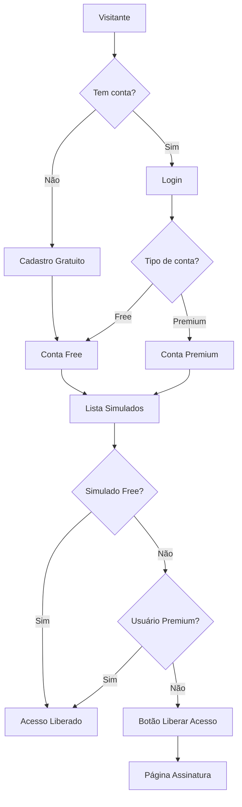

# Design Document - Freemium Improvements

## Overview

Este documento descreve a arquitetura e implementação das melhorias no modelo freemium do sistema Operação Alfa. As principais mudanças incluem:

1. Substituição do fluxo de "Assinar agora" por "Cadastro gratuito" na tela de login
2. Adição de campo `is_free` nos simulados para controle de acesso
3. Interface diferenciada para usuários free vs premium
4. Ajustes visuais no logo (PWA e Admin)

## Architecture

### System Flow



### Database Changes

```mermaid
erDiagram
    exams {
        bigint id PK
        bigint career_id FK
        string title
        text description
        int time_limit_minutes
        boolean active
        boolean is_free "NEW - default false"
        timestamps
    }
```

## Components and Interfaces

### Backend (Laravel)

#### 1. Migration - Add `is_free` to exams

```php
// database/migrations/YYYY_MM_DD_add_is_free_to_exams_table.php
Schema::table('exams', function (Blueprint $table) {
    $table->boolean('is_free')->default(false)->after('active');
});
```

#### 2. Exam Model Update

```php
// app/Domain/Exam/Models/Exam.php
protected $fillable = [
    'career_id',
    'title', 
    'description',
    'time_limit_minutes',
    'active',
    'is_free', // NEW
];

protected $casts = [
    'time_limit_minutes' => 'integer',
    'active' => 'boolean',
    'is_free' => 'boolean', // NEW
];
```

#### 3. API Response Update

O endpoint de listagem de exams deve incluir `is_free` na resposta.

#### 4. AdminLTE Config Update

```php
// config/adminlte.php
'logo_img' => 'images/logo-operacao-alfa.png',
'auth_logo' => [
    'enabled' => true,
    'img' => [
        'path' => 'images/logo-operacao-alfa.png',
        'alt' => 'Operação Alfa',
        'class' => '',
        'width' => 150,
        'height' => 150,
    ],
],
```

### Frontend (React PWA)

#### 1. Type Updates

```typescript
// types/index.ts
export interface Exam {
  id: string;
  careerId: string;
  title: string;
  description?: string;
  durationMin: number;
  numQuestions: number;
  active: boolean;
  isFree: boolean; // NEW
}
```

#### 2. Login Page Changes

- Remover seção "Credenciais de Teste"
- Substituir "Assinar agora" por "Criar conta gratuita"
- Ajustar logo: `max-width: 100%`, `height: 300px`

#### 3. Registration Page (New)

Nova página `/cadastro` com formulário:
- Nome completo
- Email
- Senha
- Confirmação de senha

#### 4. Simulados Page Updates

```typescript
// Lógica de acesso
const canAccess = (exam: Exam, user: User | null) => {
  if (!user) return false;
  if (exam.isFree) return true;
  return user.subscriptionStatus === 'active' || user.subscriptionStatus === 'trial';
};
```

Visual para simulados bloqueados:
- Ícone de cadeado
- Badge "Premium"
- Botão "Liberar acesso" → navega para `/assinar`

## Data Models

### Exam (Updated)

| Field | Type | Description |
|-------|------|-------------|
| id | bigint | Primary key |
| career_id | bigint | FK to careers |
| title | string | Exam title |
| description | text | Optional description |
| time_limit_minutes | int | Duration in minutes |
| active | boolean | Is exam active |
| is_free | boolean | **NEW** - Is exam free for all users |
| created_at | timestamp | Creation date |
| updated_at | timestamp | Last update |

### User Access Logic

| User Type | Free Exam | Premium Exam |
|-----------|-----------|--------------|
| Not logged | ❌ | ❌ |
| Free user | ✅ | ❌ (show lock + upgrade button) |
| Premium user | ✅ | ✅ |


## Correctness Properties

*A property is a characteristic or behavior that should hold true across all valid executions of a system-essentially, a formal statement about what the system should do. Properties serve as the bridge between human-readable specifications and machine-verifiable correctness guarantees.*

Based on the prework analysis, the following properties can be verified through property-based testing:

### Property 1: Valid registration creates free account

*For any* valid registration data (non-empty name, valid email format, password meeting requirements), submitting the registration form should result in a new user with `subscriptionStatus = 'inactive'` (free tier).

**Validates: Requirements 1.3**

### Property 2: Invalid registration shows errors

*For any* invalid registration data (empty name, invalid email, weak password, mismatched confirmation), submitting the registration form should result in validation errors being displayed without creating an account.

**Validates: Requirements 1.4**

### Property 3: Exam is_free persistence

*For any* exam, setting `is_free` to true or false and saving should persist that value correctly in the database, and subsequent queries should return the same value.

**Validates: Requirements 2.3**

### Property 4: API includes is_free in response

*For any* exam returned by the API, the response object should include the `is_free` boolean field.

**Validates: Requirements 2.4**

### Property 5: Free user access control

*For any* free user and any exam, the user should be able to access the exam if and only if `exam.is_free === true`.

**Validates: Requirements 3.4, 3.5**

## Error Handling

### Registration Errors

| Error Type | User Message |
|------------|--------------|
| Email already exists | "Este email já está cadastrado" |
| Invalid email format | "Email inválido" |
| Password too short | "Senha deve ter pelo menos 6 caracteres" |
| Password mismatch | "As senhas não conferem" |
| Empty name | "Nome é obrigatório" |

### Access Control Errors

| Scenario | Behavior |
|----------|----------|
| Free user → Premium exam | Show PaywallModal |
| Not logged → Any exam | Redirect to login |
| Premium user → Any exam | Allow access |

## Testing Strategy

### Property-Based Testing

Library: **fast-check** (JavaScript/TypeScript)

Configuration: Minimum 100 iterations per property test.

Each property test must be tagged with format: `**Feature: freemium-improvements, Property {number}: {property_text}**`

### Unit Tests

1. **Registration Form Validation**
   - Test email format validation
   - Test password strength validation
   - Test name required validation

2. **Access Control Logic**
   - Test `canAccess()` function with various user/exam combinations

3. **API Response Format**
   - Test exam endpoint includes `is_free` field

### Integration Tests

1. **Registration Flow**
   - Complete registration creates user in database
   - User is logged in after registration

2. **Exam Access Flow**
   - Free user can access free exam
   - Free user blocked from premium exam
   - Premium user can access all exams

## File Changes Summary

### Backend (Laravel)

| File | Change |
|------|--------|
| `database/migrations/XXXX_add_is_free_to_exams_table.php` | New migration |
| `app/Domain/Exam/Models/Exam.php` | Add `is_free` to fillable/casts |
| `config/adminlte.php` | Add logo configuration |
| `public/images/logo-operacao-alfa.png` | Copy logo file |
| `resources/views/admin/exams/index.blade.php` | Add is_free column |
| `resources/views/admin/exams/form.blade.php` | Add is_free toggle |

### Frontend (React PWA)

| File | Change |
|------|--------|
| `resources/react/pages/Login.tsx` | Remove test credentials, change button, fix logo |
| `resources/react/pages/Cadastro.tsx` | New registration page |
| `resources/react/types/index.ts` | Add `isFree` to Exam type |
| `resources/react/pages/Simulados.tsx` | Update card with lock/unlock logic |
| `resources/react/App.tsx` | Add `/cadastro` route |
