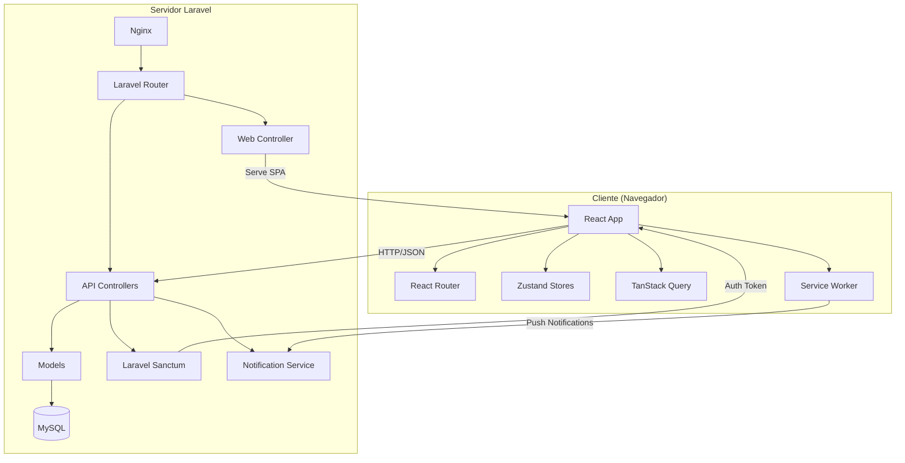
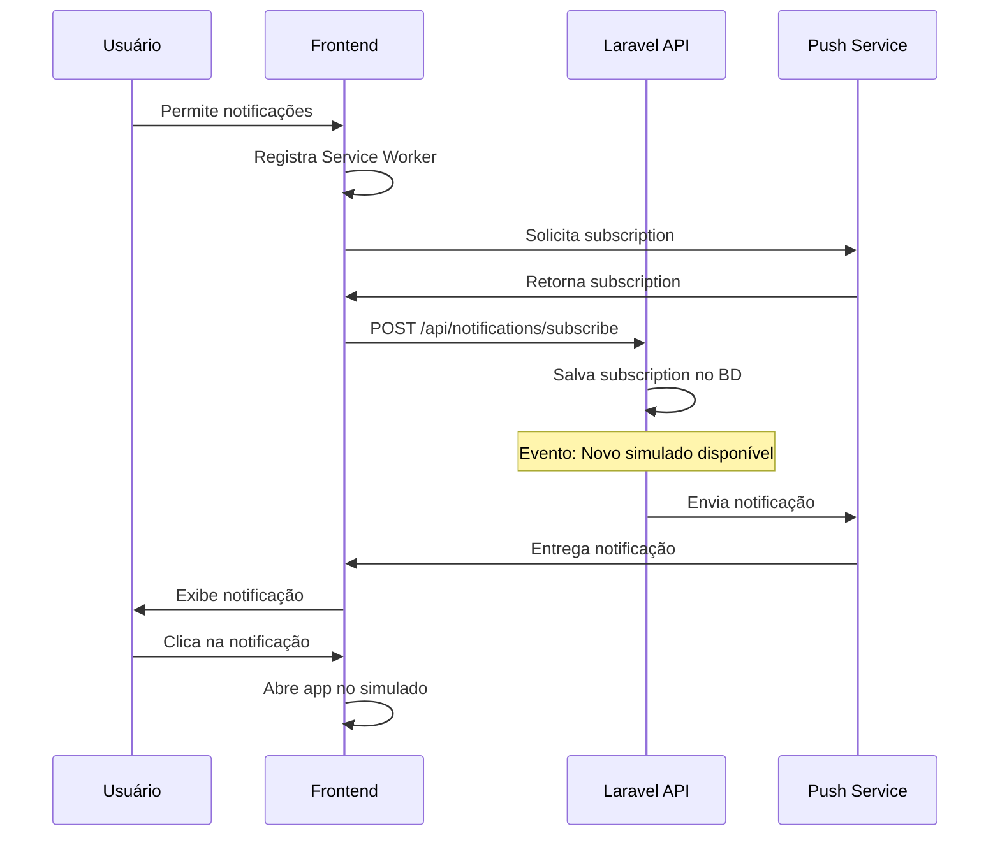

# Documento de Design - Integração PWA React/Laravel

## Visão Geral

Este documento descreve o design técnico para integração da interface React/Vite (alfa-quest) ao backend Laravel existente, criando uma aplicação web moderna e instalável. A solução mantém a separação entre frontend e backend, com o Laravel servindo APIs RESTful e o React fornecendo uma interface de usuário rica e responsiva.

### Objetivos Principais

1. Integrar o build do Vite ao pipeline de deploy do Laravel
2. Implementar autenticação segura usando Laravel Sanctum
3. Criar APIs RESTful completas para todas as funcionalidades do frontend
4. Configurar PWA com manifest e ícones para instalação
5. Implementar sistema de notificações push
6. Migrar componentes React mantendo funcionalidade completa
7. Criar seeders robustos para desenvolvimento

## Arquitetura

### Diagrama de Arquitetura



### Fluxo de Requisição

1. **Primeira Carga**: Nginx → Laravel → Blade View → React App (index.html)
2. **Navegação**: React Router (client-side)
3. **API Calls**: React → Axios/Fetch → Laravel API → JSON Response
4. **Autenticação**: Login → Sanctum Token → LocalStorage → Header em todas requisições

## Componentes e Interfaces

### 1. Frontend (React/TypeScript)

#### 1.1 Estrutura de Diretórios

```
laravel/resources/
├── react/                    # Código fonte React (movido de alfa-quest/src)
│   ├── components/
│   │   ├── layout/
│   │   │   ├── AppLayout.tsx
│   │   │   ├── Header.tsx
│   │   │   └── Navigation.tsx
│   │   ├── ui/              # shadcn/ui components
│   │   ├── PaywallModal.tsx
│   │   └── QuestaoCard.tsx
│   ├── pages/
│   │   ├── Index.tsx
│   │   ├── Login.tsx
│   │   ├── Simulados.tsx
│   │   ├── ExecutarSimulado.tsx
│   │   ├── Ranking.tsx
│   │   ├── Desempenho.tsx
│   │   ├── Carreiras.tsx
│   │   ├── Aprovados.tsx
│   │   ├── Assinar.tsx
│   │   └── Conta.tsx
│   ├── services/
│   │   ├── api.ts           # Axios instance configurado
│   │   ├── auth.ts          # Serviços de autenticação
│   │   ├── simulados.ts     # Serviços de simulados
│   │   ├── carreiras.ts     # Serviços de carreiras
│   │   └── notifications.ts # Serviços de notificações
│   ├── stores/
│   │   ├── authStore.ts
│   │   └── simuladosStore.ts
│   ├── types/
│   │   └── index.ts
│   ├── lib/
│   │   └── utils.ts
│   ├── hooks/
│   │   ├── use-mobile.tsx
│   │   └── use-toast.ts
│   ├── App.tsx
│   ├── main.tsx
│   └── index.css
├── views/
│   └── app.blade.php        # Template principal que carrega React
└── js/
    └── bootstrap.js         # Configurações Laravel (se necessário)
```

#### 1.2 Configuração do Vite

```typescript
// vite.config.ts (na raiz do Laravel)
import { defineConfig } from 'vite';
import react from '@vitejs/plugin-react-swc';
import laravel from 'laravel-vite-plugin';
import path from 'path';

export default defineConfig({
  plugins: [
    laravel({
      input: ['resources/react/main.tsx', 'resources/react/index.css'],
      refresh: true,
    }),
    react(),
  ],
  resolve: {
    alias: {
      '@': path.resolve(__dirname, './resources/react'),
    },
  },
  build: {
    outDir: 'public/build',
    manifest: true,
    rollupOptions: {
      output: {
        manualChunks: {
          'react-vendor': ['react', 'react-dom', 'react-router-dom'],
          'ui-vendor': ['@radix-ui/react-dialog', '@radix-ui/react-dropdown-menu'],
        },
      },
    },
  },
});
```

#### 1.3 Serviço de API

```typescript
// resources/react/services/api.ts
import axios from 'axios';

const api = axios.create({
  baseURL: '/api',
  headers: {
    'Content-Type': 'application/json',
    'Accept': 'application/json',
  },
});

// Interceptor para adicionar token
api.interceptors.request.use((config) => {
  const token = localStorage.getItem('auth_token');
  if (token) {
    config.headers.Authorization = `Bearer ${token}`;
  }
  return config;
});

// Interceptor para tratar erros de autenticação
api.interceptors.response.use(
  (response) => response,
  (error) => {
    if (error.response?.status === 401) {
      localStorage.removeItem('auth_token');
      window.location.href = '/login';
    }
    return Promise.reject(error);
  }
);

export default api;
```

### 2. Backend (Laravel)

#### 2.1 Arquitetura em Camadas por Feature

A aplicação segue uma arquitetura limpa organizada por funcionalidade (feature-based), com separação clara de responsabilidades:

- **Domain**: Lógica de negócio, Models, DTOs, Enums
- **Actions**: Casos de uso single-purpose (uma ação = uma classe)
- **Repositories**: Acesso a dados, única camada que conhece Models
- **Http**: Controllers, Requests, Resources (transformação de DTOs para JSON)

```
app/
├── Domain/
│   ├── Auth/
│   │   ├── Models/
│   │   │   └── User.php
│   │   ├── DTOs/
│   │   │   ├── UserData.php
│   │   │   ├── LoginData.php
│   │   │   └── RegisterData.php
│   │   ├── Enums/
│   │   │   ├── UserRole.php
│   │   │   └── SubscriptionStatus.php
│   │   ├── Actions/
│   │   │   ├── LoginUserAction.php
│   │   │   ├── RegisterUserAction.php
│   │   │   └── LogoutUserAction.php
│   │   └── Repositories/
│   │       └── UserRepository.php
│   │
│   ├── Exam/
│   │   ├── Models/
│   │   │   ├── Exam.php
│   │   │   ├── Question.php
│   │   │   ├── Attempt.php
│   │   │   └── UserAnswer.php
│   │   ├── DTOs/
│   │   │   ├── ExamData.php
│   │   │   ├── QuestionData.php
│   │   │   ├── AttemptData.php
│   │   │   ├── AnswerData.php
│   │   │   └── ResultData.php
│   │   ├── Enums/
│   │   │   ├── AnswerOption.php
│   │   │   └── ExamStatus.php
│   │   ├── Actions/
│   │   │   ├── ListExamsAction.php
│   │   │   ├── GetExamDetailsAction.php
│   │   │   ├── StartAttemptAction.php
│   │   │   ├── SubmitAnswerAction.php
│   │   │   ├── FinishAttemptAction.php
│   │   │   └── CalculateResultAction.php
│   │   └── Repositories/
│   │       ├── ExamRepository.php
│   │       ├── QuestionRepository.php
│   │       ├── AttemptRepository.php
│   │       └── AnswerRepository.php
│   │
│   ├── Career/
│   │   ├── Models/
│   │   │   ├── Career.php
│   │   │   └── Notice.php
│   │   ├── DTOs/
│   │   │   ├── CareerData.php
│   │   │   └── NoticeData.php
│   │   ├── Actions/
│   │   │   ├── ListCareersAction.php
│   │   │   ├── GetCareerDetailsAction.php
│   │   │   └── ListExamsByCareerAction.php
│   │   └── Repositories/
│   │       ├── CareerRepository.php
│   │       └── NoticeRepository.php
│   │
│   ├── Ranking/
│   │   ├── Models/
│   │   │   ├── Ranking.php
│   │   │   └── ExamResult.php
│   │   ├── DTOs/
│   │   │   ├── RankingEntryData.php
│   │   │   └── RankingData.php
│   │   ├── Enums/
│   │   │   └── RankingType.php
│   │   ├── Actions/
│   │   │   ├── GetRankingAction.php
│   │   │   ├── GetUserPositionAction.php
│   │   │   └── UpdateRankingAction.php
│   │   └── Repositories/
│   │       ├── RankingRepository.php
│   │       └── ResultRepository.php
│   │
│   ├── Performance/
│   │   ├── DTOs/
│   │   │   ├── StatisticsData.php
│   │   │   └── HistoryData.php
│   │   ├── Actions/
│   │   │   ├── GetStatisticsAction.php
│   │   │   └── GetHistoryAction.php
│   │   └── Repositories/
│   │       └── PerformanceRepository.php
│   │
│   ├── Approved/
│   │   ├── Models/
│   │   │   └── Approved.php
│   │   ├── DTOs/
│   │   │   └── ApprovedData.php
│   │   ├── Actions/
│   │   │   └── ListApprovedAction.php
│   │   └── Repositories/
│   │       └── ApprovedRepository.php
│   │
│   ├── Subscription/
│   │   ├── DTOs/
│   │   │   ├── PlanData.php
│   │   │   └── SubscriptionData.php
│   │   ├── Enums/
│   │   │   └── PlanType.php
│   │   ├── Actions/
│   │   │   ├── ListPlansAction.php
│   │   │   ├── CreateSubscriptionAction.php
│   │   │   ├── GetSubscriptionStatusAction.php
│   │   │   └── CancelSubscriptionAction.php
│   │   └── Repositories/
│   │       └── SubscriptionRepository.php
│   │
│   ├── Notification/
│   │   ├── Models/
│   │   │   └── NotificationSubscription.php
│   │   ├── DTOs/
│   │   │   ├── SubscriptionData.php
│   │   │   └── NotificationData.php
│   │   ├── Actions/
│   │   │   ├── SubscribeToNotificationsAction.php
│   │   │   ├── UnsubscribeFromNotificationsAction.php
│   │   │   └── SendNotificationAction.php
│   │   └── Repositories/
│   │       └── NotificationRepository.php
│   │
│   └── Admin/
│       ├── Exam/
│       │   ├── Actions/
│       │   │   ├── CreateExamAction.php
│       │   │   ├── UpdateExamAction.php
│       │   │   └── DeleteExamAction.php
│       │   └── Repositories/
│       │       └── AdminExamRepository.php
│       └── User/
│           ├── Actions/
│           │   ├── ListUsersAction.php
│           │   └── UpdateUserRoleAction.php
│           └── Repositories/
│               └── AdminUserRepository.php
│
├── Http/
│   ├── Controllers/
│   │   ├── Auth/
│   │   │   └── AuthController.php
│   │   ├── Api/
│   │   │   ├── Exam/
│   │   │   │   ├── ExamController.php
│   │   │   │   └── AttemptController.php
│   │   │   ├── Career/
│   │   │   │   └── CareerController.php
│   │   │   ├── Ranking/
│   │   │   │   └── RankingController.php
│   │   │   ├── Performance/
│   │   │   │   └── PerformanceController.php
│   │   │   ├── Approved/
│   │   │   │   └── ApprovedController.php
│   │   │   ├── Subscription/
│   │   │   │   └── SubscriptionController.php
│   │   │   ├── Notification/
│   │   │   │   └── NotificationController.php
│   │   │   └── User/
│   │   │       └── UserController.php
│   │   └── Admin/
│   │       ├── Exam/
│   │       │   └── ExamController.php
│   │       └── User/
│   │           └── UserController.php
│   │
│   ├── Requests/
│   │   ├── Auth/
│   │   │   ├── LoginRequest.php
│   │   │   └── RegisterRequest.php
│   │   ├── Exam/
│   │   │   ├── StartAttemptRequest.php
│   │   │   └── SubmitAnswerRequest.php
│   │   ├── Subscription/
│   │   │   └── CreateSubscriptionRequest.php
│   │   └── Admin/
│   │       ├── CreateExamRequest.php
│   │       └── UpdateExamRequest.php
│   │
│   └── Resources/
│       ├── Auth/
│       │   └── UserResource.php
│       ├── Exam/
│       │   ├── ExamResource.php
│       │   ├── QuestionResource.php
│       │   └── AttemptResource.php
│       ├── Career/
│       │   └── CareerResource.php
│       └── Ranking/
│           └── RankingResource.php
```

#### 2.2 Exemplo de Implementação - Feature Exam

**DTO (Data Transfer Object)**
```php
namespace App\Domain\Exam\DTOs;

readonly class ExamData
{
    public function __construct(
        public string $id,
        public string $careerId,
        public string $title,
        public ?string $description,
        public int $timeLimitMinutes,
        public bool $active,
        public int $totalQuestions,
    ) {}
    
    public static function fromArray(array $data): self
    {
        return new self(
            id: $data['id'],
            careerId: $data['career_id'],
            title: $data['title'],
            description: $data['description'] ?? null,
            timeLimitMinutes: $data['time_limit_minutes'],
            active: $data['active'],
            totalQuestions: $data['total_questions'] ?? 0,
        );
    }
}
```

**Repository**
```php
namespace App\Domain\Exam\Repositories;

use App\Domain\Exam\Models\Exam;
use App\Domain\Exam\DTOs\ExamData;
use Illuminate\Support\Collection;

class ExamRepository
{
    public function findAll(): Collection
    {
        return Exam::with('career')
            ->where('active', true)
            ->get()
            ->map(fn($exam) => $this->toDTO($exam));
    }
    
    public function findById(string $id): ?ExamData
    {
        $exam = Exam::with(['career', 'questions'])->find($id);
        
        return $exam ? $this->toDTO($exam) : null;
    }
    
    public function findByCareer(string $careerId): Collection
    {
        return Exam::where('career_id', $careerId)
            ->where('active', true)
            ->get()
            ->map(fn($exam) => $this->toDTO($exam));
    }
    
    private function toDTO(Exam $exam): ExamData
    {
        return ExamData::fromArray([
            'id' => $exam->id,
            'career_id' => $exam->career_id,
            'title' => $exam->title,
            'description' => $exam->description,
            'time_limit_minutes' => $exam->time_limit_minutes,
            'active' => $exam->active,
            'total_questions' => $exam->questions->count(),
        ]);
    }
}
```

**Action**
```php
namespace App\Domain\Exam\Actions;

use App\Domain\Exam\Repositories\ExamRepository;
use Illuminate\Support\Collection;

class ListExamsAction
{
    public function __construct(
        private ExamRepository $repository
    ) {}
    
    public function execute(?string $careerId = null): Collection
    {
        if ($careerId) {
            return $this->repository->findByCareer($careerId);
        }
        
        return $this->repository->findAll();
    }
}
```

**Controller**
```php
namespace App\Http\Controllers\Api\Exam;

use App\Http\Controllers\Controller;
use App\Domain\Exam\Actions\ListExamsAction;
use App\Domain\Exam\Actions\GetExamDetailsAction;
use App\Http\Resources\Exam\ExamResource;
use Illuminate\Http\Request;

class ExamController extends Controller
{
    public function index(Request $request, ListExamsAction $action)
    {
        $exams = $action->execute($request->query('career_id'));
        
        return ExamResource::collection($exams);
    }
    
    public function show(string $id, GetExamDetailsAction $action)
    {
        $exam = $action->execute($id);
        
        if (!$exam) {
            return response()->json(['message' => 'Exam not found'], 404);
        }
        
        return new ExamResource($exam);
    }
}
```

**Resource (API Response)**
```php
namespace App\Http\Resources\Exam;

use Illuminate\Http\Resources\Json\JsonResource;

class ExamResource extends JsonResource
{
    public function toArray($request): array
    {
        return [
            'id' => $this->id,
            'careerId' => $this->careerId,
            'title' => $this->title,
            'description' => $this->description,
            'durationMin' => $this->timeLimitMinutes,
            'numQuestions' => $this->totalQuestions,
            'active' => $this->active,
        ];
    }
}
```

#### 2.3 Rotas da API

```php
// routes/api.php
use App\Http\Controllers\Auth\AuthController;
use App\Http\Controllers\Api\Exam\{ExamController, AttemptController};
use App\Http\Controllers\Api\Career\CareerController;
use App\Http\Controllers\Api\Ranking\RankingController;
use App\Http\Controllers\Api\Performance\PerformanceController;
use App\Http\Controllers\Api\Approved\ApprovedController;
use App\Http\Controllers\Api\Subscription\SubscriptionController;
use App\Http\Controllers\Api\Notification\NotificationController;
use App\Http\Controllers\Api\User\UserController;

Route::post('/login', [AuthController::class, 'login']);
Route::post('/register', [AuthController::class, 'register']);

Route::middleware('auth:sanctum')->group(function () {
    Route::post('/logout', [AuthController::class, 'logout']);
    Route::get('/me', [AuthController::class, 'me']);
    
    Route::get('/careers', [CareerController::class, 'index']);
    Route::get('/careers/{id}', [CareerController::class, 'show']);
    Route::get('/careers/{id}/exams', [CareerController::class, 'exams']);
    
    Route::get('/exams', [ExamController::class, 'index']);
    Route::get('/exams/{id}', [ExamController::class, 'show']);
    
    Route::post('/exams/{id}/start', [AttemptController::class, 'start']);
    Route::get('/attempts/{id}', [AttemptController::class, 'show']);
    Route::post('/attempts/{id}/answer', [AttemptController::class, 'answer']);
    Route::post('/attempts/{id}/finish', [AttemptController::class, 'finish']);
    
    Route::get('/ranking', [RankingController::class, 'index']);
    Route::get('/ranking/my-position', [RankingController::class, 'myPosition']);
    
    Route::get('/performance/statistics', [PerformanceController::class, 'statistics']);
    Route::get('/performance/history', [PerformanceController::class, 'history']);
    
    Route::get('/approved', [ApprovedController::class, 'index']);
    
    Route::get('/plans', [SubscriptionController::class, 'plans']);
    Route::post('/subscribe', [SubscriptionController::class, 'subscribe']);
    Route::get('/subscription/status', [SubscriptionController::class, 'status']);
    Route::post('/subscription/cancel', [SubscriptionController::class, 'cancel']);
    
    Route::post('/notifications/subscribe', [NotificationController::class, 'subscribe']);
    Route::post('/notifications/unsubscribe', [NotificationController::class, 'unsubscribe']);
    
    Route::get('/user/profile', [UserController::class, 'profile']);
    Route::put('/user/profile', [UserController::class, 'updateProfile']);
    Route::delete('/user/account', [UserController::class, 'deleteAccount']);
});
```

#### 2.4 Exemplos de Actions Complexas

**StartAttemptAction**
```php
namespace App\Domain\Exam\Actions;

use App\Domain\Exam\Repositories\{ExamRepository, AttemptRepository};
use App\Domain\Exam\DTOs\AttemptData;
use App\Domain\Auth\DTOs\UserData;

class StartAttemptAction
{
    public function __construct(
        private ExamRepository $examRepository,
        private AttemptRepository $attemptRepository,
    ) {}
    
    public function execute(string $examId, UserData $user): AttemptData
    {
        $exam = $this->examRepository->findById($examId);
        
        if (!$exam) {
            throw new \Exception('Exam not found');
        }
        
        if (!$exam->active) {
            throw new \Exception('Exam is not active');
        }
        
        return $this->attemptRepository->create([
            'exam_id' => $examId,
            'user_id' => $user->id,
            'started_at' => now(),
        ]);
    }
}
```

**SubmitAnswerAction**
```php
namespace App\Domain\Exam\Actions;

use App\Domain\Exam\Repositories\{AttemptRepository, AnswerRepository, QuestionRepository};
use App\Domain\Exam\DTOs\AnswerData;
use App\Domain\Exam\Enums\AnswerOption;

class SubmitAnswerAction
{
    public function __construct(
        private AttemptRepository $attemptRepository,
        private QuestionRepository $questionRepository,
        private AnswerRepository $answerRepository,
    ) {}
    
    public function execute(
        string $attemptId,
        string $questionId,
        AnswerOption $answer
    ): AnswerData {
        $attempt = $this->attemptRepository->findById($attemptId);
        
        if (!$attempt) {
            throw new \Exception('Attempt not found');
        }
        
        if ($attempt->finishedAt) {
            throw new \Exception('Attempt already finished');
        }
        
        $question = $this->questionRepository->findById($questionId);
        
        if (!$question) {
            throw new \Exception('Question not found');
        }
        
        $correct = $question->correctAnswer === $answer;
        
        return $this->answerRepository->createOrUpdate([
            'attempt_id' => $attemptId,
            'question_id' => $questionId,
            'chosen_answer' => $answer->value,
            'correct' => $correct,
            'time_seconds' => now()->diffInSeconds($attempt->startedAt),
        ]);
    }
}
```

**FinishAttemptAction**
```php
namespace App\Domain\Exam\Actions;

use App\Domain\Exam\Repositories\{AttemptRepository, ResultRepository};
use App\Domain\Exam\DTOs\ResultData;

class FinishAttemptAction
{
    public function __construct(
        private AttemptRepository $attemptRepository,
        private ResultRepository $resultRepository,
        private CalculateResultAction $calculateResult,
    ) {}
    
    public function execute(string $attemptId): ResultData
    {
        $attempt = $this->attemptRepository->findById($attemptId);
        
        if (!$attempt) {
            throw new \Exception('Attempt not found');
        }
        
        if ($attempt->finishedAt) {
            throw new \Exception('Attempt already finished');
        }
        
        $result = $this->calculateResult->execute($attemptId);
        
        $this->attemptRepository->update($attemptId, [
            'finished_at' => now(),
            'duration_seconds' => now()->diffInSeconds($attempt->startedAt),
            'correct_answers' => $result->totalCorrect,
            'score' => $result->finalScore,
        ]);
        
        return $this->resultRepository->create([
            'attempt_id' => $attemptId,
            'user_id' => $attempt->userId,
            'exam_id' => $attempt->examId,
            'total_questions' => $result->totalQuestions,
            'correct_answers' => $result->totalCorrect,
            'final_score' => $result->finalScore,
            'total_time_seconds' => now()->diffInSeconds($attempt->startedAt),
        ]);
    }
}
```

**CalculateResultAction**
```php
namespace App\Domain\Exam\Actions;

use App\Domain\Exam\Repositories\AnswerRepository;
use App\Domain\Exam\DTOs\ResultData;

class CalculateResultAction
{
    public function __construct(
        private AnswerRepository $answerRepository,
    ) {}
    
    public function execute(string $attemptId): ResultData
    {
        $answers = $this->answerRepository->findByAttempt($attemptId);
        
        $totalQuestions = $answers->count();
        $totalCorrect = $answers->filter(fn($a) => $a->correct)->count();
        $finalScore = $totalQuestions > 0 
            ? round(($totalCorrect / $totalQuestions) * 100, 2)
            : 0;
        
        return new ResultData(
            totalQuestions: $totalQuestions,
            totalCorrect: $totalCorrect,
            finalScore: $finalScore,
        );
    }
}
```

#### 2.5 Enums

```php
namespace App\Domain\Auth\Enums;

enum UserRole: string
{
    case ADMIN = 'admin';
    case CONSULTANT = 'consultor';
    case USER = 'user';
}

enum SubscriptionStatus: string
{
    case ACTIVE = 'active';
    case INACTIVE = 'inactive';
    case TRIAL = 'trial';
    case CANCELLED = 'cancelled';
}
```

```php
namespace App\Domain\Exam\Enums;

enum AnswerOption: string
{
    case A = 'A';
    case B = 'B';
    case C = 'C';
    case D = 'D';
    case E = 'E';
}

enum ExamStatus: string
{
    case DRAFT = 'draft';
    case PUBLISHED = 'published';
    case ARCHIVED = 'archived';
}
```

```php
namespace App\Domain\Ranking\Enums;

enum RankingType: string
{
    case DAILY = 'daily';
    case WEEKLY = 'weekly';
    case MONTHLY = 'monthly';
}
```

#### 2.6 Rota Web (SPA)

```php
// routes/web.php
Route::get('/{any}', function () {
    return view('app');
})->where('any', '.*');
```

## Modelos de Dados

### Princípios de Isolamento

- **Models** vivem apenas em `App\Domain\{Feature}\Models`
- **Models** nunca são expostos fora da camada de Repository
- **DTOs** são usados para transferir dados entre camadas
- **Resources** transformam DTOs em JSON para API responses

### Estrutura de Banco de Dados

**IMPORTANTE**: Todas as tabelas e colunas existentes em pt-BR serão renomeadas para inglês. Será necessário executar `php artisan migrate:fresh --seed` para recriar o banco de dados com a nova estrutura.

**users**
```
- id (uuid)
- name (string)
- email (string, unique)
- phone (string, nullable)
- password (string)
- role (enum: admin, consultant, user)
- subscription_status (enum: active, inactive, trial, cancelled)
- subscription_expires_at (datetime, nullable)
- subscription_platform_id (string, nullable)
- created_at, updated_at
```

**careers**
```
- id (uuid)
- name (string)
- description (text, nullable)
- created_at, updated_at
```

**notices**
```
- id (uuid)
- career_id (uuid, foreign)
- title (string)
- description (text, nullable)
- exam_date (date, nullable)
- created_at, updated_at
```

**exams**
```
- id (uuid)
- career_id (uuid, foreign)
- title (string)
- description (text, nullable)
- time_limit_minutes (integer)
- active (boolean, default: true)
- created_at, updated_at
```

**questions**
```
- id (uuid)
- exam_id (uuid, foreign)
- question_number (integer)
- statement (text)
- statement_image (string, nullable)
- option_a (text)
- option_a_image (string, nullable)
- option_b (text)
- option_b_image (string, nullable)
- option_c (text)
- option_c_image (string, nullable)
- option_d (text)
- option_d_image (string, nullable)
- option_e (text)
- option_e_image (string, nullable)
- correct_answer (enum: A, B, C, D, E)
- explanation (text, nullable)
- created_at, updated_at
```

**attempts**
```
- id (uuid)
- user_id (uuid, foreign)
- exam_id (uuid, foreign)
- started_at (datetime)
- finished_at (datetime, nullable)
- duration_seconds (integer, nullable)
- correct_answers (integer, nullable)
- score (decimal, nullable)
- created_at, updated_at
```

**user_answers**
```
- id (uuid)
- attempt_id (uuid, foreign)
- question_id (uuid, foreign)
- chosen_answer (enum: A, B, C, D, E)
- correct (boolean)
- time_seconds (integer)
- created_at, updated_at
- unique(attempt_id, question_id)
```

**exam_results**
```
- id (uuid)
- attempt_id (uuid, foreign)
- user_id (uuid, foreign)
- exam_id (uuid, foreign)
- total_questions (integer)
- correct_answers (integer)
- final_score (decimal)
- total_time_seconds (integer)
- created_at, updated_at
```

**rankings**
```
- id (uuid)
- user_id (uuid, foreign)
- career_id (uuid, foreign, nullable)
- type (enum: daily, weekly, monthly)
- total_score (decimal)
- average_correct (decimal)
- total_exams (integer)
- position (integer)
- calculated_at (datetime)
- created_at, updated_at
```

**approved**
```
- id (uuid)
- name (string)
- career (string)
- note (text, nullable)
- avatar_url (string, nullable)
- created_at, updated_at
```

**notification_subscriptions**
```
- id (uuid)
- user_id (uuid, foreign)
- endpoint (text)
- public_key (string)
- auth_token (string)
- created_at, updated_at
```

### Exemplo de DTOs

```php
namespace App\Domain\Exam\DTOs;

readonly class AttemptData
{
    public function __construct(
        public string $id,
        public string $userId,
        public string $examId,
        public string $startedAt,
        public ?string $finishedAt,
        public ?int $durationSeconds,
        public ?int $correctAnswers,
        public ?float $score,
    ) {}
}

readonly class QuestionData
{
    public function __construct(
        public string $id,
        public int $questionNumber,
        public string $statement,
        public ?string $statementImage,
        public array $options,
        public ?string $correctAnswer,
        public ?string $explanation,
    ) {}
}

readonly class ResultData
{
    public function __construct(
        public int $totalQuestions,
        public int $totalCorrect,
        public float $finalScore,
    ) {}
}
```

## Propriedades de Correção

*Uma propriedade é uma característica ou comportamento que deve ser verdadeiro em todas as execuções válidas de um sistema - essencialmente, uma declaração formal sobre o que o sistema deve fazer. Propriedades servem como a ponte entre especificações legíveis por humanos e garantias de correção verificáveis por máquina.*


### Reflexão sobre Propriedades

Após análise dos critérios de aceitação, identifiquei que muitos são testes de exemplo (configuração específica) ao invés de propriedades universais. As propriedades verdadeiras que devem ser testadas são:

1. **Roteamento de API**: Todas as rotas /api/* devem ser roteadas para controllers
2. **Servir Assets**: Todos os assets devem ter Content-Type correto
3. **Autenticação em Headers**: Todas as requisições autenticadas devem incluir token
4. **Proteção de Rotas**: Todas as rotas protegidas devem redirecionar usuários não autenticados
5. **Tratamento de Respostas**: Todas as respostas de API devem ser tratadas apropriadamente
6. **Mutações de Dados**: Todas as operações de mutação devem usar métodos HTTP corretos

Propriedades redundantes eliminadas:
- 6.1 e 6.2 são similares (servir React app) - combinadas em uma propriedade
- Múltiplos testes de "endpoint existe" (12.1-12.8) - são exemplos, não propriedades
- Testes de configuração (build, Docker) - são exemplos de setup, não propriedades de runtime

### Propriedade 1: Roteamento consistente de APIs
*Para qualquer* rota que começa com /api/, o sistema deve rotear para um controller Laravel e retornar resposta JSON válida
**Valida: Requisitos 1.3, 6.3**

### Propriedade 2: Content-Type correto para assets
*Para qualquer* asset estático (JS, CSS, imagem), o sistema deve servir com o Content-Type header apropriado para sua extensão
**Valida: Requisitos 1.4**

### Propriedade 3: Token em requisições autenticadas
*Para qualquer* requisição a um endpoint protegido, se um token válido existe no localStorage, o sistema deve incluir o header Authorization com esse token
**Valida: Requisitos 3.3**

### Propriedade 4: Proteção de rotas
*Para qualquer* rota protegida, se o usuário não possui token válido, o sistema deve redirecionar para /login
**Valida: Requisitos 6.4**

### Propriedade 5: Servir SPA para rotas frontend
*Para qualquer* rota que não começa com /api/, o sistema deve retornar o HTML da aplicação React (não 404)
**Valida: Requisitos 6.1, 6.2**

### Propriedade 6: Métodos HTTP corretos para mutações
*Para qualquer* operação de criação, o sistema deve usar POST; para atualização, PUT/PATCH; para deleção, DELETE
**Valida: Requisitos 7.2**

### Propriedade 7: Tratamento de respostas de API
*Para qualquer* resposta de API, se o status é 2xx, o sistema deve atualizar o estado com sucesso; se é 4xx/5xx, deve mostrar erro apropriado
**Valida: Requisitos 7.3**

## Tratamento de Erros

### Estratégias de Tratamento de Erros

#### Frontend (React)

1. **Erros de Rede**
   - Interceptor Axios captura erros de conexão
   - Exibe toast com mensagem amigável
   - Opção de retry para o usuário

2. **Erros de Autenticação (401)**
   - Interceptor detecta 401
   - Limpa token do localStorage
   - Redireciona para /login
   - Exibe mensagem informando que sessão expirou

3. **Erros de Validação (422)**
   - Extrai mensagens de erro do response
   - Exibe erros nos campos do formulário
   - Usa react-hook-form para gerenciar estado de erro

4. **Erros de Autorização (403)**
   - Exibe modal informando falta de permissão
   - Redireciona para página apropriada
   - Para recursos premium, exibe paywall

5. **Erros de Servidor (500)**
   - Exibe mensagem genérica amigável
   - Log do erro no console (apenas dev)
   - Opção de reportar erro (futuro)

#### Backend (Laravel)

1. **Validação de Entrada**
   ```php
   // Usar Form Requests para validação
   public function store(StoreSimuladoRequest $request)
   {
       // Validação automática
       // Retorna 422 com erros se falhar
   }
   ```

2. **Erros de Autenticação**
   ```php
   // Middleware auth:sanctum retorna 401 automaticamente
   // Handler customizado para mensagens amigáveis
   ```

3. **Erros de Autorização**
   ```php
   // Usar Policies para autorização
   $this->authorize('view', $simulado);
   // Retorna 403 se não autorizado
   ```

4. **Erros de Negócio**
   ```php
   // Lançar exceções customizadas
   throw new SimuladoJaFinalizadoException();
   // Handler converte para resposta JSON apropriada
   ```

5. **Erros Inesperados**
   ```php
   // Handler global captura exceções
   // Log detalhado no servidor
   // Retorna 500 com mensagem genérica ao cliente
   ```

## Estratégia de Testes

### Testes Unitários (PHPUnit - Backend)

1. **Models e Relationships**
   - Testar relacionamentos entre models
   - Testar scopes e métodos customizados
   - Testar casts e accessors

2. **Controllers**
   - Testar cada endpoint de API
   - Verificar status codes corretos
   - Verificar estrutura de resposta JSON
   - Testar validação de entrada

3. **Services**
   - Testar lógica de negócio isolada
   - Testar cálculos (pontuação, ranking)
   - Testar processamento de simulados

4. **Autenticação**
   - Testar login com credenciais válidas/inválidas
   - Testar proteção de rotas
   - Testar expiração de token

### Testes de Integração (PHPUnit - Backend)

1. **Fluxo Completo de Simulado**
   - Iniciar simulado
   - Responder questões
   - Finalizar simulado
   - Verificar resultado e ranking

2. **Fluxo de Autenticação**
   - Registro → Login → Acesso a recurso protegido → Logout

3. **Fluxo de Assinatura**
   - Visualizar planos → Assinar → Verificar acesso premium

### Testes E2E (Vitest + Testing Library - Frontend)

1. **Navegação**
   - Testar navegação entre páginas
   - Testar rotas protegidas
   - Testar 404

2. **Formulários**
   - Testar submissão de login
   - Testar validação de campos
   - Testar mensagens de erro

3. **Interação com API**
   - Mockar respostas de API
   - Testar loading states
   - Testar error states

### Testes de Propriedades (PHPUnit - Backend)

Conforme definido na seção de Propriedades de Correção, implementar testes que validem as propriedades universais do sistema.

## Configuração PWA

### Web App Manifest

```json
// public/manifest.json
{
  "name": "Operação ALFA - Simulados Militares",
  "short_name": "ALFA",
  "description": "Prepare-se para concursos militares com simulados completos",
  "start_url": "/",
  "display": "standalone",
  "background_color": "#ffffff",
  "theme_color": "#1e40af",
  "orientation": "portrait-primary",
  "icons": [
    {
      "src": "/icons/icon-72x72.png",
      "sizes": "72x72",
      "type": "image/png",
      "purpose": "any maskable"
    },
    {
      "src": "/icons/icon-96x96.png",
      "sizes": "96x96",
      "type": "image/png",
      "purpose": "any maskable"
    },
    {
      "src": "/icons/icon-128x128.png",
      "sizes": "128x128",
      "type": "image/png",
      "purpose": "any maskable"
    },
    {
      "src": "/icons/icon-144x144.png",
      "sizes": "144x144",
      "type": "image/png",
      "purpose": "any maskable"
    },
    {
      "src": "/icons/icon-152x152.png",
      "sizes": "152x152",
      "type": "image/png",
      "purpose": "any maskable"
    },
    {
      "src": "/icons/icon-192x192.png",
      "sizes": "192x192",
      "type": "image/png",
      "purpose": "any maskable"
    },
    {
      "src": "/icons/icon-384x384.png",
      "sizes": "384x384",
      "type": "image/png",
      "purpose": "any maskable"
    },
    {
      "src": "/icons/icon-512x512.png",
      "sizes": "512x512",
      "type": "image/png",
      "purpose": "any maskable"
    }
  ]
}
```

### Meta Tags (app.blade.php)

```html
<head>
    <meta charset="UTF-8">
    <meta name="viewport" content="width=device-width, initial-scale=1.0">
    <meta name="theme-color" content="#1e40af">
    <meta name="description" content="Prepare-se para concursos militares com simulados completos">
    
    <!-- PWA -->
    <link rel="manifest" href="/manifest.json">
    <link rel="apple-touch-icon" href="/icons/icon-192x192.png">
    
    <!-- iOS -->
    <meta name="apple-mobile-web-app-capable" content="yes">
    <meta name="apple-mobile-web-app-status-bar-style" content="default">
    <meta name="apple-mobile-web-app-title" content="ALFA">
    
    @vite(['resources/react/main.tsx', 'resources/react/index.css'])
</head>
```

## Sistema de Notificações Push

### Arquitetura de Notificações



### Service Worker (public/sw.js)

```javascript
self.addEventListener('push', function(event) {
  const data = event.data.json();
  
  const options = {
    body: data.body,
    icon: '/icons/icon-192x192.png',
    badge: '/icons/badge-72x72.png',
    data: {
      url: data.url
    }
  };
  
  event.waitUntil(
    self.registration.showNotification(data.title, options)
  );
});

self.addEventListener('notificationclick', function(event) {
  event.notification.close();
  
  event.waitUntil(
    clients.openWindow(event.notification.data.url)
  );
});
```

### Backend - Notification Service

```php
// app/Services/NotificationService.php
namespace App\Services;

use Minishlink\WebPush\WebPush;
use Minishlink\WebPush\Subscription;

class NotificationService
{
    private WebPush $webPush;
    
    public function __construct()
    {
        $this->webPush = new WebPush([
            'VAPID' => [
                'subject' => config('app.url'),
                'publicKey' => config('services.vapid.public_key'),
                'privateKey' => config('services.vapid.private_key'),
            ]
        ]);
    }
    
    public function sendToUser(User $user, array $notification)
    {
        $subscriptions = $user->notificationSubscriptions;
        
        foreach ($subscriptions as $sub) {
            $subscription = Subscription::create([
                'endpoint' => $sub->endpoint,
                'publicKey' => $sub->public_key,
                'authToken' => $sub->auth_token,
            ]);
            
            $this->webPush->sendOneNotification(
                $subscription,
                json_encode($notification)
            );
        }
        
        $this->webPush->flush();
    }
    
    public function notifyNewSimulado(Simulado $simulado)
    {
        $users = User::whereHas('carreiras', function($q) use ($simulado) {
            $q->where('carreira_id', $simulado->carreira_id);
        })->get();
        
        foreach ($users as $user) {
            $this->sendToUser($user, [
                'title' => 'Novo Simulado Disponível!',
                'body' => $simulado->titulo,
                'url' => "/simulado/{$simulado->id}",
            ]);
        }
    }
}
```

## Seeders

### Estrutura de Seeders

```php
// database/seeders/DatabaseSeeder.php
public function run()
{
    $this->call([
        UserSeeder::class,
        CarreiraSeeder::class,
        EditalSeeder::class,
        SimuladoSeeder::class,
        QuestaoSeeder::class,
        ResultadoSeeder::class,
        RankingSeeder::class,
        AprovadoSeeder::class,
    ]);
}
```

### User Seeder

```php
// database/seeders/UserSeeder.php
public function run()
{
    // Admin
    User::create([
        'name' => 'Admin Sistema',
        'email' => 'admin@alfa.com',
        'password' => Hash::make('admin123'),
        'role' => 'admin',
        'subscription_status' => 'active',
        'subscription_expires_at' => now()->addYear(),
    ]);
    
    // Usuário Premium
    User::create([
        'name' => 'João Silva',
        'email' => 'joao@example.com',
        'password' => Hash::make('senha123'),
        'role' => 'user',
        'subscription_status' => 'active',
        'subscription_expires_at' => now()->addMonths(3),
    ]);
    
    // Usuário Free
    User::create([
        'name' => 'Maria Santos',
        'email' => 'maria@example.com',
        'password' => Hash::make('senha123'),
        'role' => 'user',
        'subscription_status' => 'inactive',
    ]);
    
    // Gerar mais 20 usuários aleatórios
    User::factory(20)->create();
}
```

### Simulado e Questão Seeder

```php
// database/seeders/SimuladoSeeder.php
public function run()
{
    $carreiras = Carreira::all();
    
    foreach ($carreiras as $carreira) {
        // Criar 3-5 simulados por carreira
        $numSimulados = rand(3, 5);
        
        for ($i = 1; $i <= $numSimulados; $i++) {
            $simulado = Simulado::create([
                'carreira_id' => $carreira->id,
                'titulo' => "Simulado {$i} - {$carreira->nome}",
                'descricao' => "Simulado completo para {$carreira->nome}",
                'tempo_limite_minutos' => [90, 120, 180][rand(0, 2)],
                'ativo' => true,
            ]);
            
            // Criar 30-60 questões por simulado
            $numQuestoes = rand(30, 60);
            
            for ($q = 1; $q <= $numQuestoes; $q++) {
                Questao::create([
                    'simulado_id' => $simulado->id,
                    'numero_questao' => $q,
                    'enunciado' => "Questão {$q}: " . fake()->sentence(20),
                    'alternativa_a' => fake()->sentence(10),
                    'alternativa_b' => fake()->sentence(10),
                    'alternativa_c' => fake()->sentence(10),
                    'alternativa_d' => fake()->sentence(10),
                    'alternativa_e' => fake()->sentence(10),
                    'resposta_correta' => ['A', 'B', 'C', 'D', 'E'][rand(0, 4)],
                    'explicacao' => fake()->paragraph(),
                ]);
            }
        }
    }
}
```

## Configuração Docker

### Atualização do Dockerfile

```dockerfile
# laravel/Dockerfile
FROM php:8.2-fpm

# Instalar dependências do sistema
RUN apt-get update && apt-get install -y \
    git \
    curl \
    libpng-dev \
    libonig-dev \
    libxml2-dev \
    zip \
    unzip \
    nodejs \
    npm

# Instalar extensões PHP
RUN docker-php-ext-install pdo_mysql mbstring exif pcntl bcmath gd

# Instalar Composer
COPY --from=composer:latest /usr/bin/composer /usr/bin/composer

# Configurar diretório de trabalho
WORKDIR /var/www/laravel

# Copiar arquivos
COPY . .

# Instalar dependências PHP
RUN composer install --no-dev --optimize-autoloader

# Instalar dependências Node.js
RUN npm install

# Build do frontend para produção
RUN npm run build

# Permissões
RUN chown -R www-data:www-data /var/www/laravel/storage /var/www/laravel/bootstrap/cache

CMD ["php-fpm"]
```

### Docker Compose Atualizado

```yaml
# docker-compose.yml
services:
  simulados-app:
    build:
      context: ./laravel
      dockerfile: Dockerfile
    image: simulados-laravel-app
    container_name: simulados-app
    restart: unless-stopped
    working_dir: /var/www/laravel
    volumes:
      - ./laravel:/var/www/laravel
      - /var/www/laravel/node_modules  # Não sincronizar node_modules
    networks:
      - simulados-network
    depends_on:
      - simulados-db
      - simulados-redis
    environment:
      - NODE_ENV=development

  # Serviço adicional para dev do Vite (opcional)
  simulados-vite:
    image: node:18-alpine
    container_name: simulados-vite
    working_dir: /var/www/laravel
    volumes:
      - ./laravel:/var/www/laravel
    ports:
      - "5173:5173"
    command: npm run dev
    networks:
      - simulados-network
    profiles:
      - dev  # Apenas em desenvolvimento
```

## Otimizações de Performance

### 1. Code Splitting

```typescript
// resources/react/App.tsx
import { lazy, Suspense } from 'react';

// Lazy load de páginas
const Simulados = lazy(() => import('./pages/Simulados'));
const ExecutarSimulado = lazy(() => import('./pages/ExecutarSimulado'));
const Ranking = lazy(() => import('./pages/Ranking'));

// Componente de loading
const PageLoader = () => (
  <div className="flex items-center justify-center min-h-screen">
    <div className="animate-spin rounded-full h-12 w-12 border-b-2 border-primary"></div>
  </div>
);

// Uso no Router
<Route path="/simulados" element={
  <Suspense fallback={<PageLoader />}>
    <Simulados />
  </Suspense>
} />
```

### 2. Cache de API (TanStack Query)

```typescript
// resources/react/services/simulados.ts
import { useQuery } from '@tanstack/react-query';

export function useSimulados() {
  return useQuery({
    queryKey: ['simulados'],
    queryFn: () => api.get('/simulados').then(res => res.data),
    staleTime: 5 * 60 * 1000, // 5 minutos
    cacheTime: 10 * 60 * 1000, // 10 minutos
  });
}
```

### 3. Otimização de Imagens

```typescript
// vite.config.ts
import imagemin from 'vite-plugin-imagemin';

export default defineConfig({
  plugins: [
    imagemin({
      gifsicle: { optimizationLevel: 7 },
      optipng: { optimizationLevel: 7 },
      mozjpeg: { quality: 80 },
      pngquant: { quality: [0.8, 0.9] },
      svgo: {
        plugins: [
          { name: 'removeViewBox', active: false },
          { name: 'removeEmptyAttrs', active: true },
        ],
      },
    }),
  ],
});
```

### 4. Compressão Gzip (Nginx)

```nginx
# nginx/nginx.conf
gzip on;
gzip_vary on;
gzip_min_length 1024;
gzip_types text/plain text/css text/xml text/javascript application/x-javascript application/xml+rss application/json;
```

## Segurança

### 1. CORS

```php
// config/cors.php
return [
    'paths' => ['api/*'],
    'allowed_methods' => ['*'],
    'allowed_origins' => [env('FRONTEND_URL', 'http://localhost:8090')],
    'allowed_headers' => ['*'],
    'exposed_headers' => [],
    'max_age' => 0,
    'supports_credentials' => true,
];
```

### 2. Rate Limiting

```php
// app/Http/Kernel.php
protected $middlewareGroups = [
    'api' => [
        'throttle:api',
        \Illuminate\Routing\Middleware\SubstituteBindings::class,
    ],
];

// config/sanctum.php
'middleware' => [
    'throttle:60,1', // 60 requisições por minuto
],
```

### 3. Sanitização de Entrada

```php
// app/Http/Requests/StoreSimuladoRequest.php
public function rules()
{
    return [
        'titulo' => 'required|string|max:255',
        'descricao' => 'nullable|string|max:1000',
        'tempo_limite_minutos' => 'required|integer|min:30|max:300',
    ];
}

public function prepareForValidation()
{
    $this->merge([
        'titulo' => strip_tags($this->titulo),
        'descricao' => strip_tags($this->descricao),
    ]);
}
```

### 4. Proteção CSRF

```html
<!-- app.blade.php -->
<meta name="csrf-token" content="{{ csrf_token() }}">
```

```typescript
// resources/react/services/api.ts
api.defaults.headers.common['X-CSRF-TOKEN'] = document.querySelector('meta[name="csrf-token"]')?.getAttribute('content');
```

## Monitoramento e Logging

### 1. Logging de Erros (Frontend)

```typescript
// resources/react/services/errorLogger.ts
export function logError(error: Error, context?: any) {
  if (import.meta.env.PROD) {
    // Enviar para serviço de logging (Sentry, etc)
    console.error('Error:', error, 'Context:', context);
  } else {
    console.error('Error:', error, 'Context:', context);
  }
}
```

### 2. Logging de API (Backend)

```php
// app/Http/Middleware/LogApiRequests.php
public function handle($request, Closure $next)
{
    $response = $next($request);
    
    Log::info('API Request', [
        'method' => $request->method(),
        'url' => $request->fullUrl(),
        'user_id' => $request->user()?->id,
        'status' => $response->status(),
        'duration' => microtime(true) - LARAVEL_START,
    ]);
    
    return $response;
}
```

## Conclusão

Este design fornece uma arquitetura completa para integração do frontend React/Vite ao backend Laravel, criando um PWA moderno e performático. A solução mantém separação clara de responsabilidades, implementa autenticação segura, fornece APIs completas e inclui sistema de notificações push. Os seeders robustos facilitam o desenvolvimento e testes, enquanto as otimizações garantem performance em produção.
