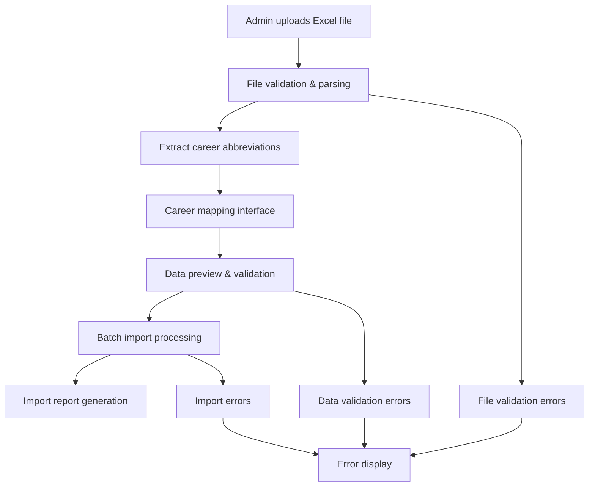
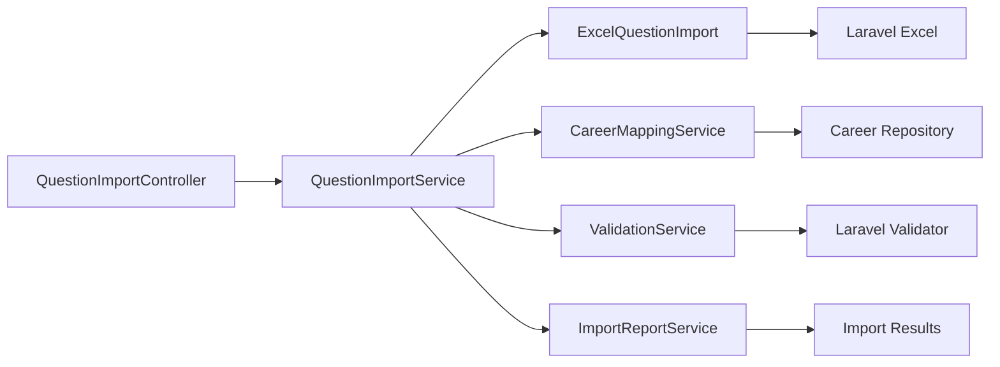

# Design Document: Question Import

## Overview

The Question Import feature enables administrators to efficiently import multiple questions from Excel files (.xls/.xlsx) into the exam system. The solution uses Laravel Excel package (Maatwebsite) for robust file processing, implements comprehensive validation, provides career mapping capabilities, and includes detailed error reporting.

The design follows Laravel best practices with dedicated import classes, proper validation, batch processing for performance, and graceful error handling to ensure data integrity.

## Architecture

### High-Level Flow



### Component Architecture



## Components and Interfaces

### 1. QuestionImportController

**Purpose**: Handle HTTP requests for the import process

**Key Methods**:
- `showImportForm()`: Display the upload form
- `uploadFile()`: Handle file upload and initial processing
- `showMapping()`: Display career mapping interface
- `processMapping()`: Handle career mapping submission
- `showPreview()`: Display import preview
- `executeImport()`: Execute the actual import
- `showReport()`: Display import results

**Responsibilities**:
- File upload handling
- Session management for multi-step process
- Response formatting
- Error handling and user feedback

### 2. QuestionImportService

**Purpose**: Orchestrate the import process and business logic

**Key Methods**:
- `processFile(UploadedFile $file): ImportSession`
- `extractCareerAbbreviations(ImportSession $session): array`
- `validateMappings(array $mappings): ValidationResult`
- `generatePreview(ImportSession $session): PreviewData`
- `executeImport(ImportSession $session): ImportResult`

**Responsibilities**:
- Coordinate import workflow
- Manage import sessions
- Business rule enforcement
- Error aggregation

### 3. ExcelQuestionImport (Laravel Excel Import Class)

**Purpose**: Handle Excel file parsing and data extraction

**Implements**: `ToCollection`, `WithValidation`, `WithHeadingRow`, `SkipsOnFailure`

**Key Methods**:
- `collection(Collection $rows)`: Process Excel rows
- `rules(): array`: Define validation rules
- `customValidationMessages(): array`: Custom error messages
- `prepareForValidation($data, $index): array`: Data preparation

**Column Mapping**:
```php
[
    'carreira' => 'career_abbreviation',
    'enunciado' => 'statement',
    'alternativa_a' => 'option_a',
    'alternativa_b' => 'option_b',
    'alternativa_c' => 'option_c',
    'alternativa_d' => 'option_d',
    'alternativa_e' => 'option_e',
    'resposta_correta' => 'correct_answer',
    'explicacao' => 'explanation'
]
```

### 4. CareerMappingService

**Purpose**: Handle career abbreviation mapping

**Key Methods**:
- `extractAbbreviations(Collection $data): array`
- `suggestMappings(array $abbreviations): array`
- `validateMappings(array $mappings): bool`
- `applyMappings(Collection $data, array $mappings): Collection`

**Mapping Logic**:
- Fuzzy matching for common abbreviations
- Manual mapping interface for unmatched items
- Validation of selected careers

### 5. ValidationService

**Purpose**: Comprehensive data validation

**Validation Rules**:
```php
[
    'statement' => 'required|string|min:10|max:2000',
    'option_a' => 'required|string|max:500',
    'option_b' => 'required|string|max:500',
    'option_c' => 'required|string|max:500',
    'option_d' => 'required|string|max:500',
    'option_e' => 'required|string|max:500',
    'correct_answer' => 'required|in:A,B,C,D,E',
    'explanation' => 'nullable|string|max:1000',
    'career_abbreviation' => 'required|string'
]
```

### 6. ImportReportService

**Purpose**: Generate detailed import reports

**Report Structure**:
- Summary statistics
- Success details by exam
- Error details with row numbers
- Downloadable error log

## Data Models

### ImportSession Model

```php
class ImportSession extends Model
{
    protected $fillable = [
        'id',
        'filename',
        'file_path',
        'total_rows',
        'career_mappings',
        'validation_errors',
        'status',
        'created_by',
        'expires_at'
    ];

    protected $casts = [
        'career_mappings' => 'array',
        'validation_errors' => 'array',
        'expires_at' => 'datetime'
    ];
}
```

### ImportResult Model

```php
class ImportResult extends Model
{
    protected $fillable = [
        'session_id',
        'total_processed',
        'successful_imports',
        'failed_imports',
        'errors',
        'success_details',
        'processing_time'
    ];

    protected $casts = [
        'errors' => 'array',
        'success_details' => 'array'
    ];
}
```

## Correctness Properties

*A property is a characteristic or behavior that should hold true across all valid executions of a system-essentially, a formal statement about what the system should do. Properties serve as the bridge between human-readable specifications and machine-verifiable correctness guarantees.*

### Property Reflection

After analyzing all acceptance criteria, I identified several properties that can be consolidated to avoid redundancy:

- File validation properties (1.2, 1.4, 1.5) can be combined into comprehensive file validation
- Question validation properties (4.1, 4.2, 4.3) can be combined into complete question validation
- Error handling properties (4.5, 8.1, 8.2) share similar error processing logic
- Report generation properties (6.1, 6.2, 6.3) can be consolidated into comprehensive reporting

### Core Properties

**Property 1: File validation and processing**
*For any* uploaded file, the system should validate format (.xls/.xlsx), size (≤10MB), and structure, rejecting invalid files with appropriate error messages while successfully parsing valid Excel files and extracting question data from the first worksheet
**Validates: Requirements 1.2, 1.3, 1.4, 1.5**

**Property 2: Career abbreviation extraction and mapping**
*For any* Excel file with career data, the system should extract all unique career abbreviations and validate that mapped careers exist and are active in the database
**Validates: Requirements 2.1, 2.3**

**Property 3: Question data validation**
*For any* question row, the system should validate that the statement has at least 10 characters, all five options (A-E) contain text, and the correct answer is one of A, B, C, D, or E
**Validates: Requirements 4.1, 4.2, 4.3**

**Property 4: Career and exam validation**
*For any* career mapping, the system should validate that the mapped career exists and has at least one active exam available for question assignment
**Validates: Requirements 4.4**

**Property 5: Error handling continuity**
*For any* import process with validation failures or database errors, the system should log detailed error information with row numbers and continue processing remaining questions rather than stopping completely
**Validates: Requirements 4.5, 8.1, 8.2**

**Property 6: Question assignment and numbering**
*For any* valid question being imported, the system should identify the correct target exam, assign sequential question numbers starting from the next available number, and create the question record with proper exam association
**Validates: Requirements 5.1, 5.3, 5.4**

**Property 7: Count maintenance**
*For any* completed import, the system should update the question count for each affected exam to reflect the newly imported questions
**Validates: Requirements 5.5**

**Property 8: Preview data aggregation**
*For any* import preview, the system should correctly count total questions and group them by career, displaying validation errors for questions with missing required fields
**Validates: Requirements 3.2, 3.3, 3.4**

**Property 9: Comprehensive reporting**
*For any* completed import, the system should generate a report with accurate statistics (total processed, successful, failed), detailed error information with row numbers, and success details grouped by exam
**Validates: Requirements 6.1, 6.2, 6.3**

**Property 10: Excel format support**
*For any* Excel file in .xls or .xlsx format, the system should successfully parse the file, detect headers, extract text content while ignoring formatting, skip empty rows, and preserve special characters and accents
**Validates: Requirements 7.1, 7.2, 7.3, 7.4, 7.5**

**Property 11: Duplicate detection**
*For any* import containing duplicate questions, the system should detect duplicates, skip them without creating database duplicates, and log appropriate warnings
**Validates: Requirements 8.4**

<function_calls>
<invoke name="prework">
<parameter name="featureName">question-import

## Error Handling

### File Upload Errors
- **Invalid format**: Clear message indicating supported formats (.xls, .xlsx)
- **File too large**: Specific message with size limit (10MB)
- **Corrupted file**: Generic error message for parsing failures
- **Upload timeout**: Retry mechanism with progress indication

### Data Validation Errors
- **Missing required fields**: Row-specific error with field names
- **Invalid data types**: Type conversion errors with expected format
- **Business rule violations**: Career mapping and exam assignment errors
- **Duplicate detection**: Warning messages for skipped duplicates

### Processing Errors
- **Database connection**: Graceful degradation with retry logic
- **Memory limits**: Batch processing to handle large files
- **Timeout handling**: Progress tracking and resumable imports
- **Transaction rollback**: Partial import recovery mechanisms

### Error Recovery Strategies

```php
// Example error handling in import service
try {
    $result = $this->processImport($session);
} catch (ValidationException $e) {
    // Continue with valid rows, collect errors
    $this->handleValidationErrors($e->errors());
} catch (DatabaseException $e) {
    // Rollback current batch, continue with next
    $this->handleDatabaseError($e);
} catch (MemoryException $e) {
    // Switch to smaller batch size
    $this->reduceBatchSize();
}
```

## Testing Strategy

### Dual Testing Approach

The testing strategy combines unit tests for specific scenarios and property-based tests for comprehensive coverage:

**Unit Tests**:
- File upload validation with specific file types and sizes
- Career mapping with known abbreviation sets
- Question validation with specific invalid data examples
- Error handling with simulated failure conditions
- Report generation with predetermined data sets

**Property-Based Tests**:
- File validation across randomly generated files of various formats and sizes
- Question validation across randomly generated question data
- Career mapping validation across random abbreviation and career combinations
- Import processing across random Excel file structures
- Error handling across random failure scenarios

### Property Test Configuration

All property tests will use **PHPUnit with Eris** (PHP property-based testing library):
- Minimum **100 iterations** per property test
- Each test tagged with: **Feature: question-import, Property {number}: {property_text}**
- Custom generators for Excel file structures, question data, and career mappings

### Test Data Generators

```php
// Example generators for property tests
class QuestionDataGenerator
{
    public static function validQuestion(): Generator
    {
        return Generator\map(
            function ($statement, $options, $answer) {
                return [
                    'statement' => $statement,
                    'option_a' => $options[0],
                    'option_b' => $options[1],
                    'option_c' => $options[2],
                    'option_d' => $options[3],
                    'option_e' => $options[4],
                    'correct_answer' => $answer
                ];
            },
            Generator\string()->withMinSize(10)->withMaxSize(500),
            Generator\vector(5, Generator\string()->withMinSize(1)->withMaxSize(100)),
            Generator\elements(['A', 'B', 'C', 'D', 'E'])
        );
    }
}
```

### Integration Testing

- **End-to-end import workflow**: Complete process from file upload to report generation
- **Database integration**: Verify proper data persistence and relationship maintenance
- **File system integration**: Temporary file handling and cleanup
- **Session management**: Multi-step process state maintenance

### Performance Testing

- **Large file handling**: Test with files containing 1000+ questions
- **Memory usage**: Monitor memory consumption during batch processing
- **Processing time**: Benchmark import speed for various file sizes
- **Concurrent imports**: Test multiple simultaneous import sessions

---

**Implementation Notes**:
- Use Laravel Excel package (Maatwebsite) for robust file processing
- Implement proper validation using Laravel's validation system
- Use database transactions for data integrity
- Implement batch processing for performance
- Provide comprehensive error reporting and logging