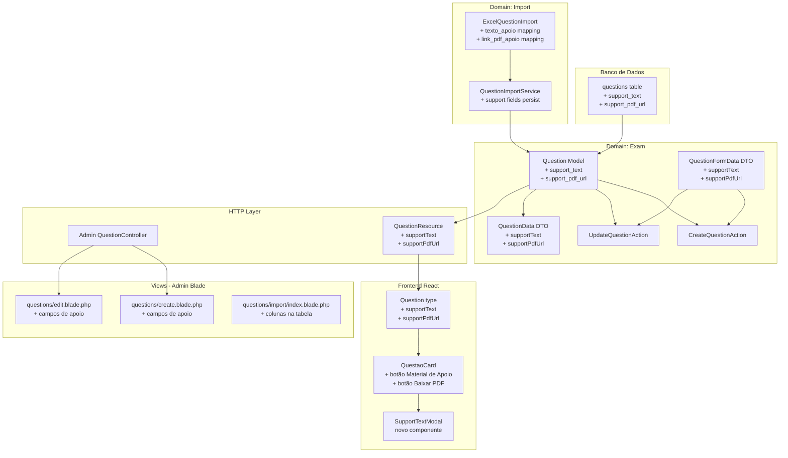
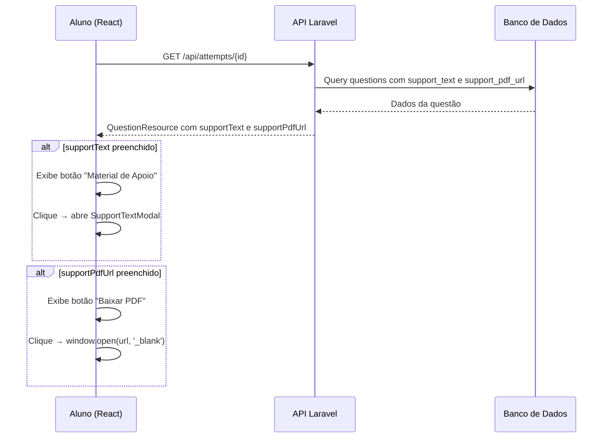

# Documento de Design — Material de Apoio da Questão

## Visão Geral

Este documento descreve o design técnico para adicionar campos opcionais de material de apoio (`support_text` e `support_pdf_url`) ao modelo `Question`. A funcionalidade abrange quatro camadas:

1. **Banco de dados**: Migração para adicionar duas colunas nullable à tabela `questions`
2. **Admin (Blade)**: Novos campos nos formulários de criação/edição de questões e atualização da tabela de formato esperado na tela de importação
3. **Importação Excel**: Mapeamento das colunas `texto_apoio` e `link_pdf_apoio` no `ExcelQuestionImport` e persistência no `QuestionImportService`
4. **API + Frontend React**: Inclusão de `supportText` e `supportPdfUrl` no `QuestionResource`, atualização do tipo `Question` no TypeScript, e criação de modal de texto de apoio e botão de download de PDF no `QuestaoCard`

A solução segue a arquitetura DDD existente, estendendo o domínio `Exam` sem criar novos domínios. Todos os campos são opcionais e retrocompatíveis — questões existentes continuam funcionando sem alteração.

## Arquitetura

### Diagrama de Componentes



### Diagrama de Fluxo — Exibição do Material de Apoio no Simulado



### Decisões de Arquitetura

1. **Campos na tabela `questions` (não em tabela separada)**: Os campos `support_text` e `support_pdf_url` são atributos diretos da questão, sem cardinalidade N:N. Adicionar colunas nullable é mais simples e performático do que criar uma tabela auxiliar.

2. **URL pública para PDF (não upload de arquivo)**: O requisito especifica que o campo armazena uma URL pública de download. Isso evita complexidade de upload/storage de PDFs e permite que o administrador use links de serviços externos (Google Drive, S3, etc.).

3. **Validação de URL no backend**: A URL do PDF é validada com a regra `url` do Laravel tanto no formulário admin quanto na importação Excel. URLs inválidas na importação geram aviso no relatório mas não impedem a importação da questão.

4. **Renderização condicional no React**: Os botões "Material de Apoio" e "Baixar PDF" só aparecem quando os respectivos campos não são `null`. Isso mantém a interface limpa para questões sem material de apoio.

5. **Extensão do `QuestionFormData` DTO**: Os novos campos são adicionados ao DTO existente seguindo o padrão já estabelecido, sem criar DTOs adicionais.

## Componentes e Interfaces

### 1. Migração — `add_support_fields_to_questions_table`

```php
Schema::table('questions', function (Blueprint $table) {
    $table->text('support_text')->nullable()->after('explanation');
    $table->string('support_pdf_url', 500)->nullable()->after('support_text');
});
```

### 2. Question Model — Atualização do `$fillable`

Adicionar `'support_text'` e `'support_pdf_url'` ao array `$fillable` existente.

### 3. QuestionFormData DTO — Novos campos

```php
readonly class QuestionFormData
{
    public function __construct(
        // ... campos existentes ...
        public ?string $supportText,
        public ?string $supportPdfUrl,
    ) {}

    public static function fromRequest(Request $request): self
    {
        return new self(
            // ... campos existentes ...
            supportText: $request->input('support_text'),
            supportPdfUrl: $request->input('support_pdf_url'),
        );
    }

    public function toArray(): array
    {
        return [
            // ... campos existentes ...
            'support_text' => $this->supportText,
            'support_pdf_url' => $this->supportPdfUrl,
        ];
    }
}
```

### 4. QuestionData DTO — Novos campos

Adicionar `supportText` e `supportPdfUrl` ao construtor e aos métodos `fromArray()` e `toArray()`.

### 5. QuestionResource — Novos campos na API

```php
public function toArray($request): array
{
    return [
        // ... campos existentes ...
        'supportText' => $this->resource->support_text,
        'supportPdfUrl' => $this->resource->support_pdf_url,
    ];
}
```

### 6. ExcelQuestionImport — Mapeamento de colunas

Adicionar ao `$columnMapping`:
```php
'texto_apoio' => 'support_text',
'link_pdf_apoio' => 'support_pdf_url',
```

### 7. QuestionImportService — Persistência dos novos campos

No método `processQuestion()`, incluir `support_text` e `support_pdf_url` no array de criação do `Question::create()`.

### 8. Validação de URL na importação

No `QuestionValidationService` ou no `ExcelQuestionImport`, validar que `link_pdf_apoio` é uma URL válida quando preenchida. Se inválida, registrar aviso e importar a questão sem o link.

### 9. Admin Blade — Formulários de criação e edição

Adicionar após o campo "Explicação" nos formulários `create.blade.php` e `edit.blade.php`:

- Campo textarea "Texto de Apoio" (`name="support_text"`, opcional)
- Campo input text "Link do PDF de Apoio" (`name="support_pdf_url"`, opcional, com validação `url`)

### 10. Admin Blade — Tabela de formato esperado na importação

Adicionar colunas `texto_apoio` e `link_pdf_apoio` na tabela de formato esperado em `import/index.blade.php`.

### 11. Validação no StoreQuestion/UpdateQuestion Request

Adicionar regras de validação:
```php
'support_text' => 'nullable|string',
'support_pdf_url' => 'nullable|url|max:500',
```

### 12. React — Tipo Question atualizado

```typescript
export interface Question {
    // ... campos existentes ...
    supportText?: string | null;
    supportPdfUrl?: string | null;
}
```

### 13. React — Componente SupportTextModal

Novo componente modal que recebe o texto de apoio e exibe em um dialog com botão de fechar.

### 14. React — QuestaoCard atualizado

Adicionar condicionalmente:
- Botão "Material de Apoio" quando `question.supportText` não é null → abre `SupportTextModal`
- Botão "Baixar PDF" quando `question.supportPdfUrl` não é null → `window.open(url, '_blank')`

### Rotas

Nenhuma rota nova é necessária. Os formulários admin já utilizam as rotas existentes de `store` e `update` do `QuestionController`. A API já retorna os dados da questão via `QuestionResource`.

## Modelos de Dados

### Alteração na tabela `questions`

| Coluna | Tipo | Descrição |
|---|---|---|
| `support_text` | text, nullable | Texto de apoio da questão (exibido em modal no simulado) |
| `support_pdf_url` | varchar(500), nullable | URL pública para download do PDF de apoio |

### Atualização do Model `Question`

```php
protected $fillable = [
    // ... campos existentes ...
    'support_text',
    'support_pdf_url',
];
```

### Atualização do DTO `QuestionData`

```php
readonly class QuestionData
{
    public function __construct(
        // ... campos existentes ...
        public ?string $supportText,
        public ?string $supportPdfUrl,
    ) {}
}
```

### Atualização do DTO `QuestionFormData`

```php
readonly class QuestionFormData
{
    public function __construct(
        // ... campos existentes ...
        public ?string $supportText,
        public ?string $supportPdfUrl,
    ) {}
}
```

### Mapeamento Excel → Banco de Dados

| Coluna Excel | Campo interno | Campo no banco |
|---|---|---|
| `texto_apoio` | `support_text` | `support_text` |
| `link_pdf_apoio` | `support_pdf_url` | `support_pdf_url` |


## Propriedades de Corretude

*Uma propriedade é uma característica ou comportamento que deve ser verdadeiro em todas as execuções válidas de um sistema — essencialmente, uma declaração formal sobre o que o sistema deve fazer. Propriedades servem como ponte entre especificações legíveis por humanos e garantias de corretude verificáveis por máquina.*

### Propriedade 1: Round-trip dos campos de material de apoio via formulário admin

*Para qualquer* combinação de valores de `support_text` (string ou null) e `support_pdf_url` (URL válida ou null), ao submeter o formulário de criação ou edição de questão com esses valores, a questão persistida no banco deve conter exatamente os mesmos valores nos campos correspondentes.

**Valida: Requisitos 1.1, 1.2, 1.3, 1.4, 2.4, 2.5, 2.7**

### Propriedade 2: Rejeição de URL inválida no formulário admin

*Para qualquer* string que não seja uma URL válida, ao submeter o formulário de criação ou edição de questão com esse valor no campo `support_pdf_url`, o sistema deve rejeitar a submissão com erro de validação, e a questão não deve ser criada/alterada.

**Valida: Requisitos 2.6**

### Propriedade 3: Round-trip dos campos de material de apoio via importação Excel

*Para qualquer* linha de planilha Excel com valores nas colunas `texto_apoio` e `link_pdf_apoio` (URL válida), após a importação, a questão criada deve conter os mesmos valores nos campos `support_text` e `support_pdf_url` respectivamente.

**Valida: Requisitos 3.2, 3.3, 3.4**

### Propriedade 4: URL inválida na importação não impede a importação da questão

*Para qualquer* linha de planilha Excel com uma URL inválida na coluna `link_pdf_apoio`, a questão deve ser importada com `support_pdf_url` como `null`, e um aviso deve ser registrado no relatório de importação.

**Valida: Requisitos 3.5**

### Propriedade 5: Renderização condicional dos botões de material de apoio

*Para qualquer* questão exibida na tela do simulado, o botão "Material de Apoio" deve ser visível se e somente se `supportText` não é null, e o botão "Baixar PDF" deve ser visível se e somente se `supportPdfUrl` não é null.

**Valida: Requisitos 4.1, 4.5, 5.1, 5.3**

### Propriedade 6: API sempre inclui campos de material de apoio no payload

*Para qualquer* questão retornada pela API (com ou sem material de apoio preenchido), o payload JSON deve conter os campos `supportText` e `supportPdfUrl`, com valor `null` quando não preenchidos.

**Valida: Requisitos 6.1, 6.2, 6.3**

## Tratamento de Erros

| Cenário | Comportamento | Código HTTP |
|---|---|---|
| URL inválida no campo `support_pdf_url` do formulário admin | Retorna erro de validação "A URL informada é inválida" | 422 |
| URL inválida na coluna `link_pdf_apoio` da planilha Excel | Registra aviso no relatório, importa questão sem o link | 200 |
| Campos `support_text` e `support_pdf_url` vazios no formulário | Aceita normalmente, armazena como `null` | 302 (redirect) |
| Colunas `texto_apoio` e `link_pdf_apoio` ausentes na planilha | Importa normalmente com campos como `null` | 200 |
| URL do PDF retorna 404/403 ao clicar "Baixar PDF" | Frontend exibe mensagem "Arquivo não disponível no momento" | N/A (client-side) |
| Campo `support_text` com texto muito longo | Aceita normalmente (tipo `text` no banco não tem limite prático) | 302 (redirect) |

### Princípios de Tratamento de Erros

1. **Validação no request**: O campo `support_pdf_url` é validado como URL válida via `nullable|url|max:500` no FormRequest do Laravel.
2. **Importação tolerante**: URLs inválidas na importação Excel geram aviso mas não impedem a importação da questão, seguindo o princípio de tolerância do importador existente.
3. **Feedback visual no admin**: Erros de validação são exibidos inline no formulário via `@error` do Blade, seguindo o padrão AdminLTE existente.
4. **Tratamento de erro no frontend**: O botão "Baixar PDF" usa `window.open()` com tratamento de erro via `fetch` HEAD request para verificar disponibilidade antes de abrir, ou exibe mensagem de erro caso a URL não esteja acessível.

## Estratégia de Testes

### Framework de Testes

- **Backend**: Pest PHP (já configurado) com banco SQLite em memória
- **Frontend**: Vitest + React Testing Library (se configurado) ou testes manuais
- **Property-Based Testing**: PHPUnit com geração de dados via `Faker` (já disponível como `fakerphp/faker`)

### Testes Unitários

Focados em casos específicos, edge cases e condições de erro:

- `CreateQuestionAction`: teste com support_text e support_pdf_url preenchidos, teste com ambos null
- `UpdateQuestionAction`: teste de atualização dos campos de apoio, teste de remoção (set to null)
- `QuestionFormData::fromRequest()`: teste de extração dos novos campos do request
- `QuestionFormData::toArray()`: teste de inclusão dos novos campos no array
- `QuestionResource::toArray()`: teste de serialização com campos preenchidos e null
- `ExcelQuestionImport`: teste de mapeamento das colunas `texto_apoio` e `link_pdf_apoio`
- `QuestionImportService::processQuestion()`: teste de persistência dos campos de apoio
- Validação: teste de rejeição de URL inválida no formulário admin
- Validação: teste de aceitação de campos vazios (opcionais)

### Testes de Propriedade (Property-Based Testing)

Biblioteca: PHPUnit com geração de dados via `Faker`.

Cada teste de propriedade deve:
- Executar no mínimo 100 iterações com dados gerados aleatoriamente
- Referenciar a propriedade do design com um comentário no formato:
  `// Feature: question-support-material, Property {N}: {título}`

Propriedades a implementar como testes:

1. **Property 1**: Gerar combinações aleatórias de support_text (string/null) e support_pdf_url (URL válida/null) → criar/editar questão via action → verificar que os valores persistidos são idênticos aos enviados
2. **Property 2**: Gerar strings aleatórias que não são URLs válidas → submeter como support_pdf_url → verificar que a validação rejeita
3. **Property 3**: Gerar dados de planilha com texto_apoio e link_pdf_apoio aleatórios → executar importação → verificar que os campos da questão criada correspondem aos valores da planilha
4. **Property 4**: Gerar dados de planilha com URLs inválidas em link_pdf_apoio → executar importação → verificar que a questão é criada com support_pdf_url null e aviso registrado
5. **Property 5**: Gerar questões com combinações aleatórias de supportText (string/null) e supportPdfUrl (string/null) → renderizar QuestaoCard → verificar que botões aparecem se e somente se o campo correspondente não é null
6. **Property 6**: Gerar questões com combinações aleatórias de support_text e support_pdf_url → serializar via QuestionResource → verificar que o JSON contém ambos os campos

### Cobertura de Testes

| Componente | Tipo de Teste |
|---|---|
| `CreateQuestionAction` / `UpdateQuestionAction` | Propriedade (1) + Unitário (edge cases) |
| Validação de URL no FormRequest | Propriedade (2) + Unitário (URLs válidas/inválidas) |
| `ExcelQuestionImport` + `QuestionImportService` | Propriedade (3, 4) + Unitário (colunas ausentes) |
| `QuestaoCard` (React) | Propriedade (5) + Unitário (modal abre/fecha) |
| `QuestionResource` | Propriedade (6) + Unitário (serialização) |
| `QuestionFormData` | Unitário (fromRequest, toArray) |
| `QuestionData` | Unitário (fromArray, toArray) |
