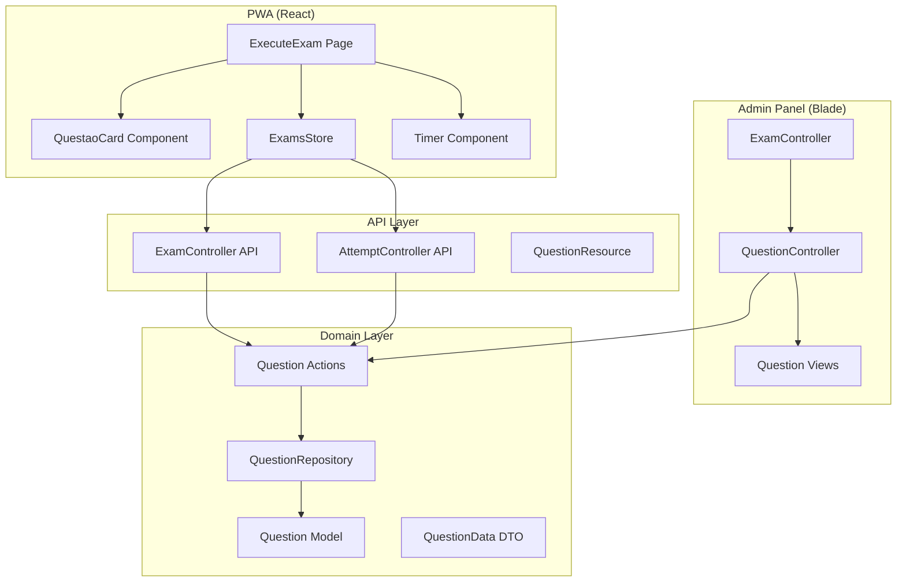

# Design Document - Simulados MVP

## Overview

Este documento descreve o design técnico para a implementação completa da funcionalidade de Simulados no sistema Operação Alfa. A implementação abrange três camadas principais:

1. **Admin Panel (Laravel/Blade)**: CRUD de questões, configuração de modo de feedback
2. **API (Laravel)**: Endpoints para gerenciamento de tentativas e serialização de dados
3. **PWA (React)**: Interface de execução de simulados com timer e feedback

O sistema segue a arquitetura Domain-Driven Design (DDD) já estabelecida no projeto, com Actions, DTOs, Repositories e Models organizados por domínio.

## Development Environment

**IMPORTANTE**: Este projeto utiliza Docker. Todos os comandos PHP/Artisan/Composer devem ser executados dentro do container Laravel:

```bash
# Executar comandos no container
docker exec -it laravel-app php artisan <comando>
docker exec -it laravel-app composer <comando>

# Ou acessar o shell do container
docker exec -it laravel-app bash
```

Os comandos npm/yarn para o frontend React também devem ser executados no container ou no diretório `laravel/`.

## Architecture



## Components and Interfaces

### Backend Components

#### 1. Question Model (Existing - needs update)
```php
// App\Domain\Exam\Models\Question
class Question extends Model
{
    protected $fillable = [
        'exam_id',
        'question_number',
        'statement',
        'statement_image',
        'option_a', 'option_a_image',
        'option_b', 'option_b_image',
        'option_c', 'option_c_image',
        'option_d', 'option_d_image',
        'option_e', 'option_e_image',
        'correct_answer',
        'explanation',
    ];
}
```

#### 2. Exam Model (Update - add feedback_mode)
```php
// App\Domain\Exam\Models\Exam
class Exam extends Model
{
    protected $fillable = [
        'career_id',
        'title',
        'description',
        'time_limit_minutes',
        'feedback_mode', // 'immediate' | 'final'
        'active',
        'is_free',
    ];
}
```

#### 3. QuestionController (Admin)
```php
// App\Http\Controllers\Admin\QuestionController
class QuestionController extends Controller
{
    public function index(Exam $exam);      // List questions for exam
    public function create(Exam $exam);     // Show create form
    public function store(Request $request, Exam $exam);  // Create question
    public function edit(Exam $exam, Question $question); // Show edit form
    public function update(Request $request, Exam $exam, Question $question);
    public function destroy(Exam $exam, Question $question);
}
```

#### 4. Question Actions
```php
// App\Domain\Exam\Actions\Admin\
CreateQuestionAction::execute(int $examId, QuestionData $data): Question
UpdateQuestionAction::execute(int $questionId, QuestionData $data): Question
DeleteQuestionAction::execute(int $questionId): bool
ListQuestionsAction::execute(int $examId): Collection
```

#### 5. QuestionResource (API)
```php
// App\Http\Resources\Exam\QuestionResource
class QuestionResource extends JsonResource
{
    public function toArray($request): array
    {
        return [
            'id' => $this->id,
            'questionNumber' => $this->question_number,
            'statement' => $this->statement,
            'statementImage' => $this->statement_image ? url($this->statement_image) : null,
            'options' => [
                ['letter' => 'A', 'text' => $this->option_a, 'image' => $this->option_a_image ? url($this->option_a_image) : null],
                ['letter' => 'B', 'text' => $this->option_b, 'image' => $this->option_b_image ? url($this->option_b_image) : null],
                ['letter' => 'C', 'text' => $this->option_c, 'image' => $this->option_c_image ? url($this->option_c_image) : null],
                ['letter' => 'D', 'text' => $this->option_d, 'image' => $this->option_d_image ? url($this->option_d_image) : null],
                ['letter' => 'E', 'text' => $this->option_e, 'image' => $this->option_e_image ? url($this->option_e_image) : null],
            ],
            'correctAnswer' => $this->when($this->shouldShowAnswer(), $this->correct_answer),
            'explanation' => $this->when($this->shouldShowAnswer(), $this->explanation),
        ];
    }
}
```

### Frontend Components (PWA)

#### 1. ExecuteExam Page (Update)
- Load questions from API on attempt start
- Display countdown timer
- Handle feedback mode (immediate vs final)
- Auto-submit on timer expiration

#### 2. QuestaoCard Component (Update)
- Display statement with optional image
- Display 5 options with optional images
- Handle selection state
- Show feedback when in immediate mode

#### 3. Timer Component (New)
```typescript
interface TimerProps {
  initialSeconds: number;
  onExpire: () => void;
  warningThreshold?: number; // seconds
}
```

#### 4. ExamResult Page (New/Update)
- Display score summary
- Show question review with correct/incorrect indicators
- Display explanations

## Data Models

### Database Schema Updates

#### Migration: Add feedback_mode to exams
```sql
ALTER TABLE exams ADD COLUMN feedback_mode ENUM('immediate', 'final') DEFAULT 'final';
```

### DTOs

#### QuestionData
```php
class QuestionData
{
    public function __construct(
        public readonly int $questionNumber,
        public readonly string $statement,
        public readonly ?string $statementImage,
        public readonly string $optionA,
        public readonly ?string $optionAImage,
        public readonly string $optionB,
        public readonly ?string $optionBImage,
        public readonly string $optionC,
        public readonly ?string $optionCImage,
        public readonly string $optionD,
        public readonly ?string $optionDImage,
        public readonly string $optionE,
        public readonly ?string $optionEImage,
        public readonly string $correctAnswer,
        public readonly ?string $explanation,
    ) {}
}
```

### TypeScript Types (PWA)

```typescript
interface Question {
  id: string;
  questionNumber: number;
  statement: string;
  statementImage?: string;
  options: Option[];
  correctAnswer?: AnswerOption; // Only present when allowed
  explanation?: string;         // Only present when allowed
}

interface Option {
  letter: AnswerOption;
  text: string;
  image?: string;
}

interface ExamWithQuestions extends Exam {
  feedbackMode: 'immediate' | 'final';
  questions: Question[];
}

interface AttemptWithQuestions extends Attempt {
  questions: Question[];
  answers: Record<string, AnswerOption>;
}
```


## Correctness Properties

*A property is a characteristic or behavior that should hold true across all valid executions of a system-essentially, a formal statement about what the system should do. Properties serve as the bridge between human-readable specifications and machine-verifiable correctness guarantees.*

### Property 1: Questions are ordered by question number
*For any* exam with questions, when retrieving the questions list, the questions SHALL be ordered by question_number in ascending order.
**Validates: Requirements 1.1**

### Property 2: Question creation associates with exam
*For any* valid question data and exam, after creating a question, the question SHALL exist in the database with the correct exam_id and all provided field values.
**Validates: Requirements 1.3**

### Property 3: Question edit round-trip preserves data
*For any* existing question, loading it for edit and saving without changes SHALL preserve all field values exactly.
**Validates: Requirements 1.4**

### Property 4: Question deletion decreases count
*For any* exam with N questions, after deleting one question, the exam SHALL have N-1 questions and the deleted question SHALL not exist.
**Validates: Requirements 1.5**

### Property 5: Feedback mode persistence
*For any* exam, setting feedback_mode to either 'immediate' or 'final' SHALL persist that value correctly in the database.
**Validates: Requirements 2.2, 2.3**

### Property 6: Time limit validation
*For any* time limit value, values less than 1 or greater than 300 SHALL be rejected by validation.
**Validates: Requirements 2.4**

### Property 7: Duplicate question number rejection
*For any* exam with an existing question number N, attempting to create another question with number N SHALL fail validation.
**Validates: Requirements 3.4**

### Property 8: Attempt initialization with timer
*For any* exam with time_limit_minutes T, starting an attempt SHALL return all questions and the initial timer value SHALL be T * 60 seconds.
**Validates: Requirements 4.1**

### Property 9: Answer persistence and retrieval
*For any* answer submission (attemptId, questionId, answer), the answer SHALL be persisted and retrievable when fetching the attempt.
**Validates: Requirements 4.4, 4.5**

### Property 10: Timer format validation
*For any* time value in seconds, the formatted display SHALL match MM:SS for values under 3600 or HH:MM:SS for values >= 3600.
**Validates: Requirements 4.6**

### Property 11: Timer warning threshold
*For any* time value less than 300 seconds (5 minutes), the timer display SHALL indicate warning state.
**Validates: Requirements 4.8**

### Property 12: Immediate mode reveals answer on submission
*For any* answer submission in an exam with feedback_mode='immediate', the API response SHALL include correctAnswer and explanation for that question.
**Validates: Requirements 5.1**

### Property 13: Final mode hides answer until completion
*For any* ongoing attempt with feedback_mode='final', the API response SHALL NOT include correctAnswer or explanation for any question.
**Validates: Requirements 5.3**

### Property 14: Finished attempt reveals all answers
*For any* finished attempt (regardless of feedback mode), fetching the attempt SHALL include correctAnswer and explanation for ALL questions.
**Validates: Requirements 5.4, 7.4**

### Property 15: Result completeness
*For any* finished attempt, the result SHALL include: total score (percentage), correct answer count, total question count, and time spent in seconds.
**Validates: Requirements 6.1**

### Property 16: Ranking entry creation on finish
*For any* finished attempt, a ranking entry SHALL be created or updated for that user/exam combination.
**Validates: Requirements 6.4, 8.2**

### Property 17: Score calculation accuracy
*For any* attempt with C correct answers out of T total questions, the score SHALL equal (C / T) * 100.
**Validates: Requirements 8.1**

### Property 18: Ranking order correctness
*For any* set of ranking entries, the order SHALL be by score descending, then by time ascending for tie-breaking.
**Validates: Requirements 8.3**

### Property 19: Best score for ranking
*For any* user with multiple attempts on the same exam, only the attempt with the highest score SHALL be reflected in the ranking.
**Validates: Requirements 8.4**

### Property 20: Image URL completeness
*For any* question with images, the API response SHALL return complete URLs (starting with http:// or https://) for all image fields.
**Validates: Requirements 7.5**

### Property 21: Conditional answer visibility based on mode and state
*For any* attempt, the visibility of correctAnswer and explanation SHALL follow:
- Finished attempt: always visible for all questions
- Ongoing + immediate mode: visible only for answered questions
- Ongoing + final mode: never visible
**Validates: Requirements 7.2, 7.3, 7.4**

## Error Handling

### Admin Panel Errors
- **Validation Errors**: Display inline error messages next to invalid fields
- **File Upload Errors**: Display toast notification with specific error (size, type, etc.)
- **Database Errors**: Display generic error message and log details

### API Errors
- **400 Bad Request**: Invalid input data (validation errors)
- **401 Unauthorized**: User not authenticated
- **403 Forbidden**: User doesn't own the attempt
- **404 Not Found**: Exam or attempt not found
- **422 Unprocessable Entity**: Business rule violation (e.g., attempt already finished)

### PWA Error Handling
- **Network Errors**: Display offline indicator, queue answers for retry
- **API Errors**: Display toast with user-friendly message
- **Timer Expiration**: Auto-submit with confirmation dialog

## Testing Strategy

### Property-Based Testing Library
**Library**: Pest PHP with custom generators for Laravel backend testing.

For frontend (React/TypeScript), we will use **fast-check** for property-based testing.

### Unit Tests
- Question CRUD operations
- Validation rules
- Score calculation
- Timer formatting

### Property-Based Tests
Each correctness property will be implemented as a property-based test with minimum 100 iterations.

Tests will be tagged with format: `**Feature: simulados-mvp, Property {number}: {property_text}**`

Example test structure:
```php
// Backend (Pest + custom generators)
it('maintains question order by question_number', function () {
    // **Feature: simulados-mvp, Property 1: Questions are ordered by question number**
    $exam = Exam::factory()->create();
    $numbers = collect(range(1, 10))->shuffle();
    
    foreach ($numbers as $num) {
        Question::factory()->create([
            'exam_id' => $exam->id,
            'question_number' => $num,
        ]);
    }
    
    $questions = $exam->questions()->get();
    $orderedNumbers = $questions->pluck('question_number')->toArray();
    
    expect($orderedNumbers)->toBe(range(1, 10));
});
```

```typescript
// Frontend (fast-check)
import fc from 'fast-check';

test('timer format is correct', () => {
  // **Feature: simulados-mvp, Property 10: Timer format validation**
  fc.assert(
    fc.property(fc.integer({ min: 0, max: 10800 }), (seconds) => {
      const formatted = formatTime(seconds);
      if (seconds >= 3600) {
        expect(formatted).toMatch(/^\d+:\d{2}:\d{2}$/);
      } else {
        expect(formatted).toMatch(/^\d+:\d{2}$/);
      }
    }),
    { numRuns: 100 }
  );
});
```

### Integration Tests
- Full exam creation flow (exam + questions)
- Complete attempt flow (start → answer → finish)
- Ranking update after attempt completion

