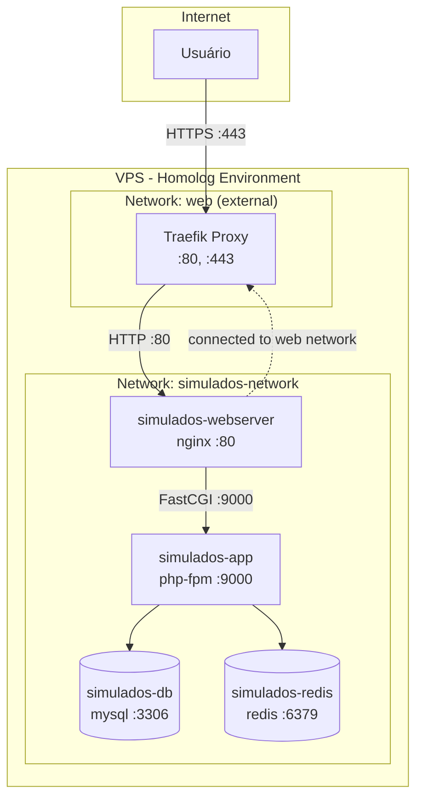
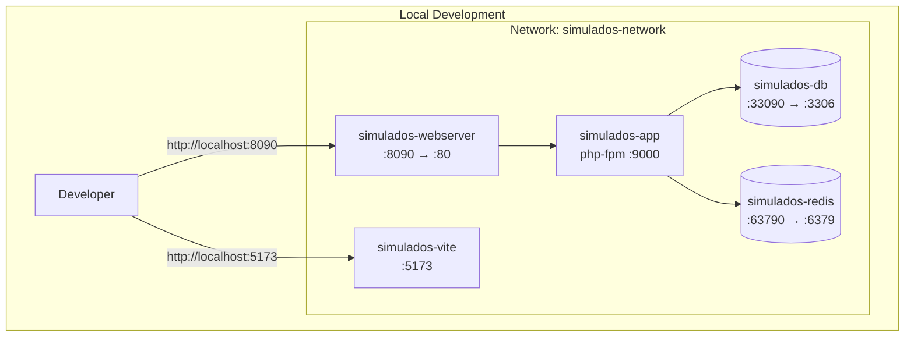

# Design Document

## Overview

Este documento descreve a arquitetura e implementação para adaptar a stack Docker Compose do projeto "Operação Alfa" para suportar deploy em VPS com Traefik como reverse proxy e HTTPS automático via Let's Encrypt, mantendo compatibilidade total com o ambiente de desenvolvimento local.

A solução utiliza a estratégia de Docker Compose override files, onde:
- `docker-compose.yml` contém a configuração base compartilhada
- `docker-compose.override.yml` adiciona configurações específicas para desenvolvimento local (carregado automaticamente)
- `docker-compose.homolog.yml` adiciona configurações específicas para homologação na VPS

## Architecture





## Components and Interfaces

### 1. Traefik Proxy (docker-compose.proxy.yml)

Componente standalone que gerencia o reverse proxy para todos os projetos na VPS.

| Configuração | Valor |
|-------------|-------|
| Imagem | traefik:v3.0 |
| Portas expostas | 80 (HTTP), 443 (HTTPS) |
| Network | web (external) |
| Certificados | Let's Encrypt via HTTP-01 |
| Dashboard | Desabilitado por padrão |

**Entrypoints:**
- `web`: porta 80, redireciona para `websecure`
- `websecure`: porta 443, TLS habilitado

**Certificate Resolver:**
- Nome: `le`
- Challenge: HTTP-01
- Storage: `/letsencrypt/acme.json`

### 2. Webserver Service (simulados-webserver)

Container nginx que serve como entrypoint HTTP da aplicação.

| Ambiente | Porta Host | Network Adicional | Labels Traefik |
|----------|-----------|-------------------|----------------|
| Local | 8090 | - | - |
| Homolog | - | web | Sim |

**Labels Traefik (homolog):**
```yaml
traefik.enable: "true"
traefik.http.routers.operacao-alfa.rule: "Host(`operacao-alfa.homolog.mydev.com.br`)"
traefik.http.routers.operacao-alfa.entrypoints: "websecure"
traefik.http.routers.operacao-alfa.tls.certresolver: "le"
traefik.http.services.operacao-alfa.loadbalancer.server.port: "80"
```

### 3. Database Service (simulados-db)

| Ambiente | Porta Host | Exposição |
|----------|-----------|-----------|
| Local | 33090 | Localhost apenas |
| Homolog | - | Não exposta |

### 4. Redis Service (simulados-redis)

| Ambiente | Porta Host | Exposição |
|----------|-----------|-----------|
| Local | 63790 | Localhost apenas |
| Homolog | - | Não exposta |

## Data Models

### Estrutura de Arquivos

```
project-root/
├── docker-compose.yml           # Base configuration
├── docker-compose.override.yml  # Local dev (auto-loaded)
├── docker-compose.homolog.yml   # Homolog VPS
├── docker-compose.proxy.yml     # Traefik standalone
├── .env                         # Local environment
├── .env.homolog.example         # Homolog template
├── traefik/
│   └── acme.json               # Let's Encrypt certificates (VPS only)
└── laravel/
    └── .env                    # Laravel environment
```

### Environment Variables (.env.homolog.example)

```bash
# Application
APP_NAME="Operação Alfa"
APP_ENV=staging
APP_DEBUG=false
APP_URL=https://operacao-alfa.homolog.mydev.com.br

# Proxy Configuration
TRUSTED_PROXIES=*

# Database (internal network only)
DB_CONNECTION=mysql
DB_HOST=simulados-db
DB_PORT=3306
DB_DATABASE=simulados_db
DB_USERNAME=simulados_user
DB_PASSWORD=<CHANGE_ME>

# Redis (internal network only)
REDIS_HOST=simulados-redis
REDIS_PORT=6379

# Session/Cache
SESSION_DRIVER=redis
CACHE_STORE=redis
QUEUE_CONNECTION=redis
```


## Correctness Properties

*A property is a characteristic or behavior that should hold true across all valid executions of a system-essentially, a formal statement about what the system should do. Properties serve as the bridge between human-readable specifications and machine-verifiable correctness guarantees.*

### Property 1: Local Environment Isolation

*For any* local development setup, running `docker compose up -d` without explicit file specification SHALL start all services with ports exposed (8090, 33090, 63790) and WITHOUT requiring the "web" external network to exist.

**Validates: Requirements 1.1, 1.2, 1.3, 1.4**

### Property 2: Homolog Network Connectivity

*For any* homolog deployment, the webserver container SHALL be connected to both the internal "simulados-network" AND the external "web" network, enabling Traefik to route traffic while maintaining internal service communication.

**Validates: Requirements 3.2, 3.3**

### Property 3: Database Port Isolation in Homolog

*For any* homolog deployment, the database and Redis containers SHALL NOT have any port mappings to the host, ensuring they are only accessible within the Docker network.

**Validates: Requirements 3.4, 3.5**

### Property 4: Traefik Label Completeness

*For any* service exposed via Traefik, the labels SHALL include: enable flag, router rule with Host, entrypoints, TLS certresolver, and service port - all required for proper HTTPS routing.

**Validates: Requirements 2.7, 3.3**

### Property 5: Certificate Persistence

*For any* Traefik deployment, the acme.json file SHALL be persisted in a volume, ensuring certificates survive container restarts and are not re-requested from Let's Encrypt.

**Validates: Requirements 2.3**

## Error Handling

### DNS Resolution Errors

**Scenario:** Domain not pointing to VPS IP
**Detection:** Traefik logs show "no route to host" or certificate challenge fails
**Resolution:** Verify DNS A record points to VPS public IP; wait for propagation (up to 48h)

### Certificate Issuance Failures

**Scenario:** Let's Encrypt HTTP-01 challenge fails
**Detection:** Traefik logs show ACME challenge errors
**Resolution:** 
1. Ensure port 80 is open on VPS firewall
2. Ensure Cloudflare is in "DNS only" mode (not proxied) during initial setup
3. Check rate limits at https://letsencrypt.org/docs/rate-limits/

### Redirect Loops

**Scenario:** Infinite HTTP→HTTPS redirects
**Detection:** Browser shows "too many redirects" error
**Resolution:**
1. Verify TRUSTED_PROXIES is set in Laravel .env
2. Ensure APP_URL uses https:// protocol
3. Check TrustProxies middleware is enabled

### Network Not Found

**Scenario:** "network web not found" error on compose up
**Detection:** Docker compose fails to start
**Resolution:** Create external network first: `docker network create web`

### Port Already in Use (Local)

**Scenario:** Port 8090 already bound
**Detection:** Docker compose fails with "port already allocated"
**Resolution:** Stop conflicting service or change port in docker-compose.override.yml

## Testing Strategy

### Manual Validation Tests

Since this is infrastructure configuration, testing is primarily manual validation:

#### Local Environment Tests

1. **Clean Start Test**
   - Remove all containers and networks
   - Run `docker compose up -d`
   - Verify http://localhost:8090 responds
   - Verify database accessible on localhost:33090
   - Verify Redis accessible on localhost:63790

2. **Override Auto-Load Test**
   - Verify `docker compose config` shows port mappings
   - Verify no Traefik labels present

3. **Dev Profile Test**
   - Run `docker compose --profile dev up -d`
   - Verify Vite server accessible on localhost:5173

#### Homolog Environment Tests

1. **Network Isolation Test**
   - Run `docker compose -f docker-compose.yml -f docker-compose.homolog.yml config`
   - Verify NO port mappings for db and redis
   - Verify webserver connected to "web" network

2. **Traefik Labels Test**
   - Verify all required labels present in config output
   - Verify Host rule matches expected domain

3. **HTTPS Access Test**
   - Access https://operacao-alfa.homolog.mydev.com.br
   - Verify valid SSL certificate
   - Verify no redirect loops

4. **Laravel URL Generation Test**
   - Login to application
   - Verify all generated URLs use https://
   - Verify asset URLs use https://

### Validation Checklist

#### Pre-Deployment (VPS)

- [ ] DNS A record for `operacao-alfa.homolog.mydev.com.br` points to VPS IP
- [ ] Ports 80 and 443 open on VPS firewall
- [ ] Cloudflare set to "DNS only" (gray cloud) initially
- [ ] Docker and Docker Compose installed on VPS
- [ ] `.env.homolog` created from `.env.homolog.example` with real values

#### Post-Deployment (VPS)

- [ ] `docker network create web` executed
- [ ] Traefik container running: `docker compose -f docker-compose.proxy.yml ps`
- [ ] Application containers running
- [ ] HTTPS accessible without certificate warnings
- [ ] Application login works
- [ ] No redirect loops
- [ ] Cloudflare SSL/TLS mode set to "Full (strict)"

### Configuration Validation Commands

```bash
# Validate local config (should show ports)
docker compose config | grep -A5 "ports:"

# Validate homolog config (should NOT show db/redis ports)
docker compose -f docker-compose.yml -f docker-compose.homolog.yml config | grep -A5 "simulados-db:" | grep ports

# Validate Traefik labels present
docker compose -f docker-compose.yml -f docker-compose.homolog.yml config | grep "traefik"

# Check network connectivity
docker network inspect web

# Verify certificate
curl -vI https://operacao-alfa.homolog.mydev.com.br 2>&1 | grep "SSL certificate"
```
